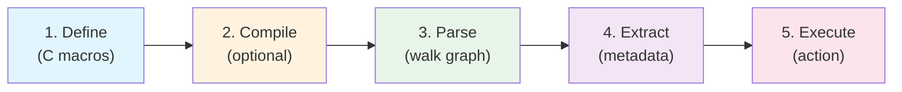

# Lecture 0: Orientation and Motivation

## 0.1 What is XDP2?

**XDP2 (eXpress DataPath 2)** is a programming model, framework, and set of C
libraries for high-performance datapath programming. It provides an API, an
optimizing compiler, test suites, and sample programs for packet and protocol
processing. XDP2 is a generalization of
[XDP (eXpress Data Path)](https://www.kernel.org/doc/html/latest/networking/af_xdp.html)
that extends beyond just Linux kernel eBPF to support programmable hardware and
software environments like DPDK.

The core source is in the [src/](../src/) directory. The project is licensed
under BSD-2-Clause-FreeBSD.

## 0.2 Why Declarative Parsing Beats Imperative Parsing

A traditional imperative packet parser looks like nested if/else chains:

```c
/* Imperative style -- hard to maintain, optimize, or retarget */
if (ethertype == ETH_P_IP) {
    struct iphdr *iph = data + 14;
    if (iph->protocol == IPPROTO_TCP) {
        struct tcphdr *th = data + 14 + iph->ihl * 4;
        /* ... extract ports ... */
    }
}
```

This approach has serious drawbacks:

| Problem | Consequence |
|---|---|
| Protocol logic is mixed with control flow | Adding a protocol means editing deeply nested code |
| Hard to optimize | Compiler cannot see the full set of possible paths |
| Single target | Code written for userspace cannot run in eBPF or hardware |
| No introspection | Cannot visualize, validate, or transform the parser |

XDP2 solves these problems by separating **what** to parse from **how** to
parse it. Protocol parsing is modeled as a **declarative data structure** --
the parse graph -- that can be walked by a generic engine, compiled to
optimized code, or mapped to hardware.

## 0.3 The Parse Graph Mental Model

A **parse graph** is a directed graph where:

- Each **node** represents one protocol layer (Ethernet, IPv4, TCP, ...)
- Each **edge** represents a transition from one layer to the next, labeled
  with a protocol number (EtherType, IP protocol number, ...)
- A **root node** is where parsing begins (typically Ethernet)
- **Leaf nodes** are where parsing terminates

The parse graph is equivalent to a Finite State Machine (FSM). Each node is a
state; transitions are determined by the protocol type field in the current
header. When the parser encounters a leaf node (no outgoing edges) or an
unknown protocol number, parsing stops.


*An example XDP2 parse graph. Nodes are protocol layers; edges are protocol
table lookups.*

## 0.4 The Five Phases of XDP2

XDP2 processes packets through five conceptual phases:



| Phase | What happens | Key files |
|---|---|---|
| **1. Define** | Programmer declares protocol nodes, tables, and metadata callbacks using C macros | [parser.h](../src/include/xdp2/parser.h), [proto_defs/](../src/include/xdp2/proto_defs/) |
| **2. Compile** | (Optional) The XDP2 compiler extracts the parse graph from the C AST and generates optimized or eBPF code | [tools/compiler/](../src/tools/compiler/) |
| **3. Parse** | The runtime engine walks the parse graph node by node for each packet | [lib/xdp2/parser.c](../src/lib/xdp2/parser.c) |
| **4. Extract** | Per-node callbacks copy protocol fields into a metadata structure | [parser_metadata.h](../src/include/xdp2/parser_metadata.h) |
| **5. Execute** | Application logic acts on the extracted metadata (flow tracking, filtering, etc.) | User code (e.g., [flow_tracker.h](../samples/xdp/flow_tracker_simple/flow_tracker.h)) |

## 0.5 Repository Map

```
xdp2/
├── src/                          Source code
│   ├── include/xdp2/             API headers
│   │   ├── parser.h              Parser macros and API
│   │   ├── parser_types.h        Core data structures
│   │   ├── parser_metadata.h     Metadata extraction templates
│   │   ├── proto_defs/           100+ protocol definitions
│   │   ├── tlvs.h                TLV parsing structures
│   │   ├── flag_fields.h         Flag-field parsing structures
│   │   └── arrays.h              Array parsing structures
│   ├── lib/xdp2/                 Library implementation
│   │   └── parser.c              Main parsing loop
│   ├── tools/compiler/           XDP2 optimizing compiler (C++)
│   ├── templates/                Code generation templates
│   └── test/                     Test suites
├── samples/                      Standalone examples
│   ├── parser/                   Userspace parser samples
│   └── xdp/                     XDP/eBPF samples
├── documentation/                This documentation
├── nix/                          Nix build system
├── flake.nix                     Nix flake definition
└── Makefile                      Convenience build targets
```

## 0.6 Prerequisites

This lecture series assumes familiarity with:

- **C programming**: structs, function pointers, macros, the preprocessor
- **Data structures**: directed graphs, hash tables, linked lists
- **Networking basics**: OSI model, Ethernet frames, IP headers, TCP/UDP
  headers, protocol encapsulation
- **Binary/hex**: reading hex dumps, byte ordering (network byte order)

For Lecture 6 (XDP/eBPF), additional background in Linux kernel eBPF is
helpful but not strictly required -- we cover the essentials there.

---

[Table of Contents](README.md) | [Lecture 1: Protocol Definitions -- The Vocabulary of Parsing >](lecture01-protocol-definitions.md)
