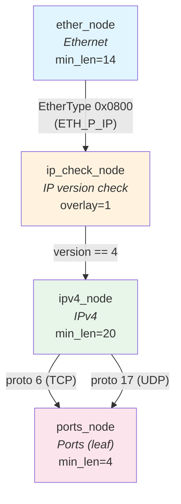
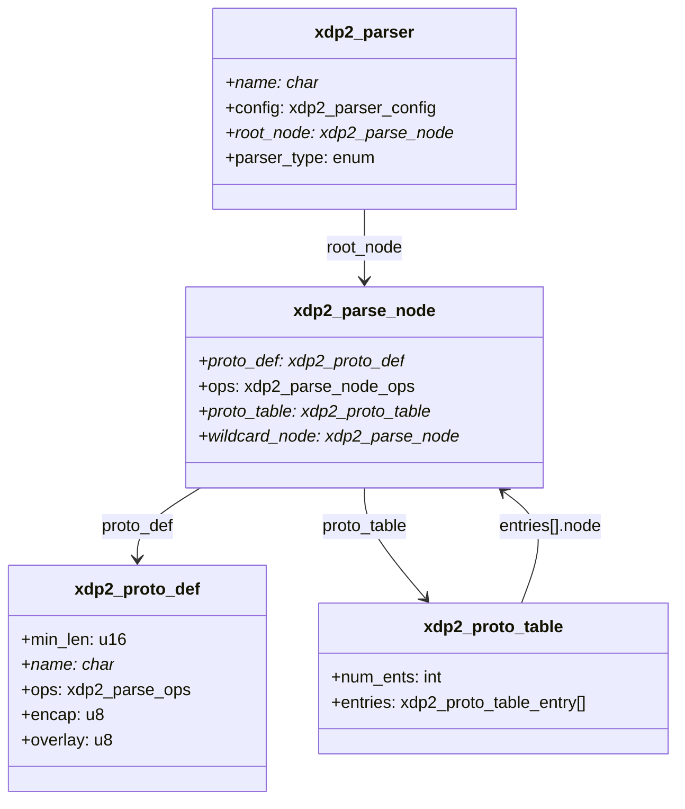

# Lecture 2: Parse Nodes, Protocol Tables, and Parsers -- Building the Graph

A protocol definition tells us how to parse one protocol in isolation. To build
a complete parser, we need three more concepts:

- **Parse nodes** attach per-use behavior (metadata extraction, handlers) to
  a protocol definition
- **Protocol tables** connect nodes to form the edges of the graph
- **Parsers** wrap the whole graph with configuration and a root node

## 2.1 The `struct xdp2_parse_node` Data Structure

Defined in
[src/include/xdp2/parser_types.h](../src/include/xdp2/parser_types.h) at
lines 270--281:

```c
struct xdp2_parse_node {
    enum xdp2_parser_node_type node_type;
    __s8 unknown_ret;                          /* Return code for unknown protocol */
    __u8 key_sel;                              /* Key selector index */
    __u8 flags;
    __u8 rsvd;
    const struct xdp2_proto_def *proto_def;    /* Protocol definition */
    const struct xdp2_parse_node_ops ops;      /* Callbacks */
    const struct xdp2_proto_table *proto_table; /* Next-protocol lookup table */
    const struct xdp2_parse_node *wildcard_node; /* Fallback for unknown proto */
    char *text_name;                           /* Debug name */
};
```

The key distinction: a **protocol definition** is shared across all uses of a
protocol (there is one `xdp2_parse_ipv4` for all parsers), while a **parse
node** is specific to one position in one parser's graph. The same protocol
definition can appear in multiple parse nodes with different callbacks.

### Parse Node Operations

The `ops` field
([parser_types.h:221--229](../src/include/xdp2/parser_types.h)) defines
optional callbacks:

```c
struct xdp2_parse_node_ops {
    void (*extract_metadata)(const void *hdr, size_t hdr_len,
                             void *metadata, void *frame,
                             const struct xdp2_ctrl_data *ctrl);
    int (*handler)(const void *hdr, size_t hdr_len, void *metadata,
                   void *frame, const struct xdp2_ctrl_data *ctrl);
    int (*post_handler)(const void *hdr, size_t hdr_len, void *metadata,
                        void *frame, const struct xdp2_ctrl_data *ctrl);
};
```

| Callback | When called | Purpose |
|---|---|---|
| `extract_metadata` | After length check | Copy protocol fields to metadata buffer |
| `handler` | After metadata extraction | Arbitrary per-protocol processing |
| `post_handler` | After TLV/flag-field/array processing | Post-processing logic |

All three are optional (NULL means skip).

## 2.2 The `struct xdp2_proto_table` Data Structure

A protocol table maps protocol numbers to parse nodes. This is how edges in
the graph are defined.

From [parser_types.h:244--257](../src/include/xdp2/parser_types.h):

```c
struct xdp2_proto_table_entry {
    int value;                                /* Protocol number */
    const struct xdp2_parse_node *node;       /* Target parse node */
};

struct xdp2_proto_table {
    int num_ents;                             /* Number of entries */
    const struct xdp2_proto_table_entry *entries;
};
```

The lookup is a **linear scan** -- the engine iterates through `entries` until
it finds a matching `value` or exhausts the table. For the small number of
entries in typical protocol tables (2--10 entries), this is faster than a hash
table due to cache locality.

## 2.3 The `struct xdp2_parser` Data Structure

A parser wraps the complete graph with configuration and entry points.

From [parser_types.h:320--327](../src/include/xdp2/parser_types.h):

```c
struct xdp2_parser {
    const char *name;
    struct xdp2_parser_config config;
    const struct xdp2_parse_node *root_node;
    enum xdp2_parser_type parser_type;       /* GENERIC, OPTIMIZED, or XDP */
    xdp2_parser_opt_entry_point parser_entry_point;
    xdp2_parser_xdp_entry_point parser_xdp_entry_point;
};
```

The configuration ([parser_types.h:301--312](../src/include/xdp2/parser_types.h)):

```c
struct xdp2_parser_config {
    __u16 max_nodes;          /* Max nodes to visit (default 255) */
    __u16 max_encaps;         /* Max encapsulation depth (default 4) */
    __u16 max_frames;         /* Max metadata frames (default 4) */
    size_t metameta_size;     /* Size of metameta area (bytes) */
    size_t frame_size;        /* Size of one metadata frame (bytes) */
    __u8 num_counters;        /* Number of parser counters */
    __u8 num_keys;            /* Number of inter-node keys */
    const struct xdp2_parse_node *okay_node;    /* Called on success */
    const struct xdp2_parse_node *fail_node;    /* Called on error */
    const struct xdp2_parse_node *atencap_node; /* Called at encapsulation */
};
```

## 2.4 Node Variants

| Node type | Macro | Has proto_table? | Description |
|---|---|---|---|
| **Interior** | `XDP2_MAKE_PARSE_NODE` | Yes | Has outgoing edges via a protocol table |
| **Leaf** | `XDP2_MAKE_LEAF_PARSE_NODE` | No | Terminal node; parsing stops here |
| **Auto-next** | `XDP2_MAKE_AUTONEXT_PARSE_NODE` | No | Always transitions to a single wildcard node |

Additionally, any node can have a **wildcard node** -- a fallback parse node
used when the protocol number is not found in the protocol table.

## 2.5 The Macro API

XDP2 provides helper macros in
[src/include/xdp2/parser.h](../src/include/xdp2/parser.h) to create these
data structures without writing verbose struct initializers.

### `XDP2_MAKE_PROTO_TABLE` ([parser.h:198--205](../src/include/xdp2/parser.h))

Creates a protocol table from a list of (protocol_number, target_node) pairs:

```c
XDP2_MAKE_PROTO_TABLE(table_name,
    ( protocol_number_1, target_node_1 ),
    ( protocol_number_2, target_node_2 ),
    ...
);
```

### `XDP2_MAKE_PARSE_NODE` ([parser.h:234--242](../src/include/xdp2/parser.h))

Creates an interior parse node with a protocol table:

```c
XDP2_MAKE_PARSE_NODE(node_name, proto_def, proto_table, (extra_fields));
```

### `XDP2_MAKE_LEAF_PARSE_NODE` ([parser.h:256--261](../src/include/xdp2/parser.h))

Creates a leaf (terminal) parse node:

```c
XDP2_MAKE_LEAF_PARSE_NODE(node_name, proto_def, (extra_fields));
```

### `XDP2_PARSER` ([parser.h:133--134](../src/include/xdp2/parser.h))

Creates a parser with a root node and configuration:

```c
XDP2_PARSER(parser_name, "description", root_node, (config_overrides));
```

## 2.6 Complete Example: `flow_tracker_simple` Parser

This is a complete parser definition from
[samples/xdp/flow_tracker_simple/parser.c](../samples/xdp/flow_tracker_simple/parser.c).
It extracts 5-tuple flow information (IPs + ports) from IPv4 TCP/UDP packets:

```c
/* Step 1: Define metadata extraction callbacks (canned templates) */
XDP2_METADATA_TEMP_ether(ether_metadata, xdp2_metadata_all)
XDP2_METADATA_TEMP_ipv4(ipv4_metadata, xdp2_metadata_all)
XDP2_METADATA_TEMP_ipv6(ipv6_metadata, xdp2_metadata_all)
XDP2_METADATA_TEMP_ports(ports_metadata, xdp2_metadata_all)

/* Step 2: Define parse nodes */
XDP2_MAKE_PARSE_NODE(ether_node, xdp2_parse_ether, ether_table,
                     (.ops.extract_metadata = ether_metadata));
XDP2_MAKE_PARSE_NODE(ip_check_node, xdp2_parse_ip, ip_check_table, ());
XDP2_MAKE_PARSE_NODE(ipv4_node, xdp2_parse_ipv4, ipv4_table,
                     (.ops.extract_metadata = ipv4_metadata));
XDP2_MAKE_LEAF_PARSE_NODE(ports_node, xdp2_parse_ports,
                          (.ops.extract_metadata = ports_metadata));

/* Step 3: Define protocol tables (the edges) */
XDP2_MAKE_PROTO_TABLE(ether_table,
                      ( __cpu_to_be16(ETH_P_IP), ip_check_node )
);
XDP2_MAKE_PROTO_TABLE(ip_check_table,
                      ( 4, ipv4_node )
);
XDP2_MAKE_PROTO_TABLE(ipv4_table,
                      ( IPPROTO_TCP, ports_node ),
                      ( IPPROTO_UDP, ports_node )
);

/* Step 4: Define the parser */
XDP2_PARSER(xdp2_parser_simple_tuple, "XDP2 parser for 5 tuple TCP/UDP",
            ether_node,
            (.max_frames = 1,
             .metameta_size = 0,
             .frame_size = sizeof(struct xdp2_metadata_all)
            )
);
```

This creates the following parse graph:




*Parse nodes and protocol tables for a parser for TCP and UDP over IPv4 and
IPv6 over Ethernet.*

## 2.7 How the Pieces Connect

The relationship between the four core data structures:



The critical insight: **protocol tables create the graph edges**. Each entry
in a protocol table maps a protocol number to the *next* parse node, forming
the directed edges of the parse graph.

## 2.8 Exercise

Extend the `flow_tracker_simple` parser to also handle VLAN-tagged packets.
You would need:

1. A new parse node for VLAN using `xdp2_parse_vlan`
2. An entry in `ether_table` for `ETH_P_8021Q` (0x8100)
3. A new `vlan_table` that maps the inner EtherType to `ip_check_node`

---

[< Lecture 1: Protocol Definitions -- The Vocabulary of Parsing](lecture01-protocol-definitions.md) | [Table of Contents](README.md) | [Lecture 3: The Runtime Parsing Engine -- Walking the Graph >](lecture03-runtime-engine.md)
