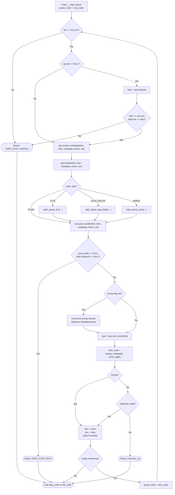
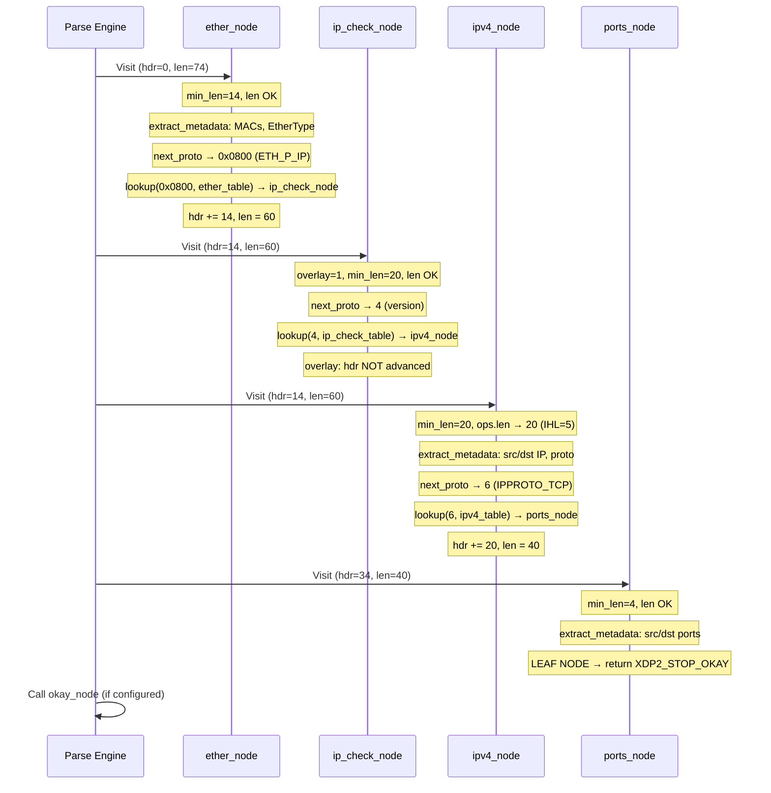

# Lecture 3: The Runtime Parsing Engine -- Walking the Graph

With the data structures from Lectures 1 and 2, we now have a complete parse
graph in memory. The runtime engine walks this graph for each packet.

## 3.1 Overview of `__xdp2_parse`

The core parsing function is `__xdp2_parse` in
[src/lib/xdp2/parser.c](../src/lib/xdp2/parser.c) at lines 461--699. It
takes six arguments:

```c
int __xdp2_parse(const struct xdp2_parser *parser,
                 void *hdr,              /* Pointer to start of packet */
                 size_t len,             /* Remaining packet length */
                 void *metadata,         /* Metadata buffer */
                 struct xdp2_ctrl_data *ctrl,  /* Control state */
                 unsigned int flags)     /* Flags (e.g., debug) */
```

The function returns an XDP2 return code indicating success or the specific
error condition.

## 3.2 The Main Parse Loop

The engine is a `do { ... } while (1)` loop with explicit exits via `goto
out`. Here is the high-level structure:




*Logic flow for parsing nodes in a parse graph.*

## 3.3 The Callback Ordering Contract

For each node visited, callbacks are invoked in this exact order
([parser.c:509--516](../src/lib/xdp2/parser.c)):

```
1. proto_def->ops.len(hdr, len)           -- compute header length
2. parse_node->ops.extract_metadata(...)  -- copy fields to metadata
3. parse_node->ops.handler(...)           -- per-protocol processing
4. [TLVs / flag-fields / arrays]          -- sub-structure processing
5. parse_node->ops.post_handler(...)      -- post-processing
6. proto_def->ops.next_proto(hdr)         -- determine next protocol
7. lookup_node(type, proto_table)         -- find next node
```

This ordering is a contract that all protocol definitions and parse nodes must
respect. The `hdr` pointer and `hlen` value are stable across all callbacks
for one node.

## 3.4 Protocol Table Lookup

The lookup function ([parser.c:37--47](../src/lib/xdp2/parser.c)) is a simple
linear scan:

```c
static const struct xdp2_parse_node *lookup_node(int type,
                                    const struct xdp2_proto_table *table)
{
    int i;

    for (i = 0; i < table->num_ents; i++)
        if (type == table->entries[i].value)
            return table->entries[i].node;

    return NULL;
}
```

If the lookup returns NULL:
1. If a `wildcard_node` exists, use it as the next node
2. Otherwise, return `parse_node->unknown_ret` (default:
   `XDP2_STOP_UNKNOWN_PROTO`)

## 3.5 Encapsulation Handling

When the engine encounters a node whose `proto_def->encap` flag is set
([parser.c:591--613](../src/lib/xdp2/parser.c)):

1. The `atencap_node` callback is invoked (if configured)
2. `ctrl->var.encaps` is incremented; if it exceeds `max_encaps`, parsing
   stops with `XDP2_STOP_ENCAP_DEPTH`
3. The metadata `frame` pointer advances by `frame_size` to the next frame
   (if `max_frames` allows)

This means encapsulated packets (e.g., GRE tunnels) automatically get separate
metadata frames for outer and inner headers.

## 3.6 Overlay Handling

When `proto_def->overlay` is set
([parser.c:670--674](../src/lib/xdp2/parser.c)):

```c
if (!proto_def->overlay) {
    /* Move over current header */
    hdr += hlen;
    len -= hlen;
}
```

The packet pointer is **not** advanced. This allows an overlay node (like an
IP version check) to inspect the header and dispatch to the correct protocol
(IPv4 or IPv6) without consuming any bytes.

## 3.7 Loop Termination and Return Codes

The main loop terminates when:

| Condition | Return code | Location |
|---|---|---|
| Leaf node (no proto_table, no wildcard) | `XDP2_STOP_OKAY` | [parser.c:584--589](../src/lib/xdp2/parser.c) |
| Packet too short | `XDP2_STOP_LENGTH` | [parser.c:491--506](../src/lib/xdp2/parser.c) |
| Unknown protocol, no wildcard | `parse_node->unknown_ret` | [parser.c:649](../src/lib/xdp2/parser.c) |
| Too many encapsulation layers | `XDP2_STOP_ENCAP_DEPTH` | [parser.c:604--607](../src/lib/xdp2/parser.c) |
| Max nodes exhausted | `XDP2_STOP_MAX_NODES` | [parser.c:682--683](../src/lib/xdp2/parser.c) |
| `next_proto` returns negative | The negative value itself | [parser.c:625--627](../src/lib/xdp2/parser.c) |

After the loop exits, the engine calls the `okay_node` or `fail_node`
depending on the return code
([parser.c:691--698](../src/lib/xdp2/parser.c)):

```c
parse_node = XDP2_CODE_IS_OKAY(ret) ?
    parser->config.okay_node : parser->config.fail_node;

if (parse_node)
    __xdp2_parse_run_exit_node(parser, parse_node, metadata, frame,
                               ctrl, flags);
```

## 3.8 The Dispatch Function

The top-level `xdp2_parse` function in
[parser.h:307--323](../src/include/xdp2/parser.h) dispatches to the
appropriate implementation based on `parser_type`:

```c
static inline int xdp2_parse(const struct xdp2_parser *parser,
                             void *hdr, size_t len,
                             void *metadata,
                             struct xdp2_ctrl_data *ctrl,
                             unsigned int flags)
{
    switch (parser->parser_type) {
    case XDP2_GENERIC:
        return __xdp2_parse(parser, hdr, len, metadata, ctrl, flags);
    case XDP2_OPTIMIZED:
        return (parser->parser_entry_point)(parser, hdr, len,
                                            metadata, ctrl, flags);
    default:
        return XDP2_STOP_FAIL;
    }
}
```

This means the same `xdp2_parse` call works for both the generic engine and
the compiler-optimized variant.

## 3.9 Concrete Trace: Ethernet/IPv4/TCP

Consider parsing a standard TCP packet with the `flow_tracker_simple` parser:



After parsing, the metadata buffer contains the Ethernet addresses, IPv4
source/destination, IP protocol number, and TCP source/destination ports.

## 3.10 Exercise

Trace the same packet through the engine, but with an unknown IP protocol
number (e.g., protocol 200). At which step does parsing stop? What return code
is produced? What metadata has been extracted at that point?

---

[< Lecture 2: Parse Nodes, Protocol Tables, and Parsers -- Building the Graph](lecture02-parse-graph.md) | [Table of Contents](README.md) | [Lecture 4: Metadata Extraction and Advanced Node Types >](lecture04-metadata-extraction.md)
