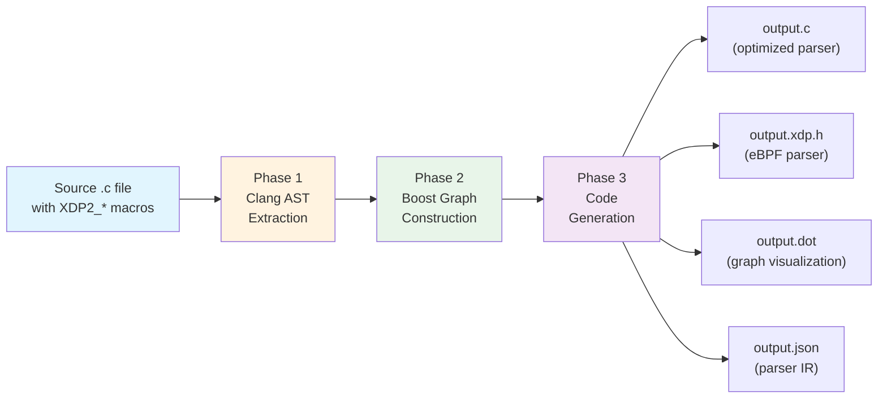

# Lecture 5: The Optimizing Compiler -- From Graph to Linear Code

## 5.1 Why Compile a Declarative Graph?

The generic parse engine (`__xdp2_parse`) is a loop with indirect function
calls at every node. This has costs:

- **Function pointer overhead**: Each callback is an indirect call the CPU
  cannot predict
- **Loop overhead**: The `do/while` loop and switch statement add branches
- **Generic code**: The engine handles all node types even if your parser only
  uses PLAIN nodes

The XDP2 compiler reads a parser definition and generates **linear C code**
that directly sequences the operations for each possible path through the
graph. The compiler can:

- Inline all callbacks
- Unroll the parse loop
- Eliminate dead code for unused node types
- Generate code tuned for a specific compilation target (C or eBPF)

The result is a parser function named `<parser_name>_opt` that has the same
API as the generic engine but runs significantly faster.

## 5.2 Compiler Architecture Overview

The compiler lives in
[src/tools/compiler/](../src/tools/compiler/) and is written in C++ using
[cppfront](https://github.com/hsutter/cppfront) (Cpp2). It has three phases:



### Phase 1: AST Extraction

The compiler uses the **Clang LibTooling API** to parse the input C source
file. It runs a custom `ASTConsumer` that matches the XDP2_* macros
(`XDP2_MAKE_PARSE_NODE`, `XDP2_MAKE_PROTO_TABLE`, `XDP2_PARSER`, etc.) and
extracts:

- Parse node names, protocol definitions, and protocol table references
- Metadata extraction function pointers
- Handler and post-handler function pointers
- TLV, flag-field, and array configurations

This is implemented in
[src/tools/compiler/include/xdp2gen/ast-consumer/](../src/tools/compiler/include/xdp2gen/ast-consumer/).

### Phase 2: Graph Construction

From the extracted AST data, the compiler builds a directed graph using the
**Boost Graph Library** (BGL). The graph representation is defined in
[src/tools/compiler/include/xdp2gen/graph.h](../src/tools/compiler/include/xdp2gen/graph.h):

```c++
/* Vertex (node) properties */
struct vertex_property {
    std::string name;           /* Parse node name */
    std::string parser_node;    /* Protocol definition reference */
    std::string metadata;       /* Metadata function name */
    std::string handler;        /* Handler function name */
    std::string table;          /* Protocol table name */
    std::optional<bool> overlay, encap;
    /* ... more fields ... */
};

/* Edge properties */
struct edge_property {
    std::string macro_name;         /* Protocol number macro */
    bool back = false;              /* True if this is a back-edge */
    unsigned int macro_name_value;  /* Numeric value */
};

/* The graph type */
using graph_t = boost::adjacency_list<
    boost::vecS, boost::vecS, boost::directedS,
    vertex_property, edge_property>;
```

Key graph operations:
- **Cycle detection**: Back-edges (cycles) indicate encapsulation protocols.
  When GRE tunnels back to Ethernet, that edge is marked `back = true`.
- **BFS depth assignment**: Breadth-first search from the root computes the
  depth of each node, which determines the order of code generation.

### Phase 3: Code Generation

Based on the output file extension, the compiler generates:

| Extension | Output | Description |
|---|---|---|
| `.c` | Optimized C | Loop-unrolled parser with `_opt` suffix |
| `.xdp.h` | eBPF-compatible C | Parser targeting XDP (see Lecture 6) |
| `.dot` | Graphviz | Visual representation of the parse graph |
| `.json` | Parser IR | JSON intermediate representation |

## 5.3 Graph Visualization

The compiler can produce a `.dot` file for Graphviz:

```bash
xdp2-compiler -i parser.c -o parser.dot
dot -Tpng parser.dot -o parser.png
```

This generates a visual graph showing all nodes, edges, protocol numbers, and
back-edges (encapsulation). This is invaluable for debugging and documentation.

## 5.4 The Parser Intermediate Representation (PIR)

The PIR is a JSON format that captures the parse graph declaratively. It can
be used as input to alternative backends (hardware compilers, other languages).
Example from
[documentation/parser-ir.md](parser-ir.md):

```json
{
  "parsers": [{
    "name": "my_parser",
    "root-node": "eth_node",
    "okay-target": "okay"
  }],
  "parse-nodes": [{
    "name": "ipv4_node",
    "min-hdr-length": 20,
    "hdr-length": {
      "field-off": 0, "field-len": 1,
      "mask": "0xf", "multiplier": 4
    },
    "next-proto": {
      "field-off": 9, "field-len": 1,
      "ents": [
        { "key": 6, "node": "tcp_node" },
        { "key": 47, "node": "gre_node" }
      ]
    }
  }]
}
```

## 5.5 The `_opt` Convention

The optimized parser follows a naming convention: if your parser is named
`my_parser`, the compiler generates `my_parser_opt`. You can select which to
use at runtime:

```c
/* Use generic engine */
xdp2_parse(my_parser, hdr, len, &metadata, &ctrl, 0);

/* Use optimized engine (same API) */
xdp2_parse(my_parser_opt, hdr, len, &metadata, &ctrl, 0);
```

The compiler generates a `.c` file that `#include`s the original source, so
both parsers coexist in the same compilation unit.

## 5.6 Exercise

Run the XDP2 compiler on the `ports_parser` sample to generate both a
`.dot` graph and an optimized `.c` parser. Compare the generated code with the
generic engine's `__xdp2_parse` loop. Where do you see the loop unrolling?

---

[< Lecture 4: Metadata Extraction and Advanced Node Types](lecture04-metadata-extraction.md) | [Table of Contents](README.md) | [Lecture 6: The XDP/eBPF Target -- Kernel-Space Parsing >](lecture06-xdp-ebpf.md)
