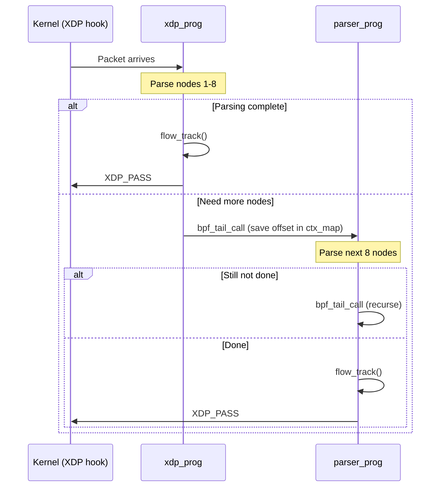

# Lecture 6: The XDP/eBPF Target -- Kernel-Space Parsing

## 6.1 eBPF and XDP Background

**eBPF** (extended Berkeley Packet Filter) allows running sandboxed programs
inside the Linux kernel. **XDP** (eXpress Data Path) is an eBPF hook point
that processes packets at the earliest possible point in the network stack --
before the kernel allocates an `sk_buff`.

XDP programs receive raw packet data and return a verdict:
- `XDP_PASS` -- pass to the normal network stack
- `XDP_DROP` -- drop the packet
- `XDP_TX` -- retransmit on the same interface
- `XDP_REDIRECT` -- redirect to another interface

## 6.2 eBPF Constraints That Shape the Design

The eBPF verifier imposes constraints that prevent using the generic
`__xdp2_parse` loop directly:

| Constraint | Impact on XDP2 |
|---|---|
| **Bounded loops** | Cannot use `do/while(1)`; must use `#pragma unroll` with fixed iteration count |
| **512-byte stack** | Cannot allocate large metadata buffers on stack; use per-CPU BPF maps |
| **No function pointers** | Cannot use `ops.extract_metadata` etc.; must inline everything |
| **Verifier complexity limit** | Deep parse graphs may exceed the verifier's instruction limit |

## 6.3 The XDP Code Generation Template

The compiler generates eBPF-compatible code using the template in
[src/templates/xdp2/xdp_def.template.c](../src/templates/xdp2/xdp_def.template.c).
The generated code consists of:

**1. Node code enum**: Each parse node gets a numeric code:
```c
enum {
    CODE_ether_node,
    CODE_ip_check_node,
    CODE_ipv4_node,
    CODE_ports_node,
    CODE_IGNORE          /* No continuation needed */
};
```

**2. Per-node inline functions**: Each node's parsing logic is generated as a
`static __always_inline` function that:
- Checks the packet length
- Extracts metadata (inlined, not via function pointer)
- Determines the next protocol
- Sets `ctx->next` to the next node's code

**3. Dispatch loop**: A `#pragma unroll` loop (typically 8 iterations) that
dispatches to the appropriate per-node function based on `ctx->next`.

## 6.4 Tail Calls for Deep Parsing

eBPF limits the number of instructions per program. To parse deeply nested
protocols, XDP2 uses **BPF tail calls** -- one program can transfer control to
another program in the same program array map.


*xdp_prog is the frontend; parser_prog continues parsing via tail calls.*

The architecture splits parsing into two BPF programs:

### `xdp_prog` -- Entry Point

From
[samples/xdp/flow_tracker_simple/flow_tracker.xdp.c](../samples/xdp/flow_tracker_simple/flow_tracker.xdp.c):

```c
SEC("prog")
int xdp_prog(struct xdp_md *ctx)
{
    /* 1. Get per-CPU parsing context from BPF map */
    struct flow_tracker_ctx *parser_ctx = xdp2_get_ctx();

    /* 2. Initialize context */
    parser_ctx->ctx.frame_num = 0;
    parser_ctx->ctx.next = CODE_IGNORE;
    parser_ctx->ctx.metadata = parser_ctx->frame;
    parser_ctx->ctx.parser = xdp2_parser_simple_tuple;

    /* 3. Parse up to 8 nodes */
    int rc = XDP2_PARSE_XDP(xdp2_parser_simple_tuple, &parser_ctx->ctx,
                            &data, data_end, false, 0);

    /* 4. If not finished, tail-call to continue */
    if (parser_ctx->ctx.next != CODE_IGNORE) {
        parser_ctx->ctx.offset = data - original;
        bpf_xdp_adjust_head(ctx, parser_ctx->ctx.offset);
        bpf_tail_call(ctx, &parsers, 0);
    }

    /* 5. Parsing complete -- run application logic */
    flow_track(parser_ctx->frame);
    return XDP_PASS;
}
```

### `parser_prog` -- Tail Call Continuation

```c
SEC("0xcafe/0")
int parser_prog(struct xdp_md *ctx)
{
    struct flow_tracker_ctx *parser_ctx = xdp2_get_ctx();

    /* Continue parsing from where xdp_prog left off */
    int rc = XDP2_PARSE_XDP(xdp2_parser_simple_tuple, &parser_ctx->ctx,
                            &data, data_end, true, 0);

    /* If still not finished, tail-call again */
    if (parser_ctx->ctx.next != CODE_IGNORE) {
        parser_ctx->ctx.offset += data - original;
        bpf_xdp_adjust_head(ctx, data - original);
        bpf_tail_call(ctx, &parsers, 0);
    }

    flow_track(parser_ctx->frame);
    bpf_xdp_adjust_head(ctx, -parser_ctx->ctx.offset);
    return XDP_PASS;
}
```

### The Tail-Call Chain



## 6.5 BPF Maps

Two BPF maps support this architecture:

**`ctx_map`** (`BPF_MAP_TYPE_PERCPU_ARRAY`): Stores the parsing context and
metadata buffer. Per-CPU to avoid locking. Large enough to hold the parser
context and metadata frames.

**`parsers`** (`BPF_MAP_TYPE_PROG_ARRAY`): Program array map that enables
tail calls. Contains `parser_prog` at index 0.

```c
struct bpf_elf_map SEC("maps") ctx_map = {
    .type = BPF_MAP_TYPE_PERCPU_ARRAY,
    .size_key = sizeof(__u32),
    .size_value = sizeof(struct flow_tracker_ctx),
    .max_elem = 2,
};

struct bpf_elf_map SEC("maps") parsers = {
    .type = BPF_MAP_TYPE_PROG_ARRAY,
    .size_key = sizeof(__u32),
    .size_value = sizeof(__u32),
    .max_elem = 1,
};
```

## 6.6 Loading and Running

```bash
# Compile the XDP program
clang -O2 -target bpf -c flow_tracker.xdp.c -o flow_tracker.xdp.o

# Load onto a network interface
sudo ip link set dev eth0 xdp obj flow_tracker.xdp.o

# Verify with bpftool
sudo bpftool map dump name flowtracker

# Unload
sudo ip link set dev eth0 xdp off
sudo rm -rfv /sys/fs/bpf/tc/globals
```

## 6.7 Limits

- Maximum ~40 nodes per packet (8 per iteration x 5 tail calls)
- eBPF verifier may reject programs with very complex parse graphs
- TLV nodes with many options trigger a tail call to `parser_prog`

## 6.8 Exercise

Load the `flow_tracker_simple` XDP program onto a test interface and generate
traffic with `ping` and `curl`. Use `bpftool map dump` to observe the flow
entries being created.

---

[< Lecture 5: The Optimizing Compiler -- From Graph to Linear Code](lecture05-compiler.md) | [Table of Contents](README.md) | [Lecture 7: Worked Examples -- Packets Walking the Parse Graph >](lecture07-worked-examples.md)
