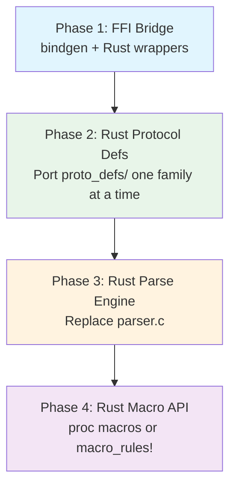

# Lecture 9: Porting the Runtime -- C to Rust

With the Linux kernel increasingly adopting Rust and the broader systems
programming world embracing it, this lecture examines what it would take to
port XDP2's C runtime to Rust. We focus on the concrete translation
challenges, key design decisions, and recommended approaches.

## 9.1 Why Port to Rust?

Rust offers three properties directly relevant to a packet parsing framework:

1. **Memory safety without GC**: No buffer overflows, use-after-free, or
   double-free -- critical for code that processes untrusted network data
2. **Strong type system**: Replaces `void*` type erasure with compile-time
   checked generics and traits
3. **Zero-cost abstractions**: Traits, generics, and enums compile to the
   same efficient code as hand-written C

The XDP2 codebase has patterns that are both helped and challenged by Rust.
This lecture walks through the major translation decisions.

## 9.2 Core Data Structures: C to Rust

### Protocol Operations: Function Pointers to Traits

The C version uses nullable function pointers in a struct
([parser_types.h:133--137](../src/include/xdp2/parser_types.h)):

```c
struct xdp2_parse_ops {
    ssize_t (*len)(const void *hdr, size_t maxlen);
    int (*next_proto)(const void *hdr);
};
```

**Rust approach -- trait with default methods:**

```rust
trait ProtocolOps {
    /// Minimum header length (replaces min_len field)
    const MIN_LEN: usize;

    /// Compute actual header length. Default: use MIN_LEN.
    fn header_len(&self, hdr: &[u8]) -> Result<usize, ParseError> {
        Ok(Self::MIN_LEN)
    }

    /// Return the next protocol number. None = leaf protocol.
    fn next_proto(&self, hdr: &[u8]) -> Option<Result<i32, ParseError>> {
        None
    }
}
```

Key differences:
- `const void *hdr` becomes `&[u8]` -- a fat pointer with built-in bounds
  checking
- Nullable function pointers become trait methods with default implementations
- Error codes become `Result<T, ParseError>` for clear error handling
- The `self` parameter carries the protocol definition's state

### Protocol Definition

The C struct ([parser_types.h:153--160](../src/include/xdp2/parser_types.h)):

```c
struct xdp2_proto_def {
    enum xdp2_parser_node_type node_type;
    __u8 encap;
    __u8 overlay;
    __u16 min_len;
    const char *name;
    const struct xdp2_parse_ops ops;
} __aligned(XDP2_CACHELINE_SIZE) __packed;
```

**Rust translation:**

```rust
#[derive(Debug)]
struct ProtoDef {
    node_type: NodeType,
    encap: bool,              // u8 flag -> bool
    overlay: bool,            // u8 flag -> bool
    min_len: u16,
    name: &'static str,       // const char* -> &'static str
    // ops are now trait methods on the implementing type
}
```

Note: `__packed __aligned` is a C-ism for cache optimization. In pure Rust,
you would not pack the struct -- instead rely on the compiler's layout
optimization and use `#[repr(C)]` only at FFI boundaries.

### Parse Node: Self-Referential Static Data

The biggest structural challenge. The C parse node
([parser_types.h:270--281](../src/include/xdp2/parser_types.h)) contains
pointers to other parse nodes:

```c
struct xdp2_parse_node {
    const struct xdp2_proto_def *proto_def;
    const struct xdp2_proto_table *proto_table;
    const struct xdp2_parse_node *wildcard_node;  /* self-referential */
    /* ... */
};
```

In C, `static const` structs can freely reference each other. In Rust,
`&'static` references in `const` items work but require careful ordering:

```rust
struct ParseNode {
    proto_def: &'static dyn ProtocolOps,
    proto_table: Option<&'static [(i32, &'static ParseNode)]>,
    wildcard_node: Option<&'static ParseNode>,
    extract_metadata: Option<fn(&[u8], usize, &mut dyn Any)>,
    name: &'static str,
}

// Static nodes can reference each other:
static PORTS_NODE: ParseNode = ParseNode {
    proto_def: &TcpProtocol,
    proto_table: None,                    // leaf
    wildcard_node: None,
    extract_metadata: Some(extract_ports),
    name: "ports_node",
};

static IPV4_TABLE: [(i32, &ParseNode)] = [
    (6,  &PORTS_NODE),   // IPPROTO_TCP
    (17, &PORTS_NODE),   // IPPROTO_UDP
];
```

**Pitfall**: Rust's `const` evaluation is more restrictive than C's static
initialization. Circular references (e.g., GRE tunneling back to Ethernet)
require `lazy_static!` or `std::sync::LazyLock` (stable since Rust 1.80).

### Protocol Table: Slice vs Linear Scan

The C protocol table is an array with a count field. In Rust, this becomes a
slice, which carries its own length:

```rust
// C: struct xdp2_proto_table { int num_ents; entries* }
// Rust: just a slice
type ProtoTable = &'static [(i32, &'static ParseNode)];

fn lookup_node(proto: i32, table: ProtoTable) -> Option<&'static ParseNode> {
    table.iter()
         .find(|(value, _)| *value == proto)
         .map(|(_, node)| *node)
}
```

The linear scan is preserved (cache-friendly for small tables). For larger
tables, the `phf` crate provides compile-time perfect hash maps.

## 9.3 Replacing `void*` -- The Metadata Problem

This is the central design decision. Every C callback takes `void *metadata`:

```c
void (*extract_metadata)(const void *hdr, size_t hdr_len,
                         void *metadata, void *frame, ...);
```

### Option A: Generics (Recommended)

Make the parser generic over the metadata type:

```rust
trait ExtractMetadata<M> {
    fn extract(&self, hdr: &[u8], metadata: &mut M);
}

fn parse<M: Default>(parser: &Parser<M>, packet: &[u8]) -> Result<M, ParseError> {
    let mut metadata = M::default();
    // ... walk the graph, calling extract on each node ...
    Ok(metadata)
}
```

- **Pro**: Zero-cost, fully type-safe, no runtime overhead
- **Con**: Each parser is monomorphized for one metadata type

### Option B: Trait Object (`dyn Any`)

```rust
fn extract_metadata(&self, hdr: &[u8], metadata: &mut dyn Any) {
    if let Some(m) = metadata.downcast_mut::<MyMetadata>() {
        m.src_addr = /* ... */;
    }
}
```

- **Pro**: Matches C's flexibility; different node types can use different metadata
- **Con**: Runtime type checking; not compatible with eBPF (no vtables)

### Recommendation

Use **Option A (generics)** for the pure-Rust runtime. The monomorphization
cost is acceptable because a parser typically has one metadata type. This is
the same approach taken by Rust's `serde` framework.

### Unions to Enums

The C metadata uses unions for address families
([parser_metadata.h](../src/include/xdp2/parser_metadata.h)):

```c
union {
    __be32 v4_addrs[2];
    struct in6_addr v6_addrs[2];
} addrs;
```

In Rust, this becomes a tagged enum -- safer and self-documenting:

```rust
enum Addrs {
    V4 { src: Ipv4Addr, dst: Ipv4Addr },
    V6 { src: Ipv6Addr, dst: Ipv6Addr },
    None,
}
```

The tag costs 1 byte but eliminates the `addr_type` field that C tracks
separately. Net effect: similar memory usage, no possibility of reading the
wrong variant.

## 9.4 The Trait-Based Parse Engine

The C main loop ([parser.c:461--688](../src/lib/xdp2/parser.c)) uses
`do { ... } while(1)` with `goto out` for all exits. Rust translation:

```rust
fn parse<M: Default>(
    parser: &Parser<M>,
    packet: &[u8],
) -> Result<M, ParseError> {
    let mut metadata = M::default();
    let mut offset = 0usize;
    let mut node = parser.root_node;
    let mut nodes_remaining = parser.config.max_nodes;

    'parse: loop {
        let remaining = &packet[offset..];
        let proto_def = node.proto_def;

        // 1. Length check
        if remaining.len() < proto_def.min_len() {
            break 'parse Err(ParseError::Length);
        }
        let hlen = proto_def.header_len(remaining)?;

        // 2. Extract metadata
        if let Some(extract) = node.extract_metadata {
            extract(&remaining[..hlen], &mut metadata);
        }

        // 3. Handler (omitted for brevity)

        // 4. Determine next node
        let next = match (node.proto_table, proto_def.next_proto(remaining)) {
            (Some(table), Some(Ok(proto))) => lookup_node(proto, table),
            (None, _) => break 'parse Ok(metadata),  // leaf
            (_, Some(Err(e))) => break 'parse Err(e),
            _ => None,
        };

        let next_node = next
            .or(node.wildcard_node)
            .ok_or(ParseError::UnknownProto)?;

        // 5. Advance (skip for overlay)
        if !proto_def.is_overlay() {
            offset += hlen;
        }

        nodes_remaining = nodes_remaining.checked_sub(1)
            .ok_or(ParseError::MaxNodes)?;
        node = next_node;
    }
}
```

Key Rust improvements:
- **Bounds checking is automatic**: `&packet[offset..]` panics if out of
  bounds (or use `.get()` for `Option`)
- **`?` operator** replaces `goto out` for error propagation
- **`break 'parse Ok(metadata)`** replaces the separate `out:` label
- **`checked_sub`** replaces the manual node counter check
- No `unsafe` needed anywhere in the core loop

## 9.5 Replacing the Macro API

The C macros (`XDP2_MAKE_PARSE_NODE`, `XDP2_MAKE_PROTO_TABLE`) use
designated initializers and variadic argument expansion
([parser.h:198--261](../src/include/xdp2/parser.h),
[pmacro.h](../src/include/xdp2/pmacro.h)).

### `macro_rules!` for Protocol Tables

```rust
macro_rules! proto_table {
    ( $( ($value:expr, $node:expr) ),* $(,)? ) => {
        &[ $( ($value, &$node) ),* ]
    };
}

// Usage -- very close to the C syntax:
static ETHER_TABLE: ProtoTable = proto_table![
    (0x0800_u16.to_be() as i32, IPV4_NODE),
    (0x86DD_u16.to_be() as i32, IPV6_NODE),
];
```

### Builder Pattern for Parse Nodes

For parse nodes with many optional fields, a builder is more ergonomic than
macro magic:

```rust
static IPV4_NODE: ParseNode = ParseNode::new("ipv4_node", &Ipv4Protocol)
    .with_table(&IP_TABLE)
    .with_extract(extract_ipv4);
```

This requires `const fn` support (stable since Rust 1.31 for basic cases,
with expanding support in recent editions).

## 9.6 Endianness and Byte-Level Access

| C pattern | Rust replacement | Crate |
|---|---|---|
| `__be16`, `__be32` | `u16::from_be_bytes()`, `NetworkEndian<u16>` | `zerocopy` |
| `htons()` / `ntohs()` | `.to_be()` / `u16::from_be()` | std |
| `__packed` struct access | `FromBytes` derive, `read_from_prefix()` | `zerocopy` |
| Bitmask operations | `bitflags!` macro | `bitflags` |
| `XDP2_BUILD_BUG_ON` | `static_assert!` or `const { assert!(...) }` | `static_assertions` |

Example -- parsing an Ethernet header with `zerocopy`:

```rust
use zerocopy::{FromBytes, NetworkEndian, U16};

#[derive(FromBytes, Debug)]
#[repr(C, packed)]
struct EthernetHeader {
    dst: [u8; 6],
    src: [u8; 6],
    ethertype: U16<NetworkEndian>,
}

impl ProtocolOps for EthernetProtocol {
    const MIN_LEN: usize = 14;

    fn next_proto(&self, hdr: &[u8]) -> Option<Result<i32, ParseError>> {
        let eth = EthernetHeader::read_from_prefix(hdr).ok()?;
        Some(Ok(eth.ethertype.get() as i32))
    }
}
```

## 9.7 Unsafe Boundaries

Where `unsafe` is **required**:

| Situation | Why | Mitigation |
|---|---|---|
| FFI bridge to C code | Calling existing C protocol defs during migration | Use `bindgen`; wrap in safe Rust API |
| Unaligned reads from packed headers | `zerocopy` handles this safely | Use `FromBytes::read_from_prefix` |
| Circular static references | GRE -> Ethernet cycle | Use `LazyLock` or index-based references |

Where `unsafe` is **NOT needed** (common misconception):

- The parse loop itself -- pure safe Rust with slice indexing
- Function dispatch -- traits replace function pointers
- Protocol table lookup -- iterator `.find()` on slices
- Metadata extraction -- generics replace `void*`

## 9.8 Incremental Migration Strategy



**Phase 1**: Use `bindgen` to generate Rust bindings for the C headers. Write
a Rust test harness that calls the C parser through FFI. This validates that
Rust can consume the existing C code.

**Phase 2**: Port `proto_defs/` one protocol family at a time, starting with
`ethernet/` and `ip/`. Each ported protocol implements the `ProtocolOps` trait.
Test against the C implementation for bit-identical results.

**Phase 3**: Rewrite `parser.c` in Rust. The 38/38 test suite from Lecture 8
becomes the validation oracle -- the Rust engine must produce identical
metadata for all test packets.

**Phase 4**: Replace the C macros with Rust macros or builder APIs. This is
the final step because the macro system is purely syntactic sugar -- the
underlying data structures must work first.

## 9.9 Exercise

Port the `ports_parser` sample
([samples/parser/ports_parser/parser.c](../samples/parser/ports_parser/parser.c))
to pure Rust. Define `EthernetProtocol`, `Ipv4Protocol`, and `TcpProtocol`
implementing the `ProtocolOps` trait. Write the parse loop and verify it
produces the same output as the C version for a test pcap file.

---

[< Lecture 8: Testing and Clean-Room Reimplementation Guide](lecture08-testing.md) | [Table of Contents](README.md) | [Lecture 10: Porting the Compiler and XDP Target -- C++ to Rust >](lecture10-rust-compiler.md)
