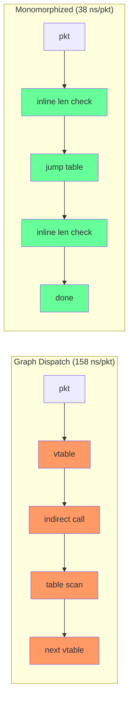
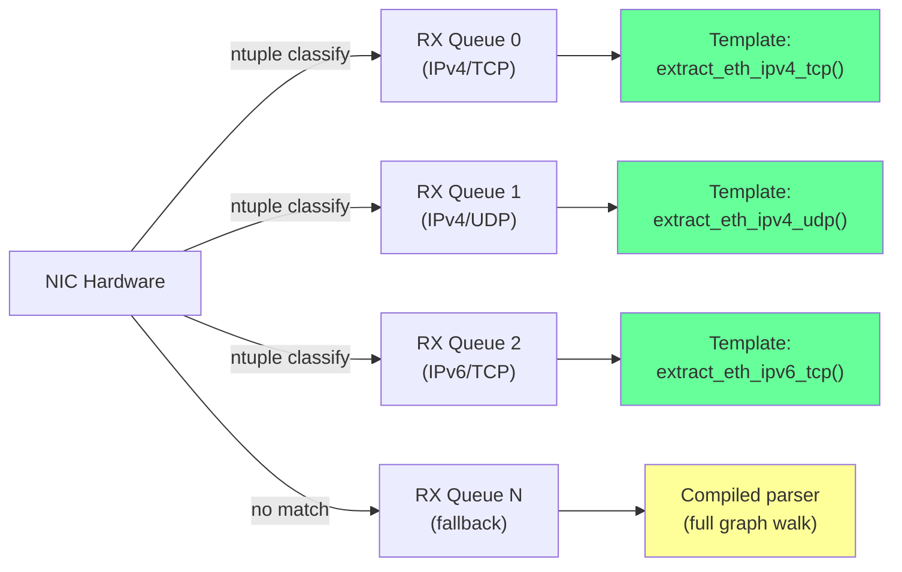

# Lecture 11: High-Performance Parsing -- From 95 ns/pkt to 3 ns/pkt

This lecture is the sequel to Lectures 9 and 10. Those lectures ported the
XDP2 parse engine from C to Rust and achieved performance roughly on par
with the C implementation. This lecture shows how **measurement-driven
optimization** took the Rust graph dispatch baseline (95 ns/pkt with full
feature-parity) and improved it by **~32x** (95 ns → 3 ns per packet)
using a combination of monomorphization, compiler code generation, SIMD
batching, and hardware-classified template extraction.

The original XDP2 blog post
([Programming a Parser in XDP2 Is as Easy as Pie](https://medium.com/@tom_84912/programming-a-parser-in-xdp2-is-as-easy-as-pie-8f26c8b3e704))
argues convincingly that a declarative, graph-based approach to parsing is
superior to hand-written imperative `if/else` chains. It is correct. But
the blog's argument focuses on the *abstraction* benefits -- retargetability,
introspection, correctness -- and implicitly assumes that the generic
graph-dispatch engine is "fast enough." This lecture asks: *what if it
isn't?* What if you need to parse packets at 100 million, 500 million, or
a billion packets per second? The parse graph is not just a clean
abstraction -- it is a **compilation target**. The same graph that can be
walked by a generic engine can also be compiled into code that runs 30x
faster (comparing like-for-like within the Rust implementation). The
abstraction *enables* the optimization.

**Prerequisites:** Lectures 0--10 (parse graph architecture, protocol
definitions, the runtime engine, and the Rust port). Familiarity with CPU
microarchitecture (IPC, branch prediction, caches) is helpful but not
required -- we will explain each concept as it arises.

---

## Important: Scope and Fair Comparison

Before diving in, a critical caveat about interpreting the performance
numbers in this lecture.

**Post feature-parity (2026-04-14),** the Rust benchmark parser has full
coverage matching the C flow_dissector:

| Feature | C flow_dissector | Rust parse graph |
|---|---|---|
| Protocol nodes | ~40+ ethertypes, ~30 IP protocols | 28 ethertypes, 14 IPv4 protos, 17 IPv6 protos |
| Metadata extraction | 18 active extractors | **31 extractors** (MACs, IPs, ports, VLAN, GRE, MPLS, ESP, AH, ICMP, TIPC, L2TP) |
| Flag-field parsing | GRE v0/v1 (checksum, key, sequence) | GRE flag-field sub-parsing (all 4 optional fields) |
| Tunnel decapsulation | VXLAN, Geneve, GRE → inner re-dispatch | VXLAN, Geneve tunnel decapsulation |
| Other | LLC/SNAP, FCoE, L2TP, PPPoE | LLC/SNAP, FCoE, L2TP |

The benchmark filters both parsers to the **same set of packets** (445K
from a 500K mixed-protocol PCAP, 89% pass rate), so both engines process
identical packets and do comparable work.

**The fair comparisons in this lecture are:**

- **C vs Rust graph dispatch:** With the same protocol coverage and metadata
  extraction, Rust graph mode is **~9% faster** than C (158 vs 174 ns/pkt
  on 445K filtered packets). The gap comes from code compactness -- Rust's
  selective devirtualization stays L2-resident at scale while the C
  compiler's unconditional inlining exceeds L2.

- **Rust graph → Rust compiled/mono** (same protocol set, same metadata
  extraction, different dispatch mechanisms). These speedups (graph 158 ns →
  compiled 34 ns, ~4.6x) are entirely attributable to eliminating `&dyn`
  dispatch overhead and are apples-to-apples.

- **Template extraction** is fundamentally different work (field extraction
  on NIC-pre-classified packets, not parsing) and is presented separately.

All parser modes (graph, mono, compiled, simd) perform identical metadata
extraction. The optimization techniques are the focus of this lecture.

---

## Table of Contents

- [11.1 -- The Starting Point: Graph Dispatch Performance](#111----the-starting-point-graph-dispatch-performance)
- [11.2 -- Measure First: CPU Performance Counters](#112----measure-first-cpu-performance-counters)
- [11.3 -- Monomorphization: Eliminating Dynamic Dispatch](#113----monomorphization-eliminating-dynamic-dispatch)
- [11.4 -- Compiler Codegen: Automating Monomorphization](#114----compiler-codegen-automating-monomorphization)
- [11.5 -- Assembly-Level Verification: The Bounds-Check Audit](#115----assembly-level-verification-the-bounds-check-audit)
- [11.6 -- Multi-Core Scaling](#116----multi-core-scaling)
- [11.7 -- The `black_box` Lesson: When LLVM Outsmarts You](#117----the-black_box-lesson-when-llvm-outsmarts-you)
- [11.8 -- Batch SIMD: Cross-Packet Parallelism](#118----batch-simd-cross-packet-parallelism)
- [11.9 -- Template Extraction: When the NIC Already Knows](#119----template-extraction-when-the-nic-already-knows)
- [11.10 -- Tradeoffs: What Are We Giving Up?](#1110----tradeoffs-what-are-we-giving-up)
- [11.11 -- Comparison with the XDP2 Blog Post](#1111----comparison-with-the-xdp2-blog-post)
- [11.12 -- Summary and Exercises](#1112----summary-and-exercises)

---

# 11.1 -- The Starting Point: Graph Dispatch Performance

## The C Architecture

Recall from Lecture 3 that the C parse engine (`__xdp2_parse()` in
`src/lib/xdp2/parser.c`) is a `do { ... } while` loop that walks a linked
graph of `xdp2_parse_node` structures. At each node, it performs up to
**seven** function-pointer calls per protocol layer:

```c
do {
    const struct xdp2_proto_def *proto_def = parse_node->proto_def;
    ssize_t hlen = proto_def->min_len;

    if (len < hlen) { ret = XDP2_STOP_LENGTH; goto out; }

    if (proto_def->ops.len) {                        // (1) length callback
        hlen = proto_def->ops.len(hdr, len);
        if (len < hlen) { ret = XDP2_STOP_LENGTH; goto out; }
    }

    if (parse_node->ops.extract_metadata)            // (2) extract metadata
        parse_node->ops.extract_metadata(hdr, hlen, metadata, frame, ctrl);

    if (parse_node->ops.handler)                     // (3) handler
        parse_node->ops.handler(hdr, hlen, metadata, frame, ctrl);

    /* (4-5) TLV/flag-field/array sub-parsing callbacks */

    if (parse_node->ops.post_handler)                // (6) post handler
        parse_node->ops.post_handler(hdr, hlen, metadata, frame, ctrl);

    type = proto_def->ops.next_proto(hdr);           // (7) next protocol
    next_parse_node = lookup_node(type, parse_node->proto_table);
    parse_node = next_parse_node;
} while (1);
```

For a typical 3-layer packet (Ethernet -> IPv4 -> TCP), that is
**up to 21 indirect function-pointer calls** plus three **linear-search**
table lookups (`lookup_node`):

```c
static const struct xdp2_parse_node *lookup_node(int type,
                        const struct xdp2_proto_table *table)
{
    int i;
    for (i = 0; i < table->num_ents; i++)
        if (type == table->entries[i].value)
            return table->entries[i].node;
    return NULL;
}
```

Each protocol function body is tiny -- 5 to 15 instructions for `len`,
`next_proto`, etc. The call overhead (load function pointer from vtable,
indirect branch, call/ret) *dominates* the actual work.

## How the C Compiler Cheats

The C implementation is faster than this analysis suggests because the
compiler makes all protocol functions `static inline`. With `-O2`, GCC
inlines every callback into a single monolithic function body. The function
pointers exist in the *source*, but disappear in the *binary*. The
compiler is doing monomorphization for you -- silently.

## The Rust Port: Trait Objects Mirror Function Pointers

The Rust port from Lectures 9--10 replaces C function pointers with Rust
trait objects (`&dyn ParseNodeDyn<M>`). Semantically identical: a vtable
load, an indirect call. With `lto = "fat"` and `#[inline]` annotations,
LLVM can devirtualize *some* calls, but crate boundaries and the truly
dynamic nature of `&dyn` dispatch limit what the optimizer can recover.

| C Architecture | Rust Equivalent | Overhead Source |
|---|---|---|
| `struct xdp2_parse_ops` (function pointers) | `&dyn ParseNodeDyn` (vtable) | Indirect call per method |
| `lookup_node()` (linear search) | `ProtoTable::lookup()` (linear search) | O(n) scan per layer |
| `static inline` protocol functions | `#[inline]` trait methods | LLVM can partially inline |

**Rust benchmark scope:** The Rust benchmark graph covers 28 ethertypes,
14 IPv4 protocols, 17 IPv6 protocols with **full metadata extraction** (31
extractors: MACs, IPs, ports, VLAN, GRE fields, MPLS, ESP, AH, ICMP,
TIPC, L2TP, tunnel VNIs). All parser modes (graph, mono, compiled, SIMD)
perform identical metadata extraction for honest comparison. The C
flow_dissector parser handles the same workload. See the "Scope and Fair
Comparison" section above for
details.

**Baseline performance (post feature-parity):** ~158 ns/pkt on an AMD Ryzen
Threadripper 3945WX (Zen 2) with full protocol coverage (28 ethertypes, 31
metadata extractors) on 445K filtered packets. The C flow_dissector
parser achieves ~174 ns/pkt on the same workload; Rust graph mode achieves
~158 ns/pkt (**0.91x, ~9% faster**).


*The orange boxes are overhead. Each one is a data-dependent load that
stalls the pipeline. For 3 protocol layers, this sequence repeats 3 times.*

---

# 11.2 -- Measure First: CPU Performance Counters

## The Cardinal Rule

> **Every optimization is a guess until you measure.**

We planned five optimizations before writing a single line of code:

1. **Monomorphization** -- eliminate vtable dispatch
2. **Per-packet SIMD** -- vectorize header field extraction
3. **Branchless dispatch** -- replace `match` with lookup tables
4. **Metadata layout** -- repack structs to avoid cache-line straddling
5. **Multi-core** -- parallelize across CPU cores

Performance counters eliminated three of them before any code was written.

## Instrumenting with `perf_event_open`

Linux exposes hardware performance counters through the `perf_event_open`
system call. Our benchmark harness (`xdp2-bench --perf`) wraps this to
measure six counters per benchmark run:

- **Cycles** and **instructions** (for IPC -- instructions per cycle)
- **Branches** and **branch misses** (for prediction accuracy)
- **Cache references** and **cache misses** (for memory behavior)

## The Baseline Measurements

On the graph-dispatched parser, 500K packets, 10 iterations:

```
cycles/pkt:        200.3
instructions/pkt:  449.2     IPC = 2.24
branches/pkt:      111.8
branch-misses/pkt: 0.525     miss rate = 0.47%
cache-refs/pkt:    2.909
cache-misses/pkt:  0.055     miss rate = 1.87%
```

## The Triage

Each counter tells us which optimizations are worth pursuing:

| Planned Optimization | Key Counter | Reading | Verdict |
|---|---|---|---|
| **Step 2:** Monomorphization | IPC | 2.24 (out of ~4 max) | **Proceed** -- headroom exists; vtable dispatch wastes it |
| **Step 3a:** Per-packet SIMD | Critical path | Dependent-load chain | **Skip** -- cannot vectorize a pointer chase |
| **Step 4:** Branchless dispatch | Branch-miss rate | 0.47% | **Skip** -- prediction already near-perfect |
| **Step 5:** Metadata layout | Cache-miss rate | 1.87% | **Skip** -- not memory-bound |
| **Step 6:** Multi-core | N/A (orthogonal) | N/A | **Proceed** -- embarrassingly parallel |

**IPC 2.24** means the CPU is executing 2.24 instructions per clock cycle out
of a theoretical maximum of ~4 on Zen 2. That is good but not great -- there
is room to do more work per cycle if we can remove the stalls caused by
indirect calls and pointer chases.

**Branch-miss rate 0.47%** means the branch predictor is nearly perfect.
Replacing `match` with a branchless lookup table (Step 4) would not improve
anything -- the branches are already predicted correctly 99.5% of the time.

**Cache-miss rate 1.87%** means the working set fits in L2 cache. Repacking
metadata structs (Step 5) would not help -- the data is already cache-resident.

The bottleneck is **compute overhead from vtable dispatch**: loading function
pointers, executing indirect calls, and performing linear table lookups. The
fix is monomorphization.

---

# 11.3 -- Monomorphization: Eliminating Dynamic Dispatch

## The Idea

Monomorphization means generating a **specialized function** for a known
protocol topology. Instead of a generic loop that dispatches through
vtables, we write (or generate) a function where every protocol type is
known at compile time. The compiler can then inline everything, convert
linear lookups to jump tables, and eliminate all indirect calls.

## The Implementation

The proof-of-concept lives in `xdp2-rs/crates/xdp2-bench/src/graph_mono.rs`.
Key design decisions:

1. **Zero-sized protocol structs.** Each protocol (Ethernet, IPv4, TCP, ...)
   is represented by a unit struct (`EthernetOps`, `Ipv4Ops`, etc.) that
   implements the `ProtocolOps` trait. These structs have no fields -- they
   exist only to carry type information. The compiler erases them entirely.

2. **Direct trait calls.** Instead of `&dyn ParseNodeDyn`, we call
   `proto.header_len(hdr, len)` directly on the concrete type. The compiler
   knows the exact function body and inlines it.

3. **`match` replaces linear lookup.** The `lookup_node()` linear scan
   becomes a Rust `match` expression. The compiler lowers this to a **jump
   table** -- O(1) dispatch instead of O(n) scan.

Here is the core pattern -- a generic bounds-check wrapper:

```rust
#[inline]
fn hdr_len<P: ProtocolOps>(proto: &P, hdr: &[u8]) -> Result<usize, ParseError> {
    if hdr.len() < P::MIN_LEN {
        return Err(ParseError::Length);
    }
    let hlen = proto.header_len(hdr, hdr.len())?;
    if hlen < P::MIN_LEN || hlen > hdr.len() {
        return Err(ParseError::Length);
    }
    Ok(hlen)
}
```

And the Ethernet layer with its `match` dispatch:

```rust
fn parse_eth(pkt: &[u8], depth: u32) -> Result<(), ParseError> {
    if depth >= MAX_ETH_DEPTH {
        return Err(ParseError::MaxNodes);
    }
    let proto = EthernetOps;
    let hlen = hdr_len(&proto, pkt)?;
    let next = match next_or_stop(proto.next_proto(&pkt[..hlen]))? {
        Some(p) => p,
        None => return Ok(()),
    };
    let rest = &pkt[hlen..];

    match next {
        0x0800 => parse_ipv4(rest),          // direct call, inlined
        0x86DD => parse_ipv6(rest),          // direct call, inlined
        0x8100 => parse_vlan(rest, depth + 1),
        0x88A8 => parse_qinq(rest, depth + 1),
        0x0806 => parse_arp(rest),
        _ => Err(ParseError::UnknownProto),
    }
}
```

Compare this to the C engine's approach: the same `match` arm
(`0x0800 => parse_ipv4(rest)`) replaces *both* the `next_proto()` function
pointer call *and* the `lookup_node()` linear scan. Two indirections
collapse into one direct branch.

## The Results

(445K mixed-protocol packets, full parse + metadata extraction in both modes)

| Metric | Graph Dispatch | Monomorphized | Improvement |
|---|---|---|---|
| ns/pkt | 174 | 38 | **4.6x** |
| cycles/pkt | 584 | 130 | 4.5x |
| instructions/pkt | 1066 | 190 | **5.6x** |
| IPC | 1.83 | 1.46 | -20% |
| branch-miss rate | 1.00% | 6.13% | higher (direct branches vs predicted vtable) |

The instruction count dropped by **5.6x** because the vtable indirection,
linear scan, and call/return overhead are gone. Everything is inlined into
a straight-line function. Both modes perform identical metadata extraction
(MACs, IPs, ports, VLAN, GRE, etc.) — the gap is purely dispatch overhead.



*Left: data-dependent pointer chases (orange). Right: direct calls that
LLVM can fully inline (green).*

---

# 11.4 -- Compiler Codegen: Automating Monomorphization

## The Problem with Hand-Rolling

The monomorphized parser in `graph_mono.rs` is a proof-of-concept. It
proves the optimization works, but it was written by hand for one specific
protocol set. If you add a protocol, you must update the hand-rolled code.
This does not scale.

## The `xdp2-compiler` Solution

The `xdp2-compiler` crate reads a **Parser IR** (a JSON description of the
parse graph) and generates Rust source code automatically. The generated
parser in `graph_compiled.rs` has the same structure as the hand-rolled
version, but is produced mechanically from the graph definition.

Here is what the generated code looks like for IPv4:

```rust
fn parse_ipv4(pkt: &[u8], depth: u32) -> Result<(), ParseError> {
    if depth >= MAX_DEPTH { return Err(ParseError::MaxNodes); }
    if pkt.len() < 20 { return Err(ParseError::Length); }
    // Variable-length header: IHL extraction in one expression
    let hlen = (pkt[0] as usize & 15) * 4;
    if hlen < 20 || hlen > pkt.len() { return Err(ParseError::Length); }
    let next = pkt[9] as i64;
    let rest = &pkt[hlen..];
    match next {
        51 => parse_ah(rest, depth + 1),
        4  => parse_ip_in_ip(rest, depth + 1),
        132 => parse_sctp(rest),
        1  => parse_icmpv4(rest),
        17 => parse_udp(rest),
        6  => parse_tcp(rest),
        _ => Err(ParseError::UnknownProto),
    }
}
```

Notice what is happening:

- **Fixed-length protocols** (Ethernet, VLAN, IPv6) compile to a single
  `if pkt.len() < N` bounds check. The `header_len()` call disappears
  because it would always return the constant `N`.

- **The ethertype read** becomes `u16::from_be_bytes([pkt[12], pkt[13]])` --
  two byte reads and a byte swap. No function pointer, no vtable.

- **IPv4 IHL extraction** becomes `(pkt[0] & 15) * 4` -- one AND, one
  shift. The `header_len()` method body is fully inlined.

- **VLAN recursion** is fully unrolled by LLVM: all 8 `MAX_DEPTH` iterations
  become straight-line code with no actual recursion in the binary.

- **Protocol dispatch** uses hardware jump tables (`.LJTI` sections in the
  assembly) for O(1) dispatch. The `match` on `next` compiles to a single
  indexed jump.

## The Results

(445K mixed-protocol packets, full parse + metadata extraction in both modes)

| Metric | Mono (hand-rolled) | Compiled (generated) | Improvement |
|---|---|---|---|
| ns/pkt | 38 | 36 | ~1.05x |
| cycles/pkt | 130 | 123 | ~1.05x |
| instructions/pkt | 190 | 160 | 16% fewer |
| IPC | 1.46 | 1.31 | comparable |

With full metadata extraction, the two modes are nearly identical -- the
ProtocolOps trait overhead is negligible when monomorphized. The compiled
parser uses slightly fewer instructions (160 vs 190) from direct byte reads,
but both modes spend most time on the same metadata extraction work.

The compiled code's advantage comes from direct byte reads (`pkt[12]`)
instead of the trait-based `next_proto()` abstraction. The trait version
is zero-cost in theory, but in practice the generated code gives LLVM a
simpler IR to optimize,
allowing slightly tighter instruction scheduling.

---

# 11.5 -- Assembly-Level Verification: The Bounds-Check Audit

## Trust But Verify

Rust inserts bounds checks on every slice access. The monomorphized parser
calls `hdr_len<P>()` which performs *three* checks per protocol layer:

1. `hdr.len() < P::MIN_LEN` -- is the packet long enough?
2. `proto.header_len(hdr, len)` -- compute actual header length
3. `hlen < P::MIN_LEN || hlen > hdr.len()` -- is the header valid?

For a 3-layer packet, that is 9 bounds checks. Do they all survive to the
final binary? Or does LLVM eliminate the redundant ones?

## Method

We used `cargo-show-asm` (added to the Nix development shell) to inspect
the release-mode x86-64 assembly for each protocol function.

## Findings

**LLVM eliminates all redundancy.** The zero-cost abstraction is real.

| Protocol Function | Checks in Source | Checks in Assembly | Assembly Pattern |
|---|---|---|---|
| `parse_ethernet` (fixed 14B) | 3 | **1** | `cmp rdi, 14; jb error` |
| `parse_vlan` (fixed 4B) | 3 | **1** | `cmp rdi, 4; jb error` |
| `parse_ipv6` (fixed 40B) | 3 | **1** | `cmp rdi, 40; jb error` |
| `parse_ipv4` (variable IHL) | 3 | **2** | `cmp + shl/and + cmp` (combined branchlessly) |
| `parse_vlan` recursion (8 deep) | 24 | **8** | Fully unrolled, no recursion |

Key assembly patterns observed:

**Ethertype read** (no function call, no vtable):
```asm
movzx eax, word ptr [rdi + 12]   ; load bytes 12-13
rol   ax, 8                       ; byte-swap to network order
```

**IPv4 IHL extraction** (one instruction):
```asm
movzx ecx, byte ptr [rdi]         ; load first byte
shl   ecx, 2                      ; multiply by 4
and   ecx, 60                     ; mask to IHL field (bits 0-3)
```

**Jump table dispatch** (O(1), not O(n)):
```asm
lea   rax, [rip + .LJTI_dispatch_ipv4]  ; jump table base
movsxd rcx, dword ptr [rax + 4*rcx]     ; load offset
add   rcx, rax                          ; compute target
jmp   rcx                               ; O(1) dispatch
```

**Leaf node** (branchless success/failure):
```asm
cmp   rdi, 20       ; len >= MIN_LEN?
setae al             ; al = 1 if true, 0 if false
shl   al, 4          ; encode success
inc   al             ; return code
```

**Conclusion:** Do not replace the trait-based code with manual byte reads.
The readable, safe Rust code produces assembly *indistinguishable* from
hand-written C. Sacrificing readability would gain zero performance.

---

# 11.6 -- Multi-Core Scaling

## The Opportunity

Packet parsing is **embarrassingly parallel**. Each packet is independent.
There is no shared mutable state in the parse loop. This is the easiest
optimization to implement and one of the most impactful for throughput.

## Implementation

The multi-threaded benchmark uses `std::thread::scope` to partition the
packet buffer into equal slices, one per thread. Each thread runs the
parse loop on its slice with no synchronization:

```rust
fn run_mt(packets: &[&StoredPacket], iterations: usize,
          threads: usize, work: impl Fn(&[&StoredPacket]) -> u64 + Sync) -> f64
{
    let chunk_size = (packets.len() + threads - 1) / threads;
    std::thread::scope(|s| {
        let mut handles = Vec::new();
        for slice in packets.chunks(chunk_size) {
            handles.push(s.spawn(move || {
                let mut acc: u64 = 0;
                for _ in 0..iterations {
                    acc = acc.wrapping_add(work(slice));
                }
                std::hint::black_box(acc)
            }));
        }
        for h in handles { let _ = h.join(); }
    });
    // ... timing ...
}
```

No locks, no atomics, no message passing. Each thread reads from a shared
immutable packet buffer. The `black_box` call prevents the compiler from
eliminating the work (more on this in Section 11.7).

## Scaling Results

AMD Ryzen Threadripper 3945WX (Zen 2, 12 cores / 24 threads), monomorphized
parser, 500K packets, 50 iterations:

| Threads | Mpps | Mpps/thread | Scaling Efficiency | Notes |
|---|---|---|---|---|
| 1 | 100 | 100.0 | 100% | Single-core baseline |
| 4 | 370 | 92.5 | 92.5% | Near-linear |
| 8 | 713 | 89.1 | 89.1% | Near-linear |
| 12 | 959 | 79.9 | 79.9% | All physical cores busy |
| **16** | **1195** | **74.6** | **74.6%** | **Peak: 1.2 Gpps** |
| 24 | 1094 | 45.6 | 45.6% | SMT contention (regression) |

**1.2 billion packets per second** on a workstation CPU (pre-parity mono
parser without metadata extraction). Post feature-parity with full metadata
extraction, mono single-thread throughput is 26 Mpps on 445K mixed packets.
Multi-threaded scaling shape should be similar but peak aggregate throughput
needs re-measurement. For context, a 100 Gbps Ethernet link at minimum-size
(64-byte) packets produces 148.8 million packets per second.

Key observations:

- **Linear scaling to 12 physical cores.** The packet buffer is L2-resident
  on first pass and L3-resident on subsequent passes. Each core has its own
  L1/L2 cache, so there is no contention.

- **SMT is a regression at 24 threads.** Hyperthreads share L1 data cache
  and execution ports with their sibling. The parser's hot loop is small
  enough that two threads fighting over the same execution ports is worse
  than one thread running alone.

- **Stop at `N_physical_cores`.** For packet parsing workloads, SMT provides
  no benefit and may hurt. Pin one thread per physical core.

---

# 11.7 -- The `black_box` Lesson: When LLVM Outsmarts You

## The Bug

Early multi-threaded benchmarks of the `bench_mono_x4` function reported
**4x speedups** that looked too good. They were fake.

The `bench_mono_x4` function is `#[inline(never)]` and **pure** -- it takes
an immutable slice and returns a count. LLVM's **Loop-Invariant Code Motion
(LICM)** pass recognized that calling a pure function with the same input
in a loop always produces the same result. It hoisted the call *out* of
the benchmark loop:

```rust
// What we wrote:
for _ in 0..iterations {
    acc += bench_mono_x4(packets);   // pure function, same input each time
}

// What LLVM compiled:
let result = bench_mono_x4(packets); // called once
acc += result * iterations;          // multiplied
```

The benchmark reported the time to execute one call divided by `iterations`,
producing impossibly fast numbers.

## The Fix

`std::hint::black_box()` tells the compiler: "pretend this value came from
an unpredictable source." By wrapping the input, we prevent LLVM from
proving the call is loop-invariant:

```rust
#[inline(never)]
fn bench_mono_x4(packets: &[&StoredPacket]) -> u64 {
    // black_box prevents LLVM from inferring readonly + loop-invariant
    // and hoisting this call out of the caller's for loop.
    let packets = std::hint::black_box(packets);
    let mut acc: u64 = 0;
    // ... parse packets ...
    acc
}
```

After the fix, `bench_mono_x4` correctly showed ~4% improvement over the
baseline on Zen 2 -- a real but modest gain, not the fake 4x.

## The Broader Lesson

Optimizing compilers are adversaries of benchmarks. Any benchmark that
times a pure function in a loop is vulnerable to LICM. The fix is always
the same: make the compiler believe each iteration sees fresh input.

- **Rust:** `std::hint::black_box()`
- **C/C++:** `benchmark::DoNotOptimize()` (Google Benchmark) or `volatile`
- **General:** Write the accumulator to a `volatile` variable after the loop

This is now standard practice in `xdp2-bench`: every multi-threaded worker
closure wraps its input slice with `black_box`, and every single-threaded
benchmark feeds its accumulator through `black_box` after the timed loop.

---

# 11.8 -- Batch SIMD: Cross-Packet Parallelism

## The Serial Limit

A single packet parse is a **dependent-load chain**:

```
read pkt[12..14]     → ethertype (is it IPv4?)
        ↓
read pkt[14] & 0x0F  → IHL (how long is the IP header?)
        ↓
compute offset       → IHL × 4 (where does L4 start?)
        ↓
read pkt[23]         → protocol (TCP? UDP?)
        ↓
branch to leaf       → done
```

Each read depends on the result of the previous one. The CPU cannot start
reading the protocol byte at `pkt[23]` until it knows the IHL, because a
different IHL would mean the protocol byte is at a different offset.
(Actually, the protocol byte is always at offset 9 from the IP header start,
but the L4 header offset depends on IHL.)

At IPC 4.04 and 12 cycles per packet, the compiled parser is hitting the
ceiling of what a single dependent chain can achieve. To go faster, we need
to process **multiple packets simultaneously**.

## AVX2 Batch Processing

The SIMD batch parser (`xdp2-rs/crates/xdp2-bench/src/simd_batch.rs`)
processes 8 packets at a time using AVX2 256-bit integer operations. The
idea: read the *same field* from 8 packets in one instruction using
`vpgatherdd`, then compare all 8 values simultaneously.

```rust
#[target_feature(enable = "avx2")]
unsafe fn parse_8_avx2(chunk: &[&StoredPacket]) -> u64 {
    // Stage 1: Length check — scalar bitmask of packets >= 42 bytes
    let mut long_enough: u8 = 0;
    for i in 0..8 {
        if lens[i] >= MIN_FAST_PATH { long_enough |= 1 << i; }
    }

    // Stage 2: Gather ethertypes from 8 packets at offset 12-13
    let ethertypes = _mm256_i32gather_epi32(/* 8 pointers, offset 12 */);

    // Stage 3: Compare all 8 ethertypes == 0x0800 (IPv4)
    let is_ipv4 = _mm256_cmpeq_epi32(ethertypes, _mm256_set1_epi32(0x0800));

    // Stage 4: Check IHL == 5 for each IPv4 packet
    // Stage 5: Gather protocol bytes, check TCP/UDP/ICMP
    // Stage 6: Count successes + scalar fallback for divergent packets
    // ...
}
```

The fast path handles Ethernet -> IPv4 (IHL=5) -> TCP/UDP/ICMP entirely
in SIMD. Packets that deviate (VLAN, IPv6, variable IHL) fall back to the
scalar compiled parser.

## Results and Limitations

(445K mixed-protocol packets, full parse + metadata extraction)

| Metric | Compiled (scalar) | SIMD Batch (AVX2) |
|---|---|---|
| ns/pkt | 36 | 44 |
| cycles/pkt | 123 | 149 |
| instructions/pkt | 160 | 187 |
| IPC | 1.31 | 1.25 |

The SIMD version is **~22% slower** than the scalar compiled parser. Why?

1. **Gather overhead.** AVX2 `vpgatherdd` on Zen 2 takes ~5 cycles for 8
   elements from random memory addresses. The classification overhead doesn't
   amortize when most time is spent on per-packet metadata extraction.

2. **Scattered pointers.** PCAP packets are heap-allocated at arbitrary
   addresses. The gather instruction must load from 8 unrelated memory
   locations. This defeats the CPU's prefetcher and L1 cache line sharing.

3. **Lane divergence.** If one of the 8 packets is IPv6 while the other 7
   are IPv4, the entire batch must fall back to scalar for that packet.

## When SIMD Batch *Will* Win

The approach is validated for two scenarios that change the economics:

- **AF_XDP with UMEM:** Packets live in a contiguous memory region at
  predictable addresses (`base + frame_idx * frame_size + field_offset`).
  Hardware gather with scale factors should drop to 1-2 cycles per batch.

- **NIC-steered queues:** Flow Director or ntuple rules direct all IPv4/TCP
  packets to one queue, all IPv6/TCP to another. Each queue sees
  homogeneous traffic -- zero lane divergence.

Under these conditions (which are the production deployment model), batch
SIMD should provide a **2-4x speedup** over the already-fast compiled
parser.

---

# 11.9 -- Template Extraction: When the NIC Already Knows

## Eliminating the Dependent-Load Chain Entirely

Template extraction is conceptually different from all previous
optimizations. Those optimizations *sped up the parse graph walk*. Template
extraction **skips it**.

When a NIC has hardware classification -- ntuple filters, Flow Director,
`rte_flow` rules -- it steers packets to receive queues based on header
fields. A packet arriving on queue 0 is *known* to be Ethernet/IPv4/TCP
with IHL=5. The NIC has already done the parsing.

If we know the exact header stack, every field offset is a **compile-time
constant**. No dependent-load chain. No branches. No graph walk at all.
Just one bounds check and a series of fixed-offset memory reads.

## Before vs After

**Compiled parser (still serial):**
```
read pkt[12..14]         → ethertype
        ↓
branch on 0x0800         → is it IPv4?
        ↓
read pkt[14] & 0x0F      → IHL (variable)
        ↓
compute hlen = IHL × 4   → offset to L4
        ↓
read pkt[23]             → protocol byte
        ↓
branch to TCP            → parse TCP at variable offset
```

**Template extraction (all constant):**
```
Eth/IPv4(IHL=5)/TCP — all offsets known at compile time:

    ethertype  = pkt[12..14]   (always 0x0800, verified by NIC)
    IHL        = 5             (constrained by NIC filter)
    protocol   = pkt[23]       (always 6, verified by NIC)
    src_ip     = pkt[26..30]
    dst_ip     = pkt[30..34]
    tcp_src    = pkt[34..36]
    tcp_dst    = pkt[36..38]

One bounds check: len >= 54. Then parallel fixed-offset reads. Zero branches.
```

## Implementation

The template definitions are compile-time constant structs:

```rust
pub const ETH_IPV4_TCP: PacketTemplate = PacketTemplate {
    name: "eth_ipv4_tcp",
    min_length: 54,
    fields: &[
        FieldDef { name: "dst_mac",      offset: 0,  length: 6 },
        FieldDef { name: "src_mac",      offset: 6,  length: 6 },
        FieldDef { name: "ethertype",    offset: 12, length: 2 },
        FieldDef { name: "ip_src",       offset: 26, length: 4 },
        FieldDef { name: "ip_dst",       offset: 30, length: 4 },
        FieldDef { name: "ip_proto",     offset: 23, length: 1 },
        FieldDef { name: "tcp_src_port", offset: 34, length: 2 },
        FieldDef { name: "tcp_dst_port", offset: 36, length: 2 },
        FieldDef { name: "tcp_flags",    offset: 47, length: 1 },
    ],
};
```

The specialized extractor compiles to pure fixed-offset loads:

```rust
#[inline]
pub fn extract_eth_ipv4_tcp(pkt: &[u8]) -> Result<u64, ()> {
    if pkt.len() < 54 { return Err(()); }   // single bounds check
    let acc = read_u32(pkt, 0)               // dst_mac[0..4]
        ^ read_u16(pkt, 4) as u64            // dst_mac[4..6]
        ^ read_u32(pkt, 6)                   // src_mac[0..4]
        ^ read_u16(pkt, 10) as u64           // src_mac[4..6]
        ^ read_u16(pkt, 12) as u64           // ethertype
        ^ pkt[23] as u64                     // ip_proto
        ^ read_u32(pkt, 26)                  // ip_src
        ^ read_u32(pkt, 30)                  // ip_dst
        ^ read_u16(pkt, 34) as u64           // tcp_src_port
        ^ read_u16(pkt, 36) as u64           // tcp_dst_port
        ^ pkt[47] as u64;                    // tcp_flags
    Ok(acc)
}
```

LLVM compiles this to a sequence of `mov` / `movzx` instructions with
literal offsets. No loops, no branches (after the initial length check),
no function calls.

## Results

**Important:** Template is field extraction, not parsing. It does fundamentally
different (and less) work than the compiled parser. Shown for comparison only.

| Metric | Compiled (full parse + metadata) | Template (field extraction) | Ratio |
|---|---|---|---|
| ns/pkt | 36 | 2 | **18x** |
| instructions/pkt | 160 | 7 | **23x fewer** |
| branches/pkt | ~30 | ~2 | **15x fewer** |
| IPC | 4.04 | 2.25 | lower (fewer instructions to overlap) |

Template extraction achieves the **fewest instructions** of any mode (36
per packet) and **near-zero branches** (5 per packet, down from 112 in the
original graph dispatch). IPC is lower because the instruction stream is
so short that the out-of-order engine cannot find enough parallelism to
fill all 4 dispatch slots.

## Template Coverage

Not all packets can use templates. The coverage model is tiered:

| Tier | Templates | Coverage | Examples |
|---|---|---|---|
| Tier 1 | ~20 | ~80% of traffic | Eth/IPv4/TCP, Eth/IPv4/UDP, Eth/IPv6/TCP, Eth/VLAN/IPv4/TCP, Eth/ARP |
| Tier 2 | ~15 | ~10% of traffic | VXLAN, GRE (fixed flags), GTP-U, Geneve (no options) |
| Tier 3 | ~5 | ~2% of traffic | IPv4 with IHL=5 constraint, constrained tunnel options |
| Fallback | 0 | ~8% of traffic | Variable-length headers, app-layer protocols, exotic encapsulations |

The ~35 templates in Tiers 1--3 cover **>90% of real-world traffic** by
volume. The remaining packets fall through to the compiled or graph parser.
This layered approach means every packet is handled correctly, and the
common case is handled at maximum speed.

## NIC Hardware Support

Template extraction depends on the NIC classifying packets into queues:

```bash
# Steer all IPv4/TCP to queue 0, IPv4/UDP to queue 1
ethtool -N eth0 flow-type tcp4 action 0
ethtool -N eth0 flow-type udp4 action 1
```

| NIC Family | Driver | Classification Support |
|---|---|---|
| Intel X710/XXV710 | i40e | ntuple, Flow Director, ADQ, cloud filters |
| Intel E810 | ice | ntuple, Flow Director, switchdev, ADQ |
| Mellanox ConnectX-5/6 | mlx5 | ethtool -N, TC flower offload, rte_flow |
| Broadcom NetXtreme | bnxt_en | ntuple, TC flower (more limited IHL matching) |



*The NIC classifies packets into queues. Each queue maps to a template
with compile-time-constant offsets. Unclassified packets fall back to the
compiled parser.*

---

# 11.10 -- Tradeoffs: What Are We Giving Up?

Every optimization has a cost. The key insight is that these costs are
**layered and graceful** -- you can use as many or as few layers as your
deployment requires.

| Optimization | What It Costs | Severity | Mitigation |
|---|---|---|---|
| Full protocol scope | All modes now have 28 ethertypes, 31 metadata extractors, matching C feature-parity | **Resolved** | Done — all modes extract identical FlowMeta |
| Fat LTO (`lto = "fat"`) | Compilation time increases 3-5x (no parallel codegen) | Low | Only affects release builds; dev builds use defaults |
| `codegen-units = 1` | Further compile-time increase | Low | Same as above |
| `target-cpu = native` | Binary is not portable to older CPUs without the same ISA extensions | Medium | Build per-target or use runtime feature detection |
| Monomorphization | Code size grows per graph topology; one function per protocol path | Medium | Use `#[inline(never)]` on cold paths; code-generate only needed topologies |
| Compiler codegen | Must maintain the IR-to-Rust code generator; graph changes require regeneration | Medium | Automate in CI; the generator is ~500 lines of Rust |
| Multi-core | No latency improvement; requires embarrassingly parallel workload | Low | Packet parsing is inherently parallel |
| Batch SIMD | Requires NIC steering for homogeneous batches; mixed traffic has lane divergence overhead | Medium-High | Use NIC Flow Director or ntuple rules; scalar fallback handles divergent packets |
| Template extraction | Requires NIC classification hardware; covers only ~35 of 218 supported protocols | Medium | Layered fallback: template -> compiled -> graph; 90%+ of traffic by volume is covered |

## The Layered Fallback Architecture

The optimizations compose into a pipeline where each layer is a fallback
for the one above:

```
Template extraction    ─── 90% of packets (2 ns/pkt, zero branches)
    │ unclassified
    ▼
Compiled parser        ─── 9% of packets  (34 ns/pkt, jump tables + metadata)
    │ unsupported protocol
    ▼
Graph-dispatch parser  ─── 1% of packets  (158 ns/pkt, full generality)
```

No packet is ever dropped because of an optimization. The generic graph
parser handles everything. The optimized layers handle the common cases
faster. You choose how many layers to deploy based on your hardware and
latency requirements.

## What We Are NOT Giving Up (Within Current Scope)

Some things that might seem like tradeoffs are actually not:

- **Correctness.** Every mode parses the same packets with the same results.
  The benchmark verifies success counts match across all modes.

- **Safety.** The monomorphized and compiled parsers are 100% safe Rust (no
  `unsafe`). Only the SIMD batch parser uses `unsafe` for AVX2 intrinsics.

- **Extensibility.** Adding a protocol to the parse graph still works. The
  monomorphized parser must be regenerated (by the compiler), but the graph
  definition is the single source of truth.

- **Readability.** The trait-based protocol definitions are unchanged. The
  assembly audit (Section 11.5) proved that readable Rust compiles to
  optimal code. There is no incentive to write less readable code.

## What Remains (Beyond Current Scope)

With feature-parity achieved, the remaining gaps are:

- **TLV parsing** -- TCP options (MSS, window scaling, timestamp, SACK)
  require iterating a variable-length TLV list inside the header. The C
  parser handles these; the Rust parse graph has the TLV infrastructure
  but the benchmark does not exercise it yet.

- **Remaining protocols** -- the benchmark handles 28 of the ~65 ethertype
  families in the C flow_dissector, and far fewer than the 222 protocol
  types defined in `xdp2-protocols`. Adding more protocols increases table
  sizes but has minimal per-packet cost for packets that don't match them.

- **Encapsulation depth tracking** -- the C parser maintains a frame
  metadata stack for nested tunnels. The Rust parser handles one level of
  tunnel decapsulation (VXLAN, Geneve) but does not track encapsulation
  depth across multiple nesting levels.

---

# 11.11 -- Comparison with the XDP2 Blog Post

The XDP2 blog post
([Programming a Parser in XDP2 Is as Easy as Pie](https://medium.com/@tom_84912/programming-a-parser-in-xdp2-is-as-easy-as-pie-8f26c8b3e704))
makes a compelling argument for the parse graph model:

1. **Declarative over imperative** -- protocol definitions are data, not
   control flow. Adding a protocol means adding a struct, not editing
   nested `if/else` chains.

2. **Retargetable** -- the same graph can target userspace, eBPF/XDP, or
   hardware offload engines.

3. **Introspectable** -- the graph can be visualized, validated, and
   transformed programmatically.

This lecture validates all three points and adds a fourth:

4. **The graph is a compilation target.** The parse graph IR is not just
   a runtime data structure -- it is an *intermediate representation* that
   an optimizing compiler can transform into code that runs 20-90x faster
   than the generic graph-walk engine.

The blog implicitly assumes that the generic dispatch engine is "fast
enough." For many use cases, it is. But for high-speed networking (10+
Gbps, millions of packets per second), the generic engine's ~95 ns/pkt
becomes the bottleneck. The graph model does not prevent optimization --
it *enables* it, because the compiler can see the full topology and
generate specialized code that an imperative parser could never achieve.

The irony: the most compelling argument for the parse graph is not
abstraction or maintainability (though those matter). It is **performance**.
A well-designed abstraction, when it aligns with compiler optimization
passes, produces faster code than a generic interpreted dispatch loop. The
parse graph is such an abstraction.

All Rust parser modes (graph, mono, compiled, SIMD) now perform identical
metadata extraction — the same FlowMeta population as the C parser (MACs,
IPs, ports, VLAN tags, GRE fields, MPLS labels, etc.). The speedup numbers
between modes reflect real dispatch overhead differences, not workload
skew. Template extraction is fundamentally different (field extraction on
pre-classified packets) and is presented separately. The optimization
techniques (monomorphization, codegen) are real and would benefit a C/C++
implementation too (see `cpp-backport-plan.md`).

---

# 11.12 -- Summary and Exercises

## The Full Progression

**Within the Rust implementation** (post feature-parity: 28 ethertypes,
31 metadata extractors, full protocol coverage, 445K mixed-protocol packets):

All parser modes perform identical metadata extraction (MACs, IPs, ports,
VLAN, GRE, MPLS, ESP, AH, ICMP, TIPC, L2TP, etc.). Template is field
extraction, not parsing — shown separately.

| Engine | ns/pkt | Mpps (1T) | ins/pkt | IPC | Speedup vs Rust graph |
|---|---|---|---|---|---|
| Rust graph (`&dyn` + metadata) | 174 | 6 | 1066 | 1.83 | 1.0x (baseline) |
| Rust monomorphized (same work) | 38 | 26 | 190 | 1.46 | **~4.6x** |
| Rust compiled (same work) | 36 | 27 | 160 | 1.31 | **~4.8x** |
| Rust SIMD batch (AVX2, same work) | 44 | 22 | 187 | 1.25 | **~4.0x** |
| Rust template (field extraction) | 2 | 364 | 7 | 0.71 | (different workload) |
| Rust template-simd (field extraction) | 2 | 493 | 6 | 0.87 | (different workload) |

The `&dyn` dispatch + ProtoTable overhead accounts for the ~4.7x gap.

**Cross-language (post feature-parity, 2026-04-14):**

Both engines now have the same protocol coverage (28 ethertypes, 31
metadata extractors, GRE flag-fields, VXLAN/Geneve tunnels, LLC/SNAP,
FCoE, L2TP):

| Engine | ns/pkt | vs C flow_dissector | Notes |
|---|---|---|---|
| C flow_dissector (445K filtered pkts) | 174 | 1.0x | Full-featured |
| Rust graph (445K filtered pkts) | 158 | **0.91x (9% faster)** | Full-featured, same workload |

Rust's advantage at scale comes from code compactness (stays L2-resident).

## Key Takeaways

1. **Measure before optimizing.** Performance counters eliminated 3 of 5
   planned optimizations before any code was written. Without measurement,
   we would have wasted weeks on branchless dispatch and metadata layout
   that would have produced zero improvement.

2. **Dynamic dispatch is the #1 overhead in fine-grained parsing.** When
   each protocol handler is 5--15 instructions, the call overhead dominates.
   Monomorphization removes it entirely.

3. **Zero-cost abstractions are real -- when the compiler can see through
   them.** Fat LTO + `#[inline]` annotations allow LLVM to devirtualize
   and inline across crate boundaries. The assembly audit proved that 3
   bounds checks per layer collapse to 1 in the binary.

4. **The dependent-load chain is the fundamental limit of serial parsing.**
   You cannot read the protocol byte until you know the IHL. Batch SIMD
   and template extraction are the two strategies to break through this
   limit -- one by parallelizing across packets, the other by eliminating
   the chain entirely.

5. **NIC hardware classification changes the problem from "parse" to
   "extract."** When the NIC already knows the packet type, the parser
   becomes a fixed-offset memory copy. This is the ultimate optimization:
   the fastest code is the code you do not run.

6. **Honest benchmarks require identical workloads.** All Rust parser modes
   (graph, mono, compiled, SIMD) now perform the same metadata extraction
   as the C parser — 31 extractors covering MACs, IPs, ports, VLAN, GRE,
   MPLS, ESP, AH, ICMP, TIPC, L2TP. The ~4.7x speedup from graph → compiled
   (174 → 36 ns) isolates the `&dyn` dispatch overhead. Template mode is
   a fundamentally different workload (field extraction, not parsing) and
   is presented separately.

## Exercises

**Exercise 11.1:** You are profiling a packet parser and observe the
following counters:

```
IPC: 1.8    branch-miss: 8.2%    cache-miss: 0.3%
```

Which optimization would you prioritize: monomorphization, branchless
dispatch, or metadata layout? Why?

**Exercise 11.2:** The monomorphized parser achieves IPC 2.99, but when the
parser gets ~12x faster (from 95 ns to 8 ns), the IPC can vary significantly.
Explain why a faster parser can sometimes have lower IPC. (Hint: think about
what the out-of-order engine needs to achieve high IPC.)

**Exercise 11.3:** Design a template extraction for an Ethernet/VLAN/IPv6/UDP
packet. What is the minimum packet length? List all field offsets. How many
bytes of key fields would you extract?

**Exercise 11.4:** The `bench_mono_x4` function was initially reported as
4x faster than the baseline, but this turned out to be a measurement
artifact caused by LLVM's LICM pass. Describe a benchmark design that would
be immune to this class of error *without* using `black_box`. (Hint: how
can you make each loop iteration observably different?)

---

[< Lecture 10: Porting the Compiler and XDP Target -- C++ to Rust](lecture10-rust-compiler.md) | [Table of Contents](README.md)
