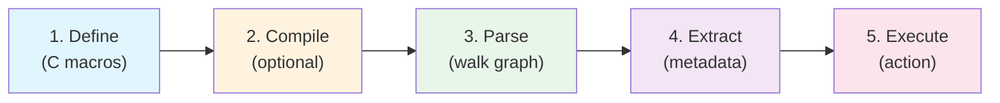
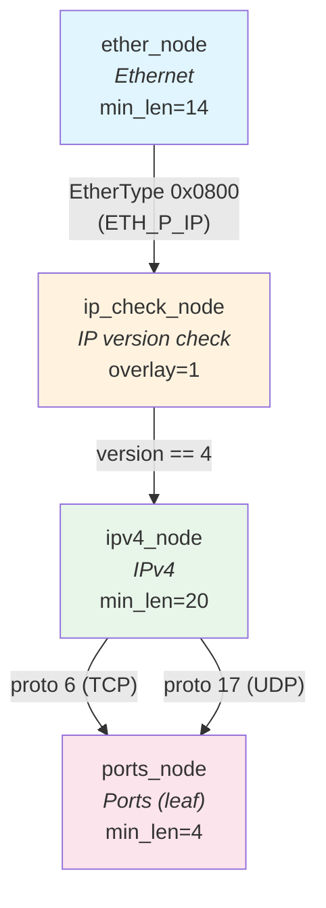
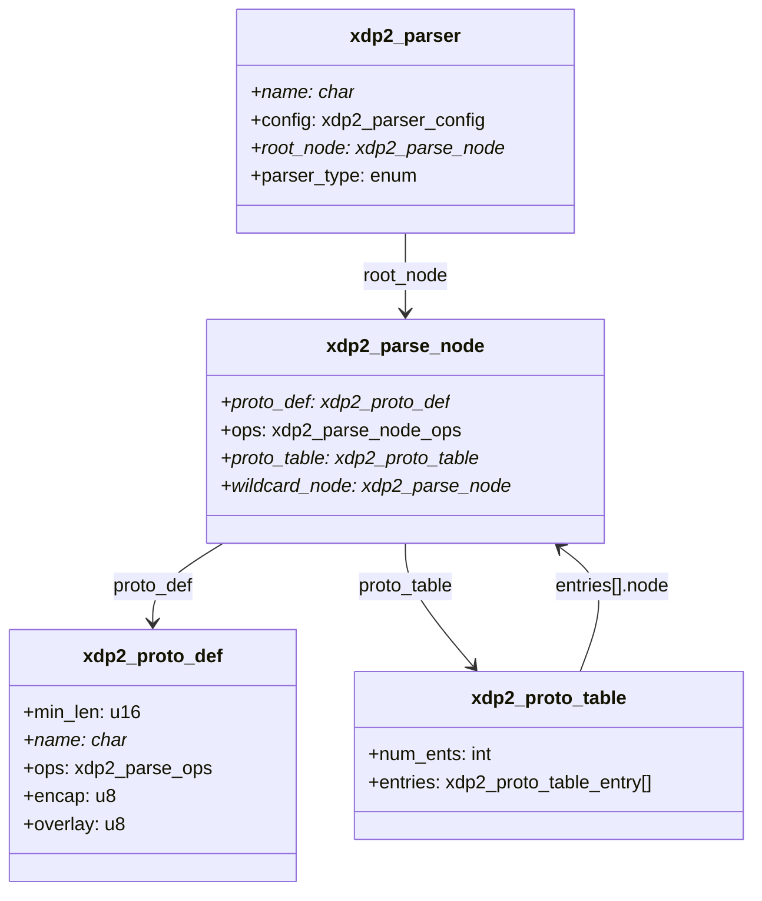
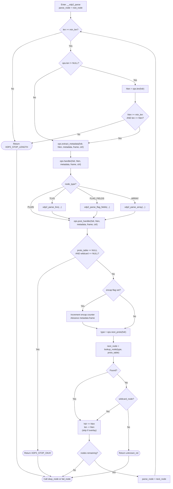
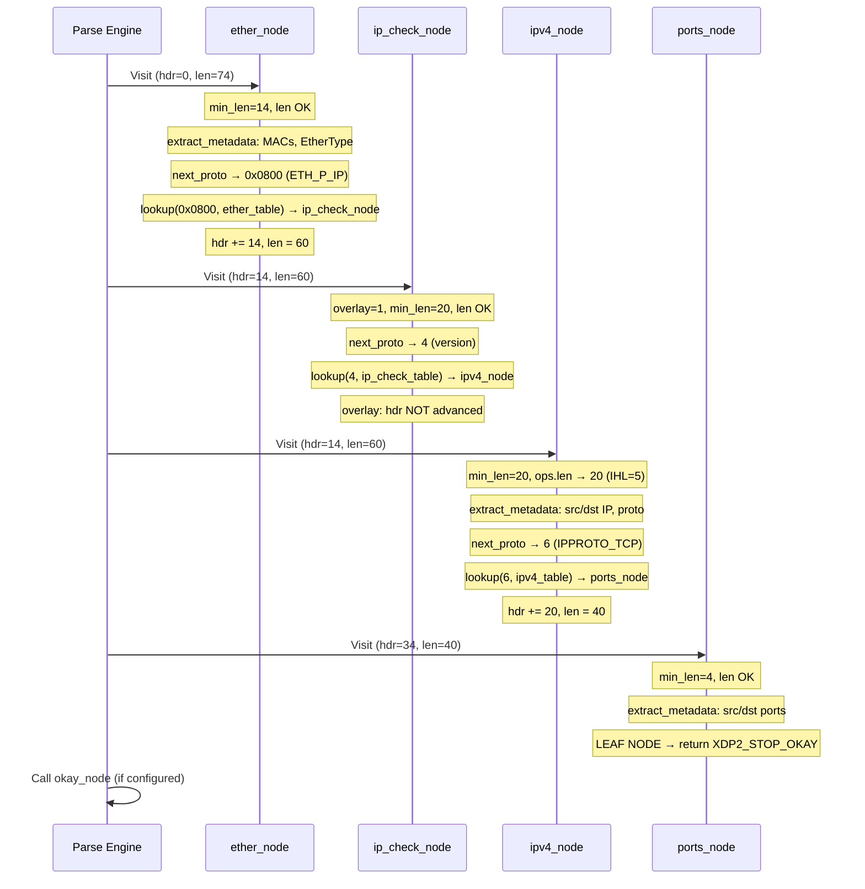
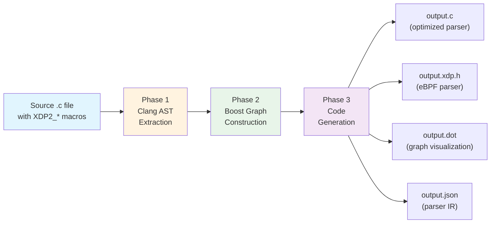
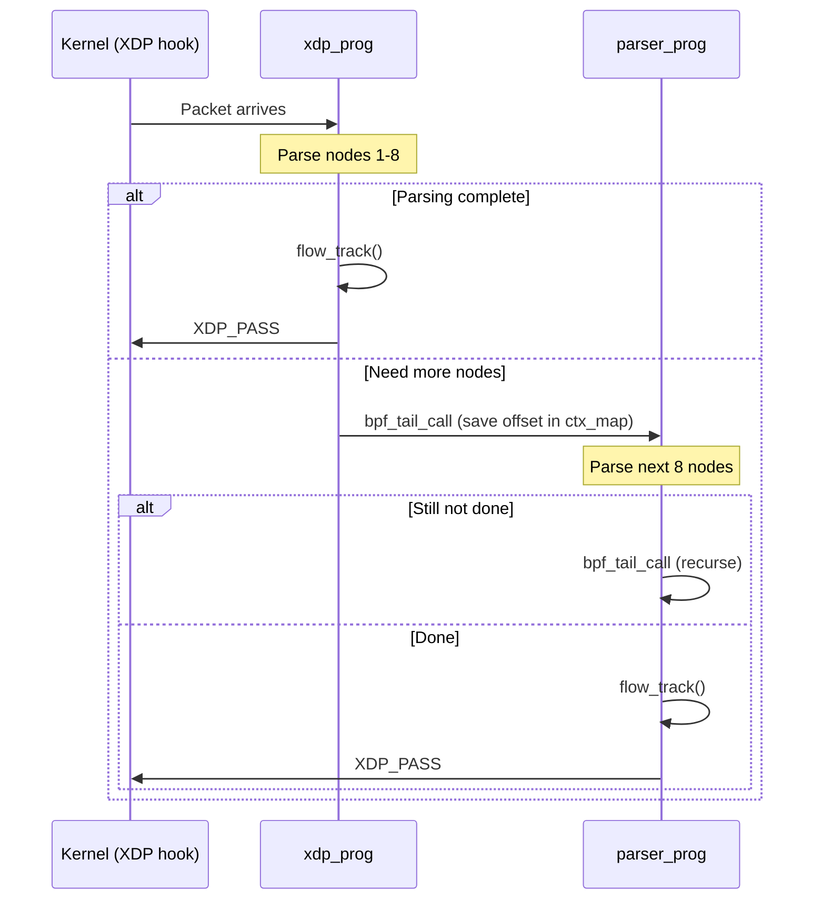
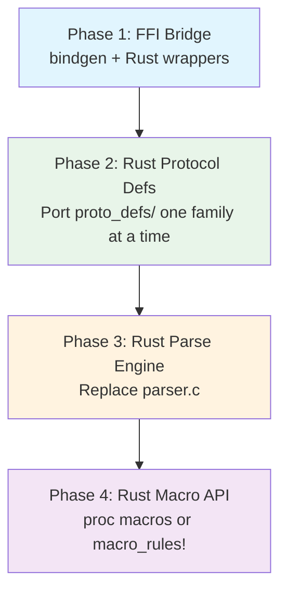

# XDP2: A Lecture Series on Parse-Graph-Based Packet Processing

This document describes the design and implementation of XDP2 in enough detail
that a reader could reimplement it from scratch. It is structured as a series
of eleven lectures (0--10), each covering one major phase or topic. The intended
audience is third-year computer science students with background in C, data
structures, and basic networking (OSI model, Ethernet, IP, TCP/UDP). Lectures
9 and 10 cover porting XDP2 from C/C++ to Rust.

---

## Table of Contents

- [Lecture 0: Orientation and Motivation](#lecture-0-orientation-and-motivation)
- [Lecture 1: Protocol Definitions -- The Vocabulary of Parsing](#lecture-1-protocol-definitions----the-vocabulary-of-parsing)
- [Lecture 2: Parse Nodes, Protocol Tables, and Parsers -- Building the Graph](#lecture-2-parse-nodes-protocol-tables-and-parsers----building-the-graph)
- [Lecture 3: The Runtime Parsing Engine -- Walking the Graph](#lecture-3-the-runtime-parsing-engine----walking-the-graph)
- [Lecture 4: Metadata Extraction and Advanced Node Types](#lecture-4-metadata-extraction-and-advanced-node-types)
- [Lecture 5: The Optimizing Compiler -- From Graph to Linear Code](#lecture-5-the-optimizing-compiler----from-graph-to-linear-code)
- [Lecture 6: The XDP/eBPF Target -- Kernel-Space Parsing](#lecture-6-the-xdpebpf-target----kernel-space-parsing)
- [Lecture 7: Worked Examples -- Packets Walking the Parse Graph](#lecture-7-worked-examples----packets-walking-the-parse-graph)
- [Lecture 8: Testing and Clean-Room Reimplementation Guide](#lecture-8-testing-and-clean-room-reimplementation-guide)
- [Lecture 9: Porting the Runtime -- C to Rust](#lecture-9-porting-the-runtime----c-to-rust)
- [Lecture 10: Porting the Compiler and XDP Target -- C++ to Rust](#lecture-10-porting-the-compiler-and-xdp-target----c-to-rust)

---

# Lecture 0: Orientation and Motivation

## 0.1 What is XDP2?

**XDP2 (eXpress DataPath 2)** is a programming model, framework, and set of C
libraries for high-performance datapath programming. It provides an API, an
optimizing compiler, test suites, and sample programs for packet and protocol
processing. XDP2 is a generalization of
[XDP (eXpress Data Path)](https://www.kernel.org/doc/html/latest/networking/af_xdp.html)
that extends beyond just Linux kernel eBPF to support programmable hardware and
software environments like DPDK.

The core source is in the [src/](../src/) directory. The project is licensed
under BSD-2-Clause-FreeBSD.

## 0.2 Why Declarative Parsing Beats Imperative Parsing

A traditional imperative packet parser looks like nested if/else chains:

```c
/* Imperative style -- hard to maintain, optimize, or retarget */
if (ethertype == ETH_P_IP) {
    struct iphdr *iph = data + 14;
    if (iph->protocol == IPPROTO_TCP) {
        struct tcphdr *th = data + 14 + iph->ihl * 4;
        /* ... extract ports ... */
    }
}
```

This approach has serious drawbacks:

| Problem | Consequence |
|---|---|
| Protocol logic is mixed with control flow | Adding a protocol means editing deeply nested code |
| Hard to optimize | Compiler cannot see the full set of possible paths |
| Single target | Code written for userspace cannot run in eBPF or hardware |
| No introspection | Cannot visualize, validate, or transform the parser |

XDP2 solves these problems by separating **what** to parse from **how** to
parse it. Protocol parsing is modeled as a **declarative data structure** --
the parse graph -- that can be walked by a generic engine, compiled to
optimized code, or mapped to hardware.

## 0.3 The Parse Graph Mental Model

A **parse graph** is a directed graph where:

- Each **node** represents one protocol layer (Ethernet, IPv4, TCP, ...)
- Each **edge** represents a transition from one layer to the next, labeled
  with a protocol number (EtherType, IP protocol number, ...)
- A **root node** is where parsing begins (typically Ethernet)
- **Leaf nodes** are where parsing terminates

The parse graph is equivalent to a Finite State Machine (FSM). Each node is a
state; transitions are determined by the protocol type field in the current
header. When the parser encounters a leaf node (no outgoing edges) or an
unknown protocol number, parsing stops.


*An example XDP2 parse graph. Nodes are protocol layers; edges are protocol
table lookups.*

## 0.4 The Five Phases of XDP2

XDP2 processes packets through five conceptual phases:



| Phase | What happens | Key files |
|---|---|---|
| **1. Define** | Programmer declares protocol nodes, tables, and metadata callbacks using C macros | [parser.h](../src/include/xdp2/parser.h), [proto_defs/](../src/include/xdp2/proto_defs/) |
| **2. Compile** | (Optional) The XDP2 compiler extracts the parse graph from the C AST and generates optimized or eBPF code | [tools/compiler/](../src/tools/compiler/) |
| **3. Parse** | The runtime engine walks the parse graph node by node for each packet | [lib/xdp2/parser.c](../src/lib/xdp2/parser.c) |
| **4. Extract** | Per-node callbacks copy protocol fields into a metadata structure | [parser_metadata.h](../src/include/xdp2/parser_metadata.h) |
| **5. Execute** | Application logic acts on the extracted metadata (flow tracking, filtering, etc.) | User code (e.g., [flow_tracker.h](../samples/xdp/flow_tracker_simple/flow_tracker.h)) |

## 0.5 Repository Map

```
xdp2/
├── src/                          Source code
│   ├── include/xdp2/             API headers
│   │   ├── parser.h              Parser macros and API
│   │   ├── parser_types.h        Core data structures
│   │   ├── parser_metadata.h     Metadata extraction templates
│   │   ├── proto_defs/           100+ protocol definitions
│   │   ├── tlvs.h                TLV parsing structures
│   │   ├── flag_fields.h         Flag-field parsing structures
│   │   └── arrays.h              Array parsing structures
│   ├── lib/xdp2/                 Library implementation
│   │   └── parser.c              Main parsing loop
│   ├── tools/compiler/           XDP2 optimizing compiler (C++)
│   ├── templates/                Code generation templates
│   └── test/                     Test suites
├── samples/                      Standalone examples
│   ├── parser/                   Userspace parser samples
│   └── xdp/                     XDP/eBPF samples
├── documentation/                This documentation
├── nix/                          Nix build system
├── flake.nix                     Nix flake definition
└── Makefile                      Convenience build targets
```

## 0.6 Prerequisites

This lecture series assumes familiarity with:

- **C programming**: structs, function pointers, macros, the preprocessor
- **Data structures**: directed graphs, hash tables, linked lists
- **Networking basics**: OSI model, Ethernet frames, IP headers, TCP/UDP
  headers, protocol encapsulation
- **Binary/hex**: reading hex dumps, byte ordering (network byte order)

For Lecture 6 (XDP/eBPF), additional background in Linux kernel eBPF is
helpful but not strictly required -- we cover the essentials there.

---

# Lecture 1: Protocol Definitions -- The Vocabulary of Parsing

A **protocol definition** describes how to parse one type of protocol header.
It answers two questions:

1. **How long is this header?** (so we know where the next header starts)
2. **What protocol comes next?** (so we know which node to visit next)

These are the only two pieces of information the parse engine needs to walk
from one node to the next.

## 1.1 The `struct xdp2_proto_def` Data Structure

Defined in
[src/include/xdp2/parser_types.h](../src/include/xdp2/parser_types.h) at
lines 153--160:

```c
struct xdp2_proto_def {
    enum xdp2_parser_node_type node_type;  /* Plain, TLVs, flag-fields, array */
    __u8 encap;                            /* Encapsulation protocol flag */
    __u8 overlay;                          /* Overlay protocol flag */
    __u16 min_len;                         /* Minimum header length (bytes) */
    const char *name;                      /* Debug name string */
    const struct xdp2_parse_ops ops;       /* Parsing operations */
};
```

The `ops` field contains the two essential function pointers
([parser_types.h:133--137](../src/include/xdp2/parser_types.h)):

```c
struct xdp2_parse_ops {
    ssize_t (*len)(const void *hdr, size_t maxlen);
    int (*next_proto)(const void *hdr);
    int (*next_proto_keyin)(const void *hdr, __u32 key);
};
```

Here is a field-by-field breakdown:

```
+-----------------------------------------------------------+
| struct xdp2_proto_def                                     |
+------------------+----------------------------------------+
| node_type        | XDP2_NODE_TYPE_PLAIN (most protocols)  |
|                  | XDP2_NODE_TYPE_TLVS  (TCP options)     |
|                  | XDP2_NODE_TYPE_FLAG_FIELDS (GRE)       |
|                  | XDP2_NODE_TYPE_ARRAY (SRv6)            |
+------------------+----------------------------------------+
| encap            | 1 if this protocol encapsulates        |
|                  | another packet (e.g., GRE, IPIP)       |
+------------------+----------------------------------------+
| overlay          | 1 if this is a "version check" node    |
|                  | that doesn't consume bytes (e.g., IP   |
|                  | version check dispatching to v4 or v6) |
+------------------+----------------------------------------+
| min_len          | Minimum header size in bytes            |
|                  | (14 for Ethernet, 20 for IPv4)         |
+------------------+----------------------------------------+
| name             | Human-readable string for debugging     |
+------------------+----------------------------------------+
| ops.len          | Returns actual header length            |
|                  | NULL => use min_len as fixed length     |
+------------------+----------------------------------------+
| ops.next_proto   | Returns next protocol number            |
|                  | NULL => this is a leaf protocol         |
+------------------+----------------------------------------+
| ops.next_proto   | Variant that takes an additional key    |
|    _keyin        | parameter from inter-node state         |
+------------------+----------------------------------------+
```

**Key design rule**: If `ops.len` is NULL, the header is fixed-length and
`min_len` is used directly. If `ops.len` is non-NULL, the function is called
and the result is checked against both `min_len` and the remaining packet
length.

## 1.2 Walk-through: Ethernet Protocol Definition

The Ethernet protocol definition is in
[src/include/xdp2/proto_defs/ethernet/proto_ether.h](../src/include/xdp2/proto_defs/ethernet/proto_ether.h):

```c
/* Line 36: The next_proto function reads the EtherType field */
static inline int ether_proto(const void *veth)
{
    return ((struct ethhdr *)veth)->h_proto;
}

/* Line 52: The protocol definition */
static const struct xdp2_proto_def xdp2_parse_ether = {
    .name = "Ethernet",
    .min_len = sizeof(struct ethhdr),       /* 14 bytes */
    .ops.next_proto = ether_proto,
};
```

Note what is **not** set:
- `ops.len` is NULL because Ethernet headers are always exactly 14 bytes
- `encap` and `overlay` are 0 (Ethernet is neither)
- `node_type` defaults to `XDP2_NODE_TYPE_PLAIN`

The `ether_proto` function simply returns the 16-bit EtherType field from the
Ethernet header. This value (e.g., `0x0800` for IPv4, `0x86DD` for IPv6) is
used by the parse engine to look up the next node in a protocol table.

## 1.3 Walk-through: IPv4 Protocol Definition

IPv4 is more complex because it has a variable-length header. Defined in
[src/include/xdp2/proto_defs/ip/proto_ipv4.h](../src/include/xdp2/proto_defs/ip/proto_ipv4.h):

```c
/* Line 41: Compute header length from the IHL field */
static inline size_t ipv4_len(const void *viph)
{
    return ((struct iphdr *)viph)->ihl * 4;
}

/* Line 51: Return the next protocol number, handling fragments */
static inline int ipv4_proto(const void *viph)
{
    const struct iphdr *iph = viph;

    if (ip_is_fragment(iph) && (iph->frag_off & htons(IP_OFFSET))) {
        /* Stop at a non-first fragment */
        return XDP2_STOP_OKAY;
    }

    return iph->protocol;
}

/* Line 75: Wrapper for the ops.len signature */
static inline ssize_t ipv4_length(const void *viph, size_t maxlen)
{
    return ipv4_len(viph);
}

/* Line 100: The protocol definition */
static const struct xdp2_proto_def xdp2_parse_ipv4 = {
    .name = "IPv4",
    .min_len = sizeof(struct iphdr),         /* 20 bytes */
    .ops.len = ipv4_length,
    .ops.next_proto = ipv4_proto,
};
```

Key points:
- `ops.len` is set because IPv4 headers vary from 20 to 60 bytes (IHL field)
- `ipv4_proto` returns `XDP2_STOP_OKAY` for non-first fragments (a negative
  value), which tells the parse engine to stop successfully
- `min_len` is 20 bytes (`sizeof(struct iphdr)`); the engine checks that the
  returned length is >= `min_len`

## 1.4 Overlays: IP Version Checking

The same file also defines an **overlay** variant
([proto_ipv4.h:126--132](../src/include/xdp2/proto_defs/ip/proto_ipv4.h)):

```c
static const struct xdp2_proto_def xdp2_parse_ipv4_check = {
    .name = "IPv4-check",
    .min_len = sizeof(struct iphdr),
    .ops.len = ipv4_length_check,      /* Returns error if version != 4 */
    .ops.next_proto = ipv4_proto,
    .overlay = 1,                      /* Does NOT consume header bytes */
};
```

When `overlay = 1`, the parse engine does **not** advance the packet pointer
past the header. This allows an "IP version check" node to inspect the version
field and dispatch to IPv4 or IPv6, each of which will re-read the same header
bytes with their own parsing logic.

## 1.5 The `encap` Flag

When `encap = 1`, the protocol is an encapsulation protocol (e.g., GRE, IPIP,
VXLAN). This triggers special behavior in the parse engine:

1. The encapsulation counter is incremented
2. A new metadata frame is allocated (if available)
3. The `atencap_node` callback is invoked (if configured)

This allows the parser to track multiple layers of encapsulated headers with
separate metadata for each layer.

## 1.6 The Protocol Definitions Library

XDP2 ships with 100+ protocol definitions organized by category in
[src/include/xdp2/proto_defs/](../src/include/xdp2/proto_defs/):

| Category | Examples | Directory |
|---|---|---|
| Ethernet | Ethernet, VLAN, PBB | `ethernet/` |
| IP | IPv4, IPv6, IPv6 extension headers | `ip/` |
| Transport | TCP, UDP, SCTP | `transport/` |
| Tunneling | GRE, VXLAN, MPLS, Geneve | `tunnel/` |
| Security | ESP, AH, TLS | `security/` |
| Management | BGP, DNS, HTTP, MQTT | `management/` |
| Storage | NVMe-oF, iSCSI | `storage/` |
| Wireless | 802.11, Zigbee | `wireless/` |
| Bluetooth | HCI, L2CAP | `bluetooth/` |
| InfiniBand | IB headers | `infiniband/` |
| CAN | CAN bus | `can/` |
| Legacy | IPX, Appletalk | `legacy/` |

All protocol definitions follow the same pattern: a set of static inline
helper functions and one or more `static const struct xdp2_proto_def`
instances.

## 1.7 Exercise

Design a protocol definition for a hypothetical protocol with:
- A 4-byte fixed header
- A 1-byte "type" field at offset 0 that indicates the next protocol
- No variable-length options

What fields in `struct xdp2_proto_def` would you set? What would the
`next_proto` function look like?

---

# Lecture 2: Parse Nodes, Protocol Tables, and Parsers -- Building the Graph

A protocol definition tells us how to parse one protocol in isolation. To build
a complete parser, we need three more concepts:

- **Parse nodes** attach per-use behavior (metadata extraction, handlers) to
  a protocol definition
- **Protocol tables** connect nodes to form the edges of the graph
- **Parsers** wrap the whole graph with configuration and a root node

## 2.1 The `struct xdp2_parse_node` Data Structure

Defined in
[src/include/xdp2/parser_types.h](../src/include/xdp2/parser_types.h) at
lines 270--281:

```c
struct xdp2_parse_node {
    enum xdp2_parser_node_type node_type;
    __s8 unknown_ret;                          /* Return code for unknown protocol */
    __u8 key_sel;                              /* Key selector index */
    __u8 flags;
    __u8 rsvd;
    const struct xdp2_proto_def *proto_def;    /* Protocol definition */
    const struct xdp2_parse_node_ops ops;      /* Callbacks */
    const struct xdp2_proto_table *proto_table; /* Next-protocol lookup table */
    const struct xdp2_parse_node *wildcard_node; /* Fallback for unknown proto */
    char *text_name;                           /* Debug name */
};
```

The key distinction: a **protocol definition** is shared across all uses of a
protocol (there is one `xdp2_parse_ipv4` for all parsers), while a **parse
node** is specific to one position in one parser's graph. The same protocol
definition can appear in multiple parse nodes with different callbacks.

### Parse Node Operations

The `ops` field
([parser_types.h:221--229](../src/include/xdp2/parser_types.h)) defines
optional callbacks:

```c
struct xdp2_parse_node_ops {
    void (*extract_metadata)(const void *hdr, size_t hdr_len,
                             void *metadata, void *frame,
                             const struct xdp2_ctrl_data *ctrl);
    int (*handler)(const void *hdr, size_t hdr_len, void *metadata,
                   void *frame, const struct xdp2_ctrl_data *ctrl);
    int (*post_handler)(const void *hdr, size_t hdr_len, void *metadata,
                        void *frame, const struct xdp2_ctrl_data *ctrl);
};
```

| Callback | When called | Purpose |
|---|---|---|
| `extract_metadata` | After length check | Copy protocol fields to metadata buffer |
| `handler` | After metadata extraction | Arbitrary per-protocol processing |
| `post_handler` | After TLV/flag-field/array processing | Post-processing logic |

All three are optional (NULL means skip).

## 2.2 The `struct xdp2_proto_table` Data Structure

A protocol table maps protocol numbers to parse nodes. This is how edges in
the graph are defined.

From [parser_types.h:244--257](../src/include/xdp2/parser_types.h):

```c
struct xdp2_proto_table_entry {
    int value;                                /* Protocol number */
    const struct xdp2_parse_node *node;       /* Target parse node */
};

struct xdp2_proto_table {
    int num_ents;                             /* Number of entries */
    const struct xdp2_proto_table_entry *entries;
};
```

The lookup is a **linear scan** -- the engine iterates through `entries` until
it finds a matching `value` or exhausts the table. For the small number of
entries in typical protocol tables (2--10 entries), this is faster than a hash
table due to cache locality.

## 2.3 The `struct xdp2_parser` Data Structure

A parser wraps the complete graph with configuration and entry points.

From [parser_types.h:320--327](../src/include/xdp2/parser_types.h):

```c
struct xdp2_parser {
    const char *name;
    struct xdp2_parser_config config;
    const struct xdp2_parse_node *root_node;
    enum xdp2_parser_type parser_type;       /* GENERIC, OPTIMIZED, or XDP */
    xdp2_parser_opt_entry_point parser_entry_point;
    xdp2_parser_xdp_entry_point parser_xdp_entry_point;
};
```

The configuration ([parser_types.h:301--312](../src/include/xdp2/parser_types.h)):

```c
struct xdp2_parser_config {
    __u16 max_nodes;          /* Max nodes to visit (default 255) */
    __u16 max_encaps;         /* Max encapsulation depth (default 4) */
    __u16 max_frames;         /* Max metadata frames (default 4) */
    size_t metameta_size;     /* Size of metameta area (bytes) */
    size_t frame_size;        /* Size of one metadata frame (bytes) */
    __u8 num_counters;        /* Number of parser counters */
    __u8 num_keys;            /* Number of inter-node keys */
    const struct xdp2_parse_node *okay_node;    /* Called on success */
    const struct xdp2_parse_node *fail_node;    /* Called on error */
    const struct xdp2_parse_node *atencap_node; /* Called at encapsulation */
};
```

## 2.4 Node Variants

| Node type | Macro | Has proto_table? | Description |
|---|---|---|---|
| **Interior** | `XDP2_MAKE_PARSE_NODE` | Yes | Has outgoing edges via a protocol table |
| **Leaf** | `XDP2_MAKE_LEAF_PARSE_NODE` | No | Terminal node; parsing stops here |
| **Auto-next** | `XDP2_MAKE_AUTONEXT_PARSE_NODE` | No | Always transitions to a single wildcard node |

Additionally, any node can have a **wildcard node** -- a fallback parse node
used when the protocol number is not found in the protocol table.

## 2.5 The Macro API

XDP2 provides helper macros in
[src/include/xdp2/parser.h](../src/include/xdp2/parser.h) to create these
data structures without writing verbose struct initializers.

### `XDP2_MAKE_PROTO_TABLE` ([parser.h:198--205](../src/include/xdp2/parser.h))

Creates a protocol table from a list of (protocol_number, target_node) pairs:

```c
XDP2_MAKE_PROTO_TABLE(table_name,
    ( protocol_number_1, target_node_1 ),
    ( protocol_number_2, target_node_2 ),
    ...
);
```

### `XDP2_MAKE_PARSE_NODE` ([parser.h:234--242](../src/include/xdp2/parser.h))

Creates an interior parse node with a protocol table:

```c
XDP2_MAKE_PARSE_NODE(node_name, proto_def, proto_table, (extra_fields));
```

### `XDP2_MAKE_LEAF_PARSE_NODE` ([parser.h:256--261](../src/include/xdp2/parser.h))

Creates a leaf (terminal) parse node:

```c
XDP2_MAKE_LEAF_PARSE_NODE(node_name, proto_def, (extra_fields));
```

### `XDP2_PARSER` ([parser.h:133--134](../src/include/xdp2/parser.h))

Creates a parser with a root node and configuration:

```c
XDP2_PARSER(parser_name, "description", root_node, (config_overrides));
```

## 2.6 Complete Example: `flow_tracker_simple` Parser

This is a complete parser definition from
[samples/xdp/flow_tracker_simple/parser.c](../samples/xdp/flow_tracker_simple/parser.c).
It extracts 5-tuple flow information (IPs + ports) from IPv4 TCP/UDP packets:

```c
/* Step 1: Define metadata extraction callbacks (canned templates) */
XDP2_METADATA_TEMP_ether(ether_metadata, xdp2_metadata_all)
XDP2_METADATA_TEMP_ipv4(ipv4_metadata, xdp2_metadata_all)
XDP2_METADATA_TEMP_ipv6(ipv6_metadata, xdp2_metadata_all)
XDP2_METADATA_TEMP_ports(ports_metadata, xdp2_metadata_all)

/* Step 2: Define parse nodes */
XDP2_MAKE_PARSE_NODE(ether_node, xdp2_parse_ether, ether_table,
                     (.ops.extract_metadata = ether_metadata));
XDP2_MAKE_PARSE_NODE(ip_check_node, xdp2_parse_ip, ip_check_table, ());
XDP2_MAKE_PARSE_NODE(ipv4_node, xdp2_parse_ipv4, ipv4_table,
                     (.ops.extract_metadata = ipv4_metadata));
XDP2_MAKE_LEAF_PARSE_NODE(ports_node, xdp2_parse_ports,
                          (.ops.extract_metadata = ports_metadata));

/* Step 3: Define protocol tables (the edges) */
XDP2_MAKE_PROTO_TABLE(ether_table,
                      ( __cpu_to_be16(ETH_P_IP), ip_check_node )
);
XDP2_MAKE_PROTO_TABLE(ip_check_table,
                      ( 4, ipv4_node )
);
XDP2_MAKE_PROTO_TABLE(ipv4_table,
                      ( IPPROTO_TCP, ports_node ),
                      ( IPPROTO_UDP, ports_node )
);

/* Step 4: Define the parser */
XDP2_PARSER(xdp2_parser_simple_tuple, "XDP2 parser for 5 tuple TCP/UDP",
            ether_node,
            (.max_frames = 1,
             .metameta_size = 0,
             .frame_size = sizeof(struct xdp2_metadata_all)
            )
);
```

This creates the following parse graph:




*Parse nodes and protocol tables for a parser for TCP and UDP over IPv4 and
IPv6 over Ethernet.*

## 2.7 How the Pieces Connect

The relationship between the four core data structures:



The critical insight: **protocol tables create the graph edges**. Each entry
in a protocol table maps a protocol number to the *next* parse node, forming
the directed edges of the parse graph.

## 2.8 Exercise

Extend the `flow_tracker_simple` parser to also handle VLAN-tagged packets.
You would need:

1. A new parse node for VLAN using `xdp2_parse_vlan`
2. An entry in `ether_table` for `ETH_P_8021Q` (0x8100)
3. A new `vlan_table` that maps the inner EtherType to `ip_check_node`

---

# Lecture 3: The Runtime Parsing Engine -- Walking the Graph

With the data structures from Lectures 1 and 2, we now have a complete parse
graph in memory. The runtime engine walks this graph for each packet.

## 3.1 Overview of `__xdp2_parse`

The core parsing function is `__xdp2_parse` in
[src/lib/xdp2/parser.c](../src/lib/xdp2/parser.c) at lines 461--699. It
takes six arguments:

```c
int __xdp2_parse(const struct xdp2_parser *parser,
                 void *hdr,              /* Pointer to start of packet */
                 size_t len,             /* Remaining packet length */
                 void *metadata,         /* Metadata buffer */
                 struct xdp2_ctrl_data *ctrl,  /* Control state */
                 unsigned int flags)     /* Flags (e.g., debug) */
```

The function returns an XDP2 return code indicating success or the specific
error condition.

## 3.2 The Main Parse Loop

The engine is a `do { ... } while (1)` loop with explicit exits via `goto
out`. Here is the high-level structure:




*Logic flow for parsing nodes in a parse graph.*

## 3.3 The Callback Ordering Contract

For each node visited, callbacks are invoked in this exact order
([parser.c:509--516](../src/lib/xdp2/parser.c)):

```
1. proto_def->ops.len(hdr, len)           -- compute header length
2. parse_node->ops.extract_metadata(...)  -- copy fields to metadata
3. parse_node->ops.handler(...)           -- per-protocol processing
4. [TLVs / flag-fields / arrays]          -- sub-structure processing
5. parse_node->ops.post_handler(...)      -- post-processing
6. proto_def->ops.next_proto(hdr)         -- determine next protocol
7. lookup_node(type, proto_table)         -- find next node
```

This ordering is a contract that all protocol definitions and parse nodes must
respect. The `hdr` pointer and `hlen` value are stable across all callbacks
for one node.

## 3.4 Protocol Table Lookup

The lookup function ([parser.c:37--47](../src/lib/xdp2/parser.c)) is a simple
linear scan:

```c
static const struct xdp2_parse_node *lookup_node(int type,
                                    const struct xdp2_proto_table *table)
{
    int i;

    for (i = 0; i < table->num_ents; i++)
        if (type == table->entries[i].value)
            return table->entries[i].node;

    return NULL;
}
```

If the lookup returns NULL:
1. If a `wildcard_node` exists, use it as the next node
2. Otherwise, return `parse_node->unknown_ret` (default:
   `XDP2_STOP_UNKNOWN_PROTO`)

## 3.5 Encapsulation Handling

When the engine encounters a node whose `proto_def->encap` flag is set
([parser.c:591--613](../src/lib/xdp2/parser.c)):

1. The `atencap_node` callback is invoked (if configured)
2. `ctrl->var.encaps` is incremented; if it exceeds `max_encaps`, parsing
   stops with `XDP2_STOP_ENCAP_DEPTH`
3. The metadata `frame` pointer advances by `frame_size` to the next frame
   (if `max_frames` allows)

This means encapsulated packets (e.g., GRE tunnels) automatically get separate
metadata frames for outer and inner headers.

## 3.6 Overlay Handling

When `proto_def->overlay` is set
([parser.c:670--674](../src/lib/xdp2/parser.c)):

```c
if (!proto_def->overlay) {
    /* Move over current header */
    hdr += hlen;
    len -= hlen;
}
```

The packet pointer is **not** advanced. This allows an overlay node (like an
IP version check) to inspect the header and dispatch to the correct protocol
(IPv4 or IPv6) without consuming any bytes.

## 3.7 Loop Termination and Return Codes

The main loop terminates when:

| Condition | Return code | Location |
|---|---|---|
| Leaf node (no proto_table, no wildcard) | `XDP2_STOP_OKAY` | [parser.c:584--589](../src/lib/xdp2/parser.c) |
| Packet too short | `XDP2_STOP_LENGTH` | [parser.c:491--506](../src/lib/xdp2/parser.c) |
| Unknown protocol, no wildcard | `parse_node->unknown_ret` | [parser.c:649](../src/lib/xdp2/parser.c) |
| Too many encapsulation layers | `XDP2_STOP_ENCAP_DEPTH` | [parser.c:604--607](../src/lib/xdp2/parser.c) |
| Max nodes exhausted | `XDP2_STOP_MAX_NODES` | [parser.c:682--683](../src/lib/xdp2/parser.c) |
| `next_proto` returns negative | The negative value itself | [parser.c:625--627](../src/lib/xdp2/parser.c) |

After the loop exits, the engine calls the `okay_node` or `fail_node`
depending on the return code
([parser.c:691--698](../src/lib/xdp2/parser.c)):

```c
parse_node = XDP2_CODE_IS_OKAY(ret) ?
    parser->config.okay_node : parser->config.fail_node;

if (parse_node)
    __xdp2_parse_run_exit_node(parser, parse_node, metadata, frame,
                               ctrl, flags);
```

## 3.8 The Dispatch Function

The top-level `xdp2_parse` function in
[parser.h:307--323](../src/include/xdp2/parser.h) dispatches to the
appropriate implementation based on `parser_type`:

```c
static inline int xdp2_parse(const struct xdp2_parser *parser,
                             void *hdr, size_t len,
                             void *metadata,
                             struct xdp2_ctrl_data *ctrl,
                             unsigned int flags)
{
    switch (parser->parser_type) {
    case XDP2_GENERIC:
        return __xdp2_parse(parser, hdr, len, metadata, ctrl, flags);
    case XDP2_OPTIMIZED:
        return (parser->parser_entry_point)(parser, hdr, len,
                                            metadata, ctrl, flags);
    default:
        return XDP2_STOP_FAIL;
    }
}
```

This means the same `xdp2_parse` call works for both the generic engine and
the compiler-optimized variant.

## 3.9 Concrete Trace: Ethernet/IPv4/TCP

Consider parsing a standard TCP packet with the `flow_tracker_simple` parser:



After parsing, the metadata buffer contains the Ethernet addresses, IPv4
source/destination, IP protocol number, and TCP source/destination ports.

## 3.10 Exercise

Trace the same packet through the engine, but with an unknown IP protocol
number (e.g., protocol 200). At which step does parsing stop? What return code
is produced? What metadata has been extracted at that point?

---

# Lecture 4: Metadata Extraction and Advanced Node Types

## 4.1 Metadata Architecture

XDP2 uses a structured metadata buffer that the programmer defines. The buffer
has two regions:

```
+--------------------------------------------------+
| Metadata Buffer                                   |
+--------------------+-----------------------------+
| MetaMeta Data      | Common to all layers         |
| (metameta_size)    | (e.g., packet hash, flags)   |
+--------------------+-----------------------------+
| Frame 0            | Outermost headers' data      |
| (frame_size)       | (Eth, IPv4, TCP fields)      |
+--------------------+-----------------------------+
| Frame 1            | First encapsulation          |
| (frame_size)       | (inner headers' data)        |
+--------------------+-----------------------------+
| Frame 2            | Second encapsulation         |
| (frame_size)       | (if present)                 |
+--------------------+-----------------------------+
| ...                | Up to max_frames              |
+--------------------------------------------------+
```


*A metadata buffer with metameta data followed by three frames.*

The parser engine maintains a `frame` pointer that starts at
`metadata + metameta_size` and advances by `frame_size` each time an
encapsulation protocol is encountered.

## 4.2 The `extract_metadata` Callback

Each parse node can define an `extract_metadata` callback that copies protocol
fields from the packet header into the current metadata frame. The signature
([parser_types.h:222--224](../src/include/xdp2/parser_types.h)):

```c
void (*extract_metadata)(const void *hdr,        /* Header pointer */
                         size_t hdr_len,          /* Header length */
                         void *metadata,          /* MetaMeta pointer */
                         void *frame,             /* Current frame */
                         const struct xdp2_ctrl_data *ctrl);
```

A typical implementation (from
[samples/parser/ports_parser/parser.c:58--66](../samples/parser/ports_parser/parser.c)):

```c
static void ipv4_metadata(const void *v, size_t hdr_len, void *_meta,
                           void *frame, const struct xdp2_ctrl_data *ctrl)
{
    struct my_metadata *metadata = _meta;
    const struct iphdr *iph = v;

    metadata->src_addr = iph->saddr;
    metadata->dst_addr = iph->daddr;
}
```

## 4.3 Canned Metadata Templates

Writing metadata extraction callbacks by hand for every protocol is tedious.
XDP2 provides **canned templates** in
[src/include/xdp2/parser_metadata.h](../src/include/xdp2/parser_metadata.h)
that generate standard extraction functions:

```c
/* Generate an Ethernet metadata extraction function */
XDP2_METADATA_TEMP_ether(func_name, metadata_struct_type)

/* Generate an IPv4 metadata extraction function */
XDP2_METADATA_TEMP_ipv4(func_name, metadata_struct_type)

/* Generate an IPv6 metadata extraction function */
XDP2_METADATA_TEMP_ipv6(func_name, metadata_struct_type)

/* Generate a ports (TCP/UDP) metadata extraction function */
XDP2_METADATA_TEMP_ports(func_name, metadata_struct_type)
```

These templates expect the metadata structure to have specific field names
(e.g., `addr_type`, `addrs`, `src_port`, `dst_port`). The built-in
`struct xdp2_metadata_all` provides all required fields and is used by most
samples.

## 4.4 TLV Parsing

*Type-Length-Value* (TLV) tuples are a common networking construct for
variable-length optional data. Examples include TCP options, IPv4 options, and
IPv6 extension headers.


*Logic flow for parsing a list of TLVs.*

### TLV Data Structures

TLV parsing introduces three new structures (defined in
[src/include/xdp2/tlvs.h](../src/include/xdp2/tlvs.h)):

**1. TLVs protocol definition** (`struct xdp2_proto_tlvs_def`): Extends the
base protocol definition with TLV-specific operations:
- `tlv_len(tlv)` -- returns the length of one TLV
- `tlv_type(tlv)` -- returns the type code of one TLV
- `tlv_data_offset(tlv)` -- returns the offset to the TLV's data
- `pad1_val`, `eol_val` -- special padding and end-of-list values

**2. TLVs parse node** (`struct xdp2_parse_tlvs_node`): Extends the base
parse node with:
- A TLV table for looking up TLV types
- A wildcard TLV node for unknown types
- Maximum TLV count and length limits

**3. TLV parse node** (`struct xdp2_parse_tlv_node`): Describes processing for
one TLV type, with optional `extract_metadata` and `handle_tlv` callbacks.

### The TLV Parsing Loop

The TLV parsing function `xdp2_parse_tlvs` in
[parser.c:97](../src/lib/xdp2/parser.c) iterates through TLV data within a
protocol header:

```
for each TLV in the options area:
    1. Check for padding (pad1_val) -- skip single-byte padding
    2. Check for end-of-list (eol_val) -- stop processing
    3. Read TLV type via tlv_type()
    4. Read TLV length via tlv_len()
    5. Validate length against remaining data
    6. Look up TLV type in the TLV table
    7. If found: call extract_metadata and handle_tlv on the TLV node
    8. Advance by TLV length
```


*Example nodes for parsing TCP options as TLVs.*

### Creating TLV Nodes

```c
/* A leaf parse node with TLVs (e.g., TCP with options) */
XDP2_MAKE_LEAF_TLVS_PARSE_NODE(tcp_node, xdp2_parse_tcp_tlvs, tcp_tlv_table,
    (.ops.extract_metadata = extract_ports), ());

/* A TLV parse node for one specific option */
XDP2_MAKE_TLV_PARSE_NODE(tcp_opt_timestamp_node,
    xdp2_parse_tcp_option_timestamp,
    (.tlv_ops.extract_metadata = extract_tcp_timestamp));

/* TLV table mapping option types to TLV nodes */
XDP2_MAKE_TLV_TABLE(tcp_tlv_table,
    ( TCPOPT_TIMESTAMP, tcp_opt_timestamp_node )
);
```

## 4.5 Flag-Fields Parsing

*Flag-fields* encode optional data using a set of flags and corresponding
data fields. The flags indicate which fields are present; fields are fixed-size
and ordered by flag position. Examples: GRE, GUE.


*Logic flow for parsing a set of flag-fields.*

### Flag-Fields Data Structures

Defined in [src/include/xdp2/flag_fields.h](../src/include/xdp2/flag_fields.h):

**`struct xdp2_flag_field`**: Describes one possible flag:
- `flag` -- the flag bit value
- `mask` -- mask to apply when testing
- `size` -- byte size of the corresponding data field

**`struct xdp2_flag_fields`**: An array of `xdp2_flag_field` entries for one
protocol.

A flag-field is matched when `(flags & entry->mask) == entry->flag`. The
parsing loop scans entries in order, and when a match is found, the
corresponding data field is processed through a flag-field node.


*Flag-field nodes for parsing GRE flag-fields.*

## 4.6 Array Parsing

*Arrays* encode repeated fixed-size elements. Examples: SRv6 segment lists,
where each segment is a 128-bit IPv6 address.

Defined in [src/include/xdp2/arrays.h](../src/include/xdp2/arrays.h):

**`struct xdp2_proto_array_def`**: Extends the base protocol definition with:
- `num_els(hdr)` -- returns the number of array elements
- `start_offset(hdr)` -- returns the offset to the first element
- `el_type(element)` -- returns the type of an element
- `el_length` -- fixed size of each element

The parsing loop iterates through elements, looks up each element's type in an
array table, and processes matching nodes.


*Array parse nodes for SRv6 segment list.*

## 4.7 Exercise

Write a parser that handles TCP with timestamp and MSS options. You will need:
1. A `tcp_node` using `XDP2_MAKE_LEAF_TLVS_PARSE_NODE`
2. TLV nodes for timestamps and MSS
3. Metadata structure fields for both options
4. A TLV table mapping `TCPOPT_TIMESTAMP` and `TCPOPT_MSS`

Refer to
[samples/xdp/flow_tracker_tlvs/parser.c](../samples/xdp/flow_tracker_tlvs/parser.c)
for a complete example.

---

# Lecture 5: The Optimizing Compiler -- From Graph to Linear Code

## 5.1 Why Compile a Declarative Graph?

The generic parse engine (`__xdp2_parse`) is a loop with indirect function
calls at every node. This has costs:

- **Function pointer overhead**: Each callback is an indirect call the CPU
  cannot predict
- **Loop overhead**: The `do/while` loop and switch statement add branches
- **Generic code**: The engine handles all node types even if your parser only
  uses PLAIN nodes

The XDP2 compiler reads a parser definition and generates **linear C code**
that directly sequences the operations for each possible path through the
graph. The compiler can:

- Inline all callbacks
- Unroll the parse loop
- Eliminate dead code for unused node types
- Generate code tuned for a specific compilation target (C or eBPF)

The result is a parser function named `<parser_name>_opt` that has the same
API as the generic engine but runs significantly faster.

## 5.2 Compiler Architecture Overview

The compiler lives in
[src/tools/compiler/](../src/tools/compiler/) and is written in C++ using
[cppfront](https://github.com/hsutter/cppfront) (Cpp2). It has three phases:



### Phase 1: AST Extraction

The compiler uses the **Clang LibTooling API** to parse the input C source
file. It runs a custom `ASTConsumer` that matches the XDP2_* macros
(`XDP2_MAKE_PARSE_NODE`, `XDP2_MAKE_PROTO_TABLE`, `XDP2_PARSER`, etc.) and
extracts:

- Parse node names, protocol definitions, and protocol table references
- Metadata extraction function pointers
- Handler and post-handler function pointers
- TLV, flag-field, and array configurations

This is implemented in
[src/tools/compiler/include/xdp2gen/ast-consumer/](../src/tools/compiler/include/xdp2gen/ast-consumer/).

### Phase 2: Graph Construction

From the extracted AST data, the compiler builds a directed graph using the
**Boost Graph Library** (BGL). The graph representation is defined in
[src/tools/compiler/include/xdp2gen/graph.h](../src/tools/compiler/include/xdp2gen/graph.h):

```c++
/* Vertex (node) properties */
struct vertex_property {
    std::string name;           /* Parse node name */
    std::string parser_node;    /* Protocol definition reference */
    std::string metadata;       /* Metadata function name */
    std::string handler;        /* Handler function name */
    std::string table;          /* Protocol table name */
    std::optional<bool> overlay, encap;
    /* ... more fields ... */
};

/* Edge properties */
struct edge_property {
    std::string macro_name;         /* Protocol number macro */
    bool back = false;              /* True if this is a back-edge */
    unsigned int macro_name_value;  /* Numeric value */
};

/* The graph type */
using graph_t = boost::adjacency_list<
    boost::vecS, boost::vecS, boost::directedS,
    vertex_property, edge_property>;
```

Key graph operations:
- **Cycle detection**: Back-edges (cycles) indicate encapsulation protocols.
  When GRE tunnels back to Ethernet, that edge is marked `back = true`.
- **BFS depth assignment**: Breadth-first search from the root computes the
  depth of each node, which determines the order of code generation.

### Phase 3: Code Generation

Based on the output file extension, the compiler generates:

| Extension | Output | Description |
|---|---|---|
| `.c` | Optimized C | Loop-unrolled parser with `_opt` suffix |
| `.xdp.h` | eBPF-compatible C | Parser targeting XDP (see Lecture 6) |
| `.dot` | Graphviz | Visual representation of the parse graph |
| `.json` | Parser IR | JSON intermediate representation |

## 5.3 Graph Visualization

The compiler can produce a `.dot` file for Graphviz:

```bash
xdp2-compiler -i parser.c -o parser.dot
dot -Tpng parser.dot -o parser.png
```

This generates a visual graph showing all nodes, edges, protocol numbers, and
back-edges (encapsulation). This is invaluable for debugging and documentation.

## 5.4 The Parser Intermediate Representation (PIR)

The PIR is a JSON format that captures the parse graph declaratively. It can
be used as input to alternative backends (hardware compilers, other languages).
Example from
[documentation/parser-ir.md](parser-ir.md):

```json
{
  "parsers": [{
    "name": "my_parser",
    "root-node": "eth_node",
    "okay-target": "okay"
  }],
  "parse-nodes": [{
    "name": "ipv4_node",
    "min-hdr-length": 20,
    "hdr-length": {
      "field-off": 0, "field-len": 1,
      "mask": "0xf", "multiplier": 4
    },
    "next-proto": {
      "field-off": 9, "field-len": 1,
      "ents": [
        { "key": 6, "node": "tcp_node" },
        { "key": 47, "node": "gre_node" }
      ]
    }
  }]
}
```

## 5.5 The `_opt` Convention

The optimized parser follows a naming convention: if your parser is named
`my_parser`, the compiler generates `my_parser_opt`. You can select which to
use at runtime:

```c
/* Use generic engine */
xdp2_parse(my_parser, hdr, len, &metadata, &ctrl, 0);

/* Use optimized engine (same API) */
xdp2_parse(my_parser_opt, hdr, len, &metadata, &ctrl, 0);
```

The compiler generates a `.c` file that `#include`s the original source, so
both parsers coexist in the same compilation unit.

## 5.6 Exercise

Run the XDP2 compiler on the `ports_parser` sample to generate both a
`.dot` graph and an optimized `.c` parser. Compare the generated code with the
generic engine's `__xdp2_parse` loop. Where do you see the loop unrolling?

---

# Lecture 6: The XDP/eBPF Target -- Kernel-Space Parsing

## 6.1 eBPF and XDP Background

**eBPF** (extended Berkeley Packet Filter) allows running sandboxed programs
inside the Linux kernel. **XDP** (eXpress Data Path) is an eBPF hook point
that processes packets at the earliest possible point in the network stack --
before the kernel allocates an `sk_buff`.

XDP programs receive raw packet data and return a verdict:
- `XDP_PASS` -- pass to the normal network stack
- `XDP_DROP` -- drop the packet
- `XDP_TX` -- retransmit on the same interface
- `XDP_REDIRECT` -- redirect to another interface

## 6.2 eBPF Constraints That Shape the Design

The eBPF verifier imposes constraints that prevent using the generic
`__xdp2_parse` loop directly:

| Constraint | Impact on XDP2 |
|---|---|
| **Bounded loops** | Cannot use `do/while(1)`; must use `#pragma unroll` with fixed iteration count |
| **512-byte stack** | Cannot allocate large metadata buffers on stack; use per-CPU BPF maps |
| **No function pointers** | Cannot use `ops.extract_metadata` etc.; must inline everything |
| **Verifier complexity limit** | Deep parse graphs may exceed the verifier's instruction limit |

## 6.3 The XDP Code Generation Template

The compiler generates eBPF-compatible code using the template in
[src/templates/xdp2/xdp_def.template.c](../src/templates/xdp2/xdp_def.template.c).
The generated code consists of:

**1. Node code enum**: Each parse node gets a numeric code:
```c
enum {
    CODE_ether_node,
    CODE_ip_check_node,
    CODE_ipv4_node,
    CODE_ports_node,
    CODE_IGNORE          /* No continuation needed */
};
```

**2. Per-node inline functions**: Each node's parsing logic is generated as a
`static __always_inline` function that:
- Checks the packet length
- Extracts metadata (inlined, not via function pointer)
- Determines the next protocol
- Sets `ctx->next` to the next node's code

**3. Dispatch loop**: A `#pragma unroll` loop (typically 8 iterations) that
dispatches to the appropriate per-node function based on `ctx->next`.

## 6.4 Tail Calls for Deep Parsing

eBPF limits the number of instructions per program. To parse deeply nested
protocols, XDP2 uses **BPF tail calls** -- one program can transfer control to
another program in the same program array map.


*xdp_prog is the frontend; parser_prog continues parsing via tail calls.*

The architecture splits parsing into two BPF programs:

### `xdp_prog` -- Entry Point

From
[samples/xdp/flow_tracker_simple/flow_tracker.xdp.c](../samples/xdp/flow_tracker_simple/flow_tracker.xdp.c):

```c
SEC("prog")
int xdp_prog(struct xdp_md *ctx)
{
    /* 1. Get per-CPU parsing context from BPF map */
    struct flow_tracker_ctx *parser_ctx = xdp2_get_ctx();

    /* 2. Initialize context */
    parser_ctx->ctx.frame_num = 0;
    parser_ctx->ctx.next = CODE_IGNORE;
    parser_ctx->ctx.metadata = parser_ctx->frame;
    parser_ctx->ctx.parser = xdp2_parser_simple_tuple;

    /* 3. Parse up to 8 nodes */
    int rc = XDP2_PARSE_XDP(xdp2_parser_simple_tuple, &parser_ctx->ctx,
                            &data, data_end, false, 0);

    /* 4. If not finished, tail-call to continue */
    if (parser_ctx->ctx.next != CODE_IGNORE) {
        parser_ctx->ctx.offset = data - original;
        bpf_xdp_adjust_head(ctx, parser_ctx->ctx.offset);
        bpf_tail_call(ctx, &parsers, 0);
    }

    /* 5. Parsing complete -- run application logic */
    flow_track(parser_ctx->frame);
    return XDP_PASS;
}
```

### `parser_prog` -- Tail Call Continuation

```c
SEC("0xcafe/0")
int parser_prog(struct xdp_md *ctx)
{
    struct flow_tracker_ctx *parser_ctx = xdp2_get_ctx();

    /* Continue parsing from where xdp_prog left off */
    int rc = XDP2_PARSE_XDP(xdp2_parser_simple_tuple, &parser_ctx->ctx,
                            &data, data_end, true, 0);

    /* If still not finished, tail-call again */
    if (parser_ctx->ctx.next != CODE_IGNORE) {
        parser_ctx->ctx.offset += data - original;
        bpf_xdp_adjust_head(ctx, data - original);
        bpf_tail_call(ctx, &parsers, 0);
    }

    flow_track(parser_ctx->frame);
    bpf_xdp_adjust_head(ctx, -parser_ctx->ctx.offset);
    return XDP_PASS;
}
```

### The Tail-Call Chain



## 6.5 BPF Maps

Two BPF maps support this architecture:

**`ctx_map`** (`BPF_MAP_TYPE_PERCPU_ARRAY`): Stores the parsing context and
metadata buffer. Per-CPU to avoid locking. Large enough to hold the parser
context and metadata frames.

**`parsers`** (`BPF_MAP_TYPE_PROG_ARRAY`): Program array map that enables
tail calls. Contains `parser_prog` at index 0.

```c
struct bpf_elf_map SEC("maps") ctx_map = {
    .type = BPF_MAP_TYPE_PERCPU_ARRAY,
    .size_key = sizeof(__u32),
    .size_value = sizeof(struct flow_tracker_ctx),
    .max_elem = 2,
};

struct bpf_elf_map SEC("maps") parsers = {
    .type = BPF_MAP_TYPE_PROG_ARRAY,
    .size_key = sizeof(__u32),
    .size_value = sizeof(__u32),
    .max_elem = 1,
};
```

## 6.6 Loading and Running

```bash
# Compile the XDP program
clang -O2 -target bpf -c flow_tracker.xdp.c -o flow_tracker.xdp.o

# Load onto a network interface
sudo ip link set dev eth0 xdp obj flow_tracker.xdp.o

# Verify with bpftool
sudo bpftool map dump name flowtracker

# Unload
sudo ip link set dev eth0 xdp off
sudo rm -rfv /sys/fs/bpf/tc/globals
```

## 6.7 Limits

- Maximum ~40 nodes per packet (8 per iteration x 5 tail calls)
- eBPF verifier may reject programs with very complex parse graphs
- TLV nodes with many options trigger a tail call to `parser_prog`

## 6.8 Exercise

Load the `flow_tracker_simple` XDP program onto a test interface and generate
traffic with `ping` and `curl`. Use `bpftool map dump` to observe the flow
entries being created.

---

# Lecture 7: Worked Examples -- Packets Walking the Parse Graph

This lecture traces real packets through XDP2 parsers step by step, showing
exactly which bytes are read, which callbacks fire, and what ends up in the
metadata buffer.

## 7.1 Example 1: IPv4/TCP through `ports_parser`

We use the simplest parser from
[samples/parser/ports_parser/parser.c](../samples/parser/ports_parser/parser.c).

### The Parser

```c
struct my_metadata {
    __be32 src_addr, dst_addr;
    __be16 src_port, dst_port;
};

XDP2_MAKE_PARSE_NODE(ether_node, xdp2_parse_ether, ether_table, ());
XDP2_MAKE_PARSE_NODE(ipv4_node, xdp2_parse_ipv4, ip_table,
                     (.ops.extract_metadata = ipv4_metadata));
XDP2_MAKE_LEAF_PARSE_NODE(tcp_node, xdp2_parse_tcp_notlvs,
                          (.ops.extract_metadata = ports_metadata));

XDP2_MAKE_PROTO_TABLE(ether_table, ( ETH_P_IP, ipv4_node ));
XDP2_MAKE_PROTO_TABLE(ip_table, ( IPPROTO_TCP, tcp_node ),
                                ( IPPROTO_UDP, udp_node ));
```

### The Packet (74 bytes)

Consider a standard TCP SYN packet from 10.0.2.15:44188 to 10.0.2.15:80:

```
Offset  Hex                                              ASCII
------  -----------------------------------------------  ----------------
0x0000  08 00 27 8a 8d 14 52 54  00 12 35 02 08 00 45 00  ..'...RT..5...E.
0x0010  00 3c 1a 2b 40 00 40 06  1c 89 0a 00 02 0f 0a 00  .<.+@.@.........
0x0020  02 0f ac 8c 00 50 00 00  00 00 00 00 00 00 a0 02  .....P..........
0x0030  fa f0 b0 fe 00 00 02 04  05 b4 04 02 08 0a 70 7c  ..............p|
0x0040  e0 fd 00 00 00 00 01 03  03 07                    ..........
```

### Step-by-Step Trace

**Step 1: `ether_node`** (Ethernet, offset 0x0000)

```
Bytes 0x0000-0x000D: Ethernet header (14 bytes)
+--------+--------+--------+--------+--------+--------+
| Dst MAC: 08:00:27:8a:8d:14                           |
+--------+--------+--------+--------+--------+--------+
| Src MAC: 52:54:00:12:35:02                           |
+--------+--------+--------+--------+--------+--------+
| EtherType: 08 00 (0x0800 = IPv4)                     |
+--------+--------+--------+--------+--------+--------+
```

- `proto_def = xdp2_parse_ether`
- `min_len = 14`, `len = 74` -- OK
- `ops.len = NULL` -- use `min_len` (14 bytes)
- `extract_metadata = NULL` -- no metadata extracted
- `ops.next_proto = ether_proto(hdr)` -- reads bytes 12-13 (`08 00`)
  -- returns `0x0800` (network byte order)
- Lookup `0x0800` in `ether_table` -- **found: `ipv4_node`**
- Advance: `hdr += 14`, `len = 60`

**Step 2: `ipv4_node`** (IPv4, offset 0x000E)

```
Bytes 0x000E-0x0021: IPv4 header (20 bytes, IHL=5)
+--------+
| 45     | Version=4, IHL=5 (20 bytes)
+--------+--------+
| 00 3c  | Total length = 60
+--------+--------+
| ...    | ID, flags, fragment offset, TTL
+--------+
| 06     | Protocol = 6 (TCP)  ← next_proto reads this
+--------+--------+
| ...    | Header checksum
+--------+--------+--------+--------+
| 0a 00 02 0f                       | Src IP: 10.0.2.15
+--------+--------+--------+--------+
| 0a 00 02 0f                       | Dst IP: 10.0.2.15
+--------+--------+--------+--------+
```

- `proto_def = xdp2_parse_ipv4`
- `min_len = 20`, `len = 60` -- OK
- `ops.len = ipv4_length(hdr)` -- reads IHL field (5), returns `5 * 4 = 20`
- `20 >= 20` (min_len check) -- OK
- **`extract_metadata = ipv4_metadata(hdr, 20, metadata, frame, ctrl)`**
  - `metadata->src_addr = iph->saddr` -- copies `0a 00 02 0f` (10.0.2.15)
  - `metadata->dst_addr = iph->daddr` -- copies `0a 00 02 0f` (10.0.2.15)
- `ops.next_proto = ipv4_proto(hdr)` -- reads protocol byte (`06`)
  - Not a fragment, returns `6` (IPPROTO_TCP)
- Lookup `6` in `ip_table` -- **found: `tcp_node`**
- Advance: `hdr += 20`, `len = 40`

**Step 3: `tcp_node`** (TCP, offset 0x0022) -- **LEAF NODE**

```
Bytes 0x0022-0x0025: First 4 bytes of TCP header
+--------+--------+
| ac 8c  | Src port: 44172  ← ports_metadata reads this
+--------+--------+
| 00 50  | Dst port: 80     ← ports_metadata reads this
+--------+--------+
```

- `proto_def = xdp2_parse_tcp_notlvs`
- `min_len = 20`, `len = 40` -- OK
- **`extract_metadata = ports_metadata(hdr, 20, metadata, frame, ctrl)`**
  - `metadata->src_port = ports[0]` -- copies `ac 8c` (44172 in host order)
  - `metadata->dst_port = ports[1]` -- copies `00 50` (80 in host order)
- `proto_table = NULL`, `wildcard_node = NULL` -- **LEAF NODE**
- Return `XDP2_STOP_OKAY`

### Final Metadata State

```
struct my_metadata {
    src_addr = 0x0a00020f   (10.0.2.15)
    dst_addr = 0x0a00020f   (10.0.2.15)
    src_port = 0xac8c       (44172)
    dst_port = 0x0050       (80)
};
```

Output: `Packet 0: 10.0.2.15:44172 -> 10.0.2.15:80`

## 7.2 Example 2: IPv6/TCP with TLV Options through `simple_parser`

We use the parser from
[samples/parser/simple_parser/parser_notmpl.c](../samples/parser/simple_parser/parser_notmpl.c)
which handles dual-stack and TCP timestamp options.

### The Parser

```c
XDP2_MAKE_PARSE_NODE(ether_node, xdp2_parse_ether, ether_table, ());
XDP2_MAKE_PARSE_NODE(ipv4_node, xdp2_parse_ipv4, ip_table,
                     (.ops.extract_metadata = extract_ipv4));
XDP2_MAKE_PARSE_NODE(ipv6_node, xdp2_parse_ipv6, ip_table,
                     (.ops.extract_metadata = extract_ipv6));
XDP2_MAKE_LEAF_PARSE_NODE(ports_node, xdp2_parse_ports,
                          (.ops.extract_metadata = extract_ports));
XDP2_MAKE_LEAF_TLVS_PARSE_NODE(tcp_node, xdp2_parse_tcp_tlvs, tcp_tlv_table,
                               (.ops.extract_metadata = extract_ports), ());

XDP2_MAKE_TLV_PARSE_NODE(tcp_opt_timestamp_node,
                         xdp2_parse_tcp_option_timestamp,
                         (.tlv_ops.extract_metadata = extract_tcp_timestamp));

XDP2_MAKE_PROTO_TABLE(ether_table,
    ( ETH_P_IP, ipv4_node ),
    ( ETH_P_IPV6, ipv6_node )
);
XDP2_MAKE_PROTO_TABLE(ip_table,
    ( IPPROTO_TCP, tcp_node ),
    ( IPPROTO_UDP, ports_node )
);
XDP2_MAKE_TLV_TABLE(tcp_tlv_table,
    ( TCPOPT_TIMESTAMP, tcp_opt_timestamp_node )
);
```

### The Packet (94 bytes)

An IPv6/TCP packet from `::1` port 51648 to `::1` port 631, with TCP
timestamp option:

```
Offset  Hex
------  -----------------------------------------------
0x0000  00 00 00 00 00 00 00 00  00 00 00 00 86 dd 60 00  Ethernet (EtherType 0x86dd = IPv6)
0x0010  00 00 00 28 06 40 00 00  00 00 00 00 00 00 00 00  IPv6 (next=6/TCP, payload=40)
0x0020  00 00 00 00 00 01 00 00  00 00 00 00 00 00 00 00  IPv6 src/dst = ::1
0x0030  00 00 00 00 00 01 c9 c0  02 77 00 00 00 00 00 00  TCP (src=51648, dst=631)
0x0040  00 00 a0 12 ff ff fe 34  00 00 02 04 ff d7 04 02  TCP hdr (doff=10 → 40 bytes)
0x0050  08 0a 70 7c e0 fd 00 00  00 00 01 03 03 07        TCP options
```

### Step-by-Step Trace

**Step 1: `ether_node`** (offset 0x0000, len=94)

- `min_len = 14`, OK
- `ether_proto(hdr)` reads bytes 12-13: `86 dd` = `0x86DD` (IPv6)
- Lookup `0x86DD` in `ether_table` -- **found: `ipv6_node`**
- Advance: `hdr += 14`, `len = 80`

**Step 2: `ipv6_node`** (offset 0x000E, len=80)

- `min_len = 40` (sizeof(struct ipv6hdr)), `len = 80` -- OK
- `ops.len = NULL` -- fixed 40-byte header
- **`extract_ipv6(hdr, 40, metadata, frame, ctrl)`**
  - `metadata->ip_proto = nexthdr` = `6` (TCP)
  - `metadata->addr_type = XDP2_ADDR_TYPE_IPV6`
  - `metadata->addrs.v6.saddr = ::1`
  - `metadata->addrs.v6.daddr = ::1`
- `ipv6_proto(hdr)` returns `6` (IPPROTO_TCP)
- Lookup `6` in `ip_table` -- **found: `tcp_node`**
- Advance: `hdr += 40`, `len = 40`

**Step 3: `tcp_node`** (offset 0x0036, len=40) -- **TLVs LEAF NODE**

- `min_len = 20`, `len = 40` -- OK
- TCP data offset field (byte 12, upper nibble) = `0xa` = 10, so
  header length = `10 * 4 = 40` bytes
- **`extract_ports(hdr, 40, metadata, frame, ctrl)`**
  - `metadata->port_pair.sport = ports[0]` = `0xc9c0` (51648)
  - `metadata->port_pair.dport = ports[1]` = `0x0277` (631)

Now the TLV sub-loop begins, processing TCP options from byte 20 to byte 40
(20 bytes of options):

```
TCP Options area (offsets relative to TCP header start):
Offset  Hex     Meaning
------  ------  ---------------------------------
20      02 04   MSS option: kind=2, len=4
22      ff d7   MSS value = 65495
24      04 02   SACK Permitted: kind=4, len=2
26      08 0a   Timestamp: kind=8, len=10
28-2f   70 7c e0 fd 00 00 00 00  TSval, TSecr
30      01      NOP (padding, kind=1 = pad1)
31      03 03   Window Scale: kind=3, len=3
33      07      Shift count = 7
```

**TLV iteration:**

1. **TLV at offset 20**: `kind = 2` (MSS), `len = 4`
   - Lookup `2` in `tcp_tlv_table` -- **not found** (only timestamp is mapped)
   - Skip by length (4 bytes)

2. **TLV at offset 24**: `kind = 4` (SACK Permitted), `len = 2`
   - Lookup `4` in `tcp_tlv_table` -- **not found**
   - Skip by length (2 bytes)

3. **TLV at offset 26**: `kind = 8` (Timestamp), `len = 10`
   - Lookup `8` in `tcp_tlv_table` -- **found: `tcp_opt_timestamp_node`**
   - **`extract_tcp_timestamp(opt, 10, metadata, frame, ctrl)`**
     - `metadata->tcp_options.timestamp.value = ntohl(0x707ce0fd)` = 1887469821
     - `metadata->tcp_options.timestamp.echo = ntohl(0x00000000)` = 0
   - Skip by length (10 bytes)

4. **TLV at offset 36**: `kind = 1` (NOP)
   - This is `pad1_val` -- single byte padding, skip 1 byte

5. **TLV at offset 37**: `kind = 3` (Window Scale), `len = 3`
   - Lookup `3` in `tcp_tlv_table` -- **not found**
   - Skip by length (3 bytes)

6. **Offset 40**: Reached end of options area. TLV loop complete.

- `tcp_node` is a leaf -- return `XDP2_STOP_OKAY`

### Final Metadata State

```
struct metadata {
    tcp_options.timestamp.value = 1887469821
    tcp_options.timestamp.echo  = 0
    addr_type   = XDP2_ADDR_TYPE_IPV6
    ip_proto    = 6
    port_pair   = { sport: 51648, dport: 631 }
    addrs.v6    = { saddr: ::1, daddr: ::1 }
};
```

### Metadata Buffer Filling (Step by Step)

```
After ether_node:   [ all zeros -- no extract_metadata ]
After ipv6_node:    [ addr_type=IPv6, ip_proto=6, addrs=::1/::1 ]
After tcp_node:     [ + sport=51648, dport=631 ]
After TLV loop:     [ + timestamp.value=1887469821, timestamp.echo=0 ]
```

## 7.3 Comparing: Canned Templates vs Hand-Written

The `flow_tracker_combo` sample
([samples/xdp/flow_tracker_combo/parser.c](../samples/xdp/flow_tracker_combo/parser.c))
achieves the same dual-stack parsing as `simple_parser` but uses canned
metadata templates instead of hand-written extract functions:

```c
/* Hand-written (simple_parser) */
static void extract_ipv4(const void *viph, size_t hdr_len, void *_meta,
                         void *frame, const struct xdp2_ctrl_data *ctrl)
{
    struct metadata *metadata = _meta;
    const struct iphdr *iph = viph;
    metadata->ip_proto = iph->protocol;
    metadata->addr_type = XDP2_ADDR_TYPE_IPV4;
    metadata->addrs.v4.saddr = iph->saddr;
    metadata->addrs.v4.daddr = iph->daddr;
}

/* Canned template (flow_tracker_combo) -- generates equivalent code */
XDP2_METADATA_TEMP_ipv4(ipv4_metadata, xdp2_metadata_all)
```

The canned template generates the same operations but requires using the
standard `xdp2_metadata_all` structure. Hand-written callbacks give you
complete control over the metadata layout.

---

# Lecture 8: Testing and Clean-Room Reimplementation Guide

## 8.1 Test Infrastructure

XDP2 includes a modular test framework in
[src/test/parser/](../src/test/parser/). The framework separates testing into
three components:


*The parser test infrastructure.*

| Component | Options | Description |
|---|---|---|
| **Input method** | tcpdump, raw, pcap, fuzz | How packets are fed to the parser |
| **Core parser** | xdp2, xdp2opt, flowdis, parselite, null | Which parsing engine to use |
| **Output method** | text, error, null | How results are reported |

Tests are run via `run-tests.sh` and validate that the parser produces
correct metadata for known packets. The test suite achieves 38/38 PASS across
x86_64, RISC-V, and AArch64.

For details, see [documentation/test-parser.md](test-parser.md).

## 8.2 The Parse-Dump Tool

The `parse_dump` tool in [src/test/parse_dump/](../src/test/parse_dump/) is a
comprehensive parser that defines nodes for all supported protocols. It can
parse pcap files and dump the metadata extracted at each layer. This is
invaluable for debugging new protocol definitions.

See [documentation/parse-dump.md](parse-dump.md) for usage.

## 8.3 Clean-Room Reimplementation Roadmap

If you were to reimplement XDP2 from scratch, here is the recommended order:

### Phase 1: Minimum Viable Parser

**Goal**: Parse Ethernet/IPv4/TCP packets with metadata extraction.

**Implement these four structures:**
1. `struct proto_def` -- protocol definition with `min_len`, `ops.len`,
   `ops.next_proto`
2. `struct parse_node` -- parse node with `proto_def`, `ops.extract_metadata`,
   `proto_table`
3. `struct proto_table` -- array of (protocol_number, parse_node*) pairs
4. `struct parser` -- root_node + configuration

**Implement the main loop:**
- A `do/while` loop that:
  - Checks length, calls `ops.len` if set
  - Calls `extract_metadata` if set
  - Calls `ops.next_proto` to get the next type
  - Looks up the type in `proto_table` (linear scan)
  - Advances the header pointer
  - Stops at leaf nodes or errors

**Write three protocol definitions:**
- Ethernet (fixed 14 bytes, next_proto = EtherType)
- IPv4 (variable length via IHL, next_proto = protocol field)
- TCP (variable length via data offset, leaf node)

**Test**: Parse a pcap file and print extracted IPs and ports.

This phase corresponds to the
[ports_parser sample](../samples/parser/ports_parser/).

### Phase 2: TLVs, Flag-Fields, and Arrays

**Add `node_type` to parse nodes** to distinguish PLAIN from TLVS,
FLAG_FIELDS, and ARRAY.

**Implement TLV parsing:**
- TLV protocol definitions with `tlv_type`, `tlv_len`, `tlv_data_offset`
- TLV tables and TLV parse nodes
- The TLV iteration loop (handle pad1, eol, unknown types)

**Implement flag-fields parsing:**
- Flag descriptor tables (`flag`, `mask`, `size`)
- The flag scanning loop

**Implement array parsing:**
- Array protocol definitions with `num_els`, `start_offset`, `el_type`
- The element iteration loop

**Test**: Parse TCP with timestamp options, GRE with flag-fields.

### Phase 3: The Optimizing Compiler

**Goal**: Generate optimized C code from parse graph definitions.

**Implement the compiler pipeline:**
1. Extract parse graph from C source (using Clang AST or by parsing macros)
2. Build a directed graph data structure
3. Detect cycles (back-edges = encapsulation)
4. Generate linear C code with inlined callbacks

**Start simple**: Generate code for a fixed parser (hardcode the graph),
then generalize to reading from source.

### Phase 4: The XDP/eBPF Target

**Goal**: Generate eBPF-compatible code with tail call support.

**Key challenges:**
- Replace indirect calls with inline code
- Use `#pragma unroll` for bounded loops
- Implement tail-call architecture for deep parsing
- Use per-CPU maps for context storage

## 8.4 Architectural Invariants

These properties must be preserved in any reimplementation:

| Invariant | Reason |
|---|---|
| Protocol definitions are `static const` | Enables compiler optimization; ensures thread safety |
| Callback ordering (len → metadata → handler → sub-structs → post_handler → next_proto) | Protocols may depend on this order |
| Linear scan for table lookup | Deterministic performance; cache-friendly for small tables |
| Overlay nodes do not advance the packet pointer | Required for version-check dispatch pattern |
| Encapsulation increments the frame pointer | Ensures outer and inner headers have separate metadata |
| `min_len` is always checked before `ops.len` | Prevents reading garbage from truncated packets |
| Negative return from `ops.len` or `ops.next_proto` stops parsing | This is how protocols signal errors or stopping conditions |

## 8.5 Performance Considerations

- **Cache line alignment**: `xdp2_proto_def` and `xdp2_parse_node` are aligned
  to cache line size (`__aligned(XDP2_CACHELINE_SIZE)`)
- **Static const structures**: Protocol definitions and parse nodes should be
  `static const` to enable the C compiler to inline and constant-fold
- **Small protocol tables**: Linear scan beats hash tables for < ~16 entries
  due to cache locality
- **Restrict to one compilation unit**: Keeping all parser structures in one
  `.c` file allows the compiler to see all definitions and optimize
  aggressively

## 8.6 Further Reading

- [Parser Architecture](parser.md) -- detailed API documentation
- [Parser IR](parser-ir.md) -- intermediate representation specification
- [XDP2 Compiler](xdp2-compiler.md) -- compiler documentation
- [XDP Target](xdp.md) -- XDP compilation target details
- [Getting Started Guide](getting-started.md) -- full build walkthrough
- [Nix Development Environment](nix/nix.md) -- build system guide

---

# Lecture 9: Porting the Runtime -- C to Rust

With the Linux kernel increasingly adopting Rust and the broader systems
programming world embracing it, this lecture examines what it would take to
port XDP2's C runtime to Rust. We focus on the concrete translation
challenges, key design decisions, and recommended approaches.

## 9.1 Why Port to Rust?

Rust offers three properties directly relevant to a packet parsing framework:

1. **Memory safety without GC**: No buffer overflows, use-after-free, or
   double-free -- critical for code that processes untrusted network data
2. **Strong type system**: Replaces `void*` type erasure with compile-time
   checked generics and traits
3. **Zero-cost abstractions**: Traits, generics, and enums compile to the
   same efficient code as hand-written C

The XDP2 codebase has patterns that are both helped and challenged by Rust.
This lecture walks through the major translation decisions.

## 9.2 Core Data Structures: C to Rust

### Protocol Operations: Function Pointers to Traits

The C version uses nullable function pointers in a struct
([parser_types.h:133--137](../src/include/xdp2/parser_types.h)):

```c
struct xdp2_parse_ops {
    ssize_t (*len)(const void *hdr, size_t maxlen);
    int (*next_proto)(const void *hdr);
};
```

**Rust approach -- trait with default methods:**

```rust
trait ProtocolOps {
    /// Minimum header length (replaces min_len field)
    const MIN_LEN: usize;

    /// Compute actual header length. Default: use MIN_LEN.
    fn header_len(&self, hdr: &[u8]) -> Result<usize, ParseError> {
        Ok(Self::MIN_LEN)
    }

    /// Return the next protocol number. None = leaf protocol.
    fn next_proto(&self, hdr: &[u8]) -> Option<Result<i32, ParseError>> {
        None
    }
}
```

Key differences:
- `const void *hdr` becomes `&[u8]` -- a fat pointer with built-in bounds
  checking
- Nullable function pointers become trait methods with default implementations
- Error codes become `Result<T, ParseError>` for clear error handling
- The `self` parameter carries the protocol definition's state

### Protocol Definition

The C struct ([parser_types.h:153--160](../src/include/xdp2/parser_types.h)):

```c
struct xdp2_proto_def {
    enum xdp2_parser_node_type node_type;
    __u8 encap;
    __u8 overlay;
    __u16 min_len;
    const char *name;
    const struct xdp2_parse_ops ops;
} __aligned(XDP2_CACHELINE_SIZE) __packed;
```

**Rust translation:**

```rust
#[derive(Debug)]
struct ProtoDef {
    node_type: NodeType,
    encap: bool,              // u8 flag -> bool
    overlay: bool,            // u8 flag -> bool
    min_len: u16,
    name: &'static str,       // const char* -> &'static str
    // ops are now trait methods on the implementing type
}
```

Note: `__packed __aligned` is a C-ism for cache optimization. In pure Rust,
you would not pack the struct -- instead rely on the compiler's layout
optimization and use `#[repr(C)]` only at FFI boundaries.

### Parse Node: Self-Referential Static Data

The biggest structural challenge. The C parse node
([parser_types.h:270--281](../src/include/xdp2/parser_types.h)) contains
pointers to other parse nodes:

```c
struct xdp2_parse_node {
    const struct xdp2_proto_def *proto_def;
    const struct xdp2_proto_table *proto_table;
    const struct xdp2_parse_node *wildcard_node;  /* self-referential */
    /* ... */
};
```

In C, `static const` structs can freely reference each other. In Rust,
`&'static` references in `const` items work but require careful ordering:

```rust
struct ParseNode {
    proto_def: &'static dyn ProtocolOps,
    proto_table: Option<&'static [(i32, &'static ParseNode)]>,
    wildcard_node: Option<&'static ParseNode>,
    extract_metadata: Option<fn(&[u8], usize, &mut dyn Any)>,
    name: &'static str,
}

// Static nodes can reference each other:
static PORTS_NODE: ParseNode = ParseNode {
    proto_def: &TcpProtocol,
    proto_table: None,                    // leaf
    wildcard_node: None,
    extract_metadata: Some(extract_ports),
    name: "ports_node",
};

static IPV4_TABLE: [(i32, &ParseNode)] = [
    (6,  &PORTS_NODE),   // IPPROTO_TCP
    (17, &PORTS_NODE),   // IPPROTO_UDP
];
```

**Pitfall**: Rust's `const` evaluation is more restrictive than C's static
initialization. Circular references (e.g., GRE tunneling back to Ethernet)
require `lazy_static!` or `std::sync::LazyLock` (stable since Rust 1.80).

### Protocol Table: Slice vs Linear Scan

The C protocol table is an array with a count field. In Rust, this becomes a
slice, which carries its own length:

```rust
// C: struct xdp2_proto_table { int num_ents; entries* }
// Rust: just a slice
type ProtoTable = &'static [(i32, &'static ParseNode)];

fn lookup_node(proto: i32, table: ProtoTable) -> Option<&'static ParseNode> {
    table.iter()
         .find(|(value, _)| *value == proto)
         .map(|(_, node)| *node)
}
```

The linear scan is preserved (cache-friendly for small tables). For larger
tables, the `phf` crate provides compile-time perfect hash maps.

## 9.3 Replacing `void*` -- The Metadata Problem

This is the central design decision. Every C callback takes `void *metadata`:

```c
void (*extract_metadata)(const void *hdr, size_t hdr_len,
                         void *metadata, void *frame, ...);
```

### Option A: Generics (Recommended)

Make the parser generic over the metadata type:

```rust
trait ExtractMetadata<M> {
    fn extract(&self, hdr: &[u8], metadata: &mut M);
}

fn parse<M: Default>(parser: &Parser<M>, packet: &[u8]) -> Result<M, ParseError> {
    let mut metadata = M::default();
    // ... walk the graph, calling extract on each node ...
    Ok(metadata)
}
```

- **Pro**: Zero-cost, fully type-safe, no runtime overhead
- **Con**: Each parser is monomorphized for one metadata type

### Option B: Trait Object (`dyn Any`)

```rust
fn extract_metadata(&self, hdr: &[u8], metadata: &mut dyn Any) {
    if let Some(m) = metadata.downcast_mut::<MyMetadata>() {
        m.src_addr = /* ... */;
    }
}
```

- **Pro**: Matches C's flexibility; different node types can use different metadata
- **Con**: Runtime type checking; not compatible with eBPF (no vtables)

### Recommendation

Use **Option A (generics)** for the pure-Rust runtime. The monomorphization
cost is acceptable because a parser typically has one metadata type. This is
the same approach taken by Rust's `serde` framework.

### Unions to Enums

The C metadata uses unions for address families
([parser_metadata.h](../src/include/xdp2/parser_metadata.h)):

```c
union {
    __be32 v4_addrs[2];
    struct in6_addr v6_addrs[2];
} addrs;
```

In Rust, this becomes a tagged enum -- safer and self-documenting:

```rust
enum Addrs {
    V4 { src: Ipv4Addr, dst: Ipv4Addr },
    V6 { src: Ipv6Addr, dst: Ipv6Addr },
    None,
}
```

The tag costs 1 byte but eliminates the `addr_type` field that C tracks
separately. Net effect: similar memory usage, no possibility of reading the
wrong variant.

## 9.4 The Trait-Based Parse Engine

The C main loop ([parser.c:461--688](../src/lib/xdp2/parser.c)) uses
`do { ... } while(1)` with `goto out` for all exits. Rust translation:

```rust
fn parse<M: Default>(
    parser: &Parser<M>,
    packet: &[u8],
) -> Result<M, ParseError> {
    let mut metadata = M::default();
    let mut offset = 0usize;
    let mut node = parser.root_node;
    let mut nodes_remaining = parser.config.max_nodes;

    'parse: loop {
        let remaining = &packet[offset..];
        let proto_def = node.proto_def;

        // 1. Length check
        if remaining.len() < proto_def.min_len() {
            break 'parse Err(ParseError::Length);
        }
        let hlen = proto_def.header_len(remaining)?;

        // 2. Extract metadata
        if let Some(extract) = node.extract_metadata {
            extract(&remaining[..hlen], &mut metadata);
        }

        // 3. Handler (omitted for brevity)

        // 4. Determine next node
        let next = match (node.proto_table, proto_def.next_proto(remaining)) {
            (Some(table), Some(Ok(proto))) => lookup_node(proto, table),
            (None, _) => break 'parse Ok(metadata),  // leaf
            (_, Some(Err(e))) => break 'parse Err(e),
            _ => None,
        };

        let next_node = next
            .or(node.wildcard_node)
            .ok_or(ParseError::UnknownProto)?;

        // 5. Advance (skip for overlay)
        if !proto_def.is_overlay() {
            offset += hlen;
        }

        nodes_remaining = nodes_remaining.checked_sub(1)
            .ok_or(ParseError::MaxNodes)?;
        node = next_node;
    }
}
```

Key Rust improvements:
- **Bounds checking is automatic**: `&packet[offset..]` panics if out of
  bounds (or use `.get()` for `Option`)
- **`?` operator** replaces `goto out` for error propagation
- **`break 'parse Ok(metadata)`** replaces the separate `out:` label
- **`checked_sub`** replaces the manual node counter check
- No `unsafe` needed anywhere in the core loop

## 9.5 Replacing the Macro API

The C macros (`XDP2_MAKE_PARSE_NODE`, `XDP2_MAKE_PROTO_TABLE`) use
designated initializers and variadic argument expansion
([parser.h:198--261](../src/include/xdp2/parser.h),
[pmacro.h](../src/include/xdp2/pmacro.h)).

### `macro_rules!` for Protocol Tables

```rust
macro_rules! proto_table {
    ( $( ($value:expr, $node:expr) ),* $(,)? ) => {
        &[ $( ($value, &$node) ),* ]
    };
}

// Usage -- very close to the C syntax:
static ETHER_TABLE: ProtoTable = proto_table![
    (0x0800_u16.to_be() as i32, IPV4_NODE),
    (0x86DD_u16.to_be() as i32, IPV6_NODE),
];
```

### Builder Pattern for Parse Nodes

For parse nodes with many optional fields, a builder is more ergonomic than
macro magic:

```rust
static IPV4_NODE: ParseNode = ParseNode::new("ipv4_node", &Ipv4Protocol)
    .with_table(&IP_TABLE)
    .with_extract(extract_ipv4);
```

This requires `const fn` support (stable since Rust 1.31 for basic cases,
with expanding support in recent editions).

## 9.6 Endianness and Byte-Level Access

| C pattern | Rust replacement | Crate |
|---|---|---|
| `__be16`, `__be32` | `u16::from_be_bytes()`, `NetworkEndian<u16>` | `zerocopy` |
| `htons()` / `ntohs()` | `.to_be()` / `u16::from_be()` | std |
| `__packed` struct access | `FromBytes` derive, `read_from_prefix()` | `zerocopy` |
| Bitmask operations | `bitflags!` macro | `bitflags` |
| `XDP2_BUILD_BUG_ON` | `static_assert!` or `const { assert!(...) }` | `static_assertions` |

Example -- parsing an Ethernet header with `zerocopy`:

```rust
use zerocopy::{FromBytes, NetworkEndian, U16};

#[derive(FromBytes, Debug)]
#[repr(C, packed)]
struct EthernetHeader {
    dst: [u8; 6],
    src: [u8; 6],
    ethertype: U16<NetworkEndian>,
}

impl ProtocolOps for EthernetProtocol {
    const MIN_LEN: usize = 14;

    fn next_proto(&self, hdr: &[u8]) -> Option<Result<i32, ParseError>> {
        let eth = EthernetHeader::read_from_prefix(hdr).ok()?;
        Some(Ok(eth.ethertype.get() as i32))
    }
}
```

## 9.7 Unsafe Boundaries

Where `unsafe` is **required**:

| Situation | Why | Mitigation |
|---|---|---|
| FFI bridge to C code | Calling existing C protocol defs during migration | Use `bindgen`; wrap in safe Rust API |
| Unaligned reads from packed headers | `zerocopy` handles this safely | Use `FromBytes::read_from_prefix` |
| Circular static references | GRE -> Ethernet cycle | Use `LazyLock` or index-based references |

Where `unsafe` is **NOT needed** (common misconception):

- The parse loop itself -- pure safe Rust with slice indexing
- Function dispatch -- traits replace function pointers
- Protocol table lookup -- iterator `.find()` on slices
- Metadata extraction -- generics replace `void*`

## 9.8 Incremental Migration Strategy



**Phase 1**: Use `bindgen` to generate Rust bindings for the C headers. Write
a Rust test harness that calls the C parser through FFI. This validates that
Rust can consume the existing C code.

**Phase 2**: Port `proto_defs/` one protocol family at a time, starting with
`ethernet/` and `ip/`. Each ported protocol implements the `ProtocolOps` trait.
Test against the C implementation for bit-identical results.

**Phase 3**: Rewrite `parser.c` in Rust. The 38/38 test suite from Lecture 8
becomes the validation oracle -- the Rust engine must produce identical
metadata for all test packets.

**Phase 4**: Replace the C macros with Rust macros or builder APIs. This is
the final step because the macro system is purely syntactic sugar -- the
underlying data structures must work first.

## 9.9 Exercise

Port the `ports_parser` sample
([samples/parser/ports_parser/parser.c](../samples/parser/ports_parser/parser.c))
to pure Rust. Define `EthernetProtocol`, `Ipv4Protocol`, and `TcpProtocol`
implementing the `ProtocolOps` trait. Write the parse loop and verify it
produces the same output as the C version for a test pcap file.

---

# Lecture 10: Porting the Compiler and XDP Target -- C++ to Rust

The XDP2 compiler (Lecture 5) is a C++ tool that extracts parse graphs from C
source and generates optimized code. This lecture examines how to port it to
Rust, and how to target eBPF using Rust-native frameworks.

## 10.1 Strategy: Compiler as Artifact Producer

The compiler is a **tool** -- it reads input files and produces output
artifacts (optimized C, eBPF code, dot graphs, JSON IR). This makes it
lower-risk to port than the runtime:

- The output format does not change (still generating C or eBPF code)
- You can validate the Rust compiler's output against the C++ compiler's
  output for identical inputs
- You can port one phase at a time, mixing C++ and Rust phases

## 10.2 Phase 1: AST Extraction -- The Hardest Part

The C++ compiler uses Clang LibTooling to parse C source and extract XDP2
macro invocations from the AST
([src/tools/compiler/include/xdp2gen/ast-consumer/](../src/tools/compiler/include/xdp2gen/ast-consumer/)).
This is the hardest part to port because Rust's Clang bindings are limited.

### Four Options

| Approach | Effort | Fidelity | Dependencies |
|---|---|---|---|
| **Consume JSON IR** | Low | High | Requires C++ compiler as frontend |
| **tree-sitter** | Medium | Medium | Pure Rust, no LLVM |
| **clang-sys FFI** | High | High | Requires LLVM/Clang libs |
| **Custom macro parser** | Medium | Low | Pure Rust, fragile |

**Recommended**: Start with **JSON IR** consumption. The existing C++ compiler
already outputs JSON IR (see Lecture 5, section 5.4). Write a Rust tool that
reads this JSON and performs graph construction + code generation in Rust:

```
[C source] --C++ compiler--> [JSON IR] --Rust tool--> [output.c / .dot]
```

This decouples the hardest problem (Clang AST parsing) from the parts that
benefit most from Rust (graph algorithms, code generation).

Long-term, **tree-sitter** with a C grammar can match XDP2_* macro
invocations structurally:

```rust
// tree-sitter query to find XDP2_MAKE_PARSE_NODE invocations
let query = Query::new(c_language, r#"
    (call_expression
        function: (identifier) @fn_name
        arguments: (argument_list) @args
        (#match? @fn_name "^XDP2_MAKE_PARSE_NODE$"))
"#)?;
```

## 10.3 Phase 2: Graph Construction -- Boost Graph to petgraph

This is the most straightforward translation. The C++ code uses Boost Graph
Library ([graph.h](../src/tools/compiler/include/xdp2gen/graph.h)):

```cpp
// C++ (Boost Graph Library)
using graph_t = boost::adjacency_list<
    boost::vecS, boost::vecS, boost::directedS,
    vertex_property, edge_property>;
```

Direct `petgraph` equivalent:

```rust
use petgraph::graph::{DiGraph, NodeIndex};

type ParseGraph = DiGraph<VertexProperty, EdgeProperty>;
```

### Vertex and Edge Properties

```rust
// From graph.h vertex_property (simplified)
struct VertexProperty {
    name: String,
    parser_node: String,
    metadata: Option<String>,
    handler: Option<String>,
    table: Option<String>,
    overlay: Option<bool>,
    encap: Option<bool>,
    // ...
}

// From graph.h edge_property
struct EdgeProperty {
    macro_name: String,
    macro_value: u32,
    is_back_edge: bool,       // Encapsulation cycle
}
```

### Key Algorithm Translations

**Cycle detection** (C++: custom BFS visitor, graph.h:340--371):

```rust
// Rust (petgraph) -- much simpler
use petgraph::algo::is_cyclic_directed;

if is_cyclic_directed(&graph) {
    // Find and mark back-edges
    let mut dfs = DfsPostOrder::new(&graph, root);
    // ... mark edges that create cycles as back_edge = true
}
```

**BFS depth assignment** (C++: custom visitor, graph.h:378--412):

```rust
use petgraph::visit::Bfs;

let mut bfs = Bfs::new(&graph, root);
let mut depths: HashMap<NodeIndex, usize> = HashMap::new();
depths.insert(root, 0);

while let Some(node) = bfs.next(&graph) {
    let depth = graph.neighbors_directed(node, Incoming)
        .filter_map(|parent| depths.get(&parent))
        .max()
        .map(|d| d + 1)
        .unwrap_or(0);
    depths.insert(node, depth);
}
```

**Graphviz output** (C++: custom `dotify` function, graph.h:488--546):

```rust
use petgraph::dot::{Dot, Config};

let dot = Dot::with_attr_getters(
    &graph,
    &[Config::EdgeNoLabel],
    &|_, edge| format!("label=\"{}\"", edge.weight().macro_name),
    &|_, (_, node)| format!("label=\"{}\"", node.name),
);
println!("{}", dot);
```

### petgraph Advantages Over Boost Graph

| Feature | Boost Graph | petgraph |
|---|---|---|
| Type safety | Template-heavy, errors are cryptic | Generic, clear errors |
| Index stability | Depends on container type | `StableGraph` option |
| Visitor pattern | Required for BFS/DFS | Iterator-based (more Rust-idiomatic) |
| Serialization | Manual | `serde` support via feature flag |
| Memory safety | Manual (raw pointers possible) | Guaranteed (safe Rust) |

**Pitfall**: petgraph's default `Graph` invalidates `NodeIndex` values when
nodes are removed. If your compiler removes nodes during optimization, use
`StableGraph` instead.

## 10.4 Phase 3: Code Generation

The C++ compiler uses custom template files with `<!--(macro ...)-->` syntax
([src/templates/xdp2/](../src/templates/xdp2/)).

**Rust replacement -- Tera templates:**

```rust
use tera::{Tera, Context};

let tera = Tera::new("templates/**/*.tera")?;
let mut ctx = Context::new();
ctx.insert("parser_name", &parser.name);
ctx.insert("nodes", &nodes);

// Generate optimized C
let output = tera.render("c_def.tera", &ctx)?;
std::fs::write("output.c", output)?;
```

Tera uses Jinja2-like syntax, replacing the custom `<!--(macro)-->` system:

```
{# Tera template equivalent of c_def.template.c #}
static int {{ parser_name }}_opt_parse(
    const struct xdp2_parser *parser, void *hdr, size_t len,
    void *metadata, struct xdp2_ctrl_data *ctrl, unsigned int flags)
{

    /* Node: {{ node.name }} */
    if (parse_node == &{{ node.name }}.pn) {
        {{ node.inline_body }}
    }

}
```

Alternative: **Askama** (compile-time checked templates) for catching template
errors at build time rather than runtime.

## 10.5 The eBPF Target: Aya Framework

The current XDP target generates C code compiled by Clang to eBPF bytecode.
The **Aya** framework enables writing eBPF programs directly in Rust.

### Current C Approach (from Lecture 6)

```c
SEC("prog")
int xdp_prog(struct xdp_md *ctx) {
    struct flow_tracker_ctx *parser_ctx = xdp2_get_ctx();
    /* ... initialize, parse, flow_track ... */
    return XDP_PASS;
}
```

### Aya Rust Equivalent

```rust
use aya_bpf::{bindings::xdp_action, macros::xdp, programs::XdpContext};

#[xdp]
pub fn xdp_prog(ctx: XdpContext) -> u32 {
    match process_packet(&ctx) {
        Ok(()) => xdp_action::XDP_PASS,
        Err(_) => xdp_action::XDP_PASS,
    }
}

fn process_packet(ctx: &XdpContext) -> Result<(), ParseError> {
    let data = unsafe {
        core::slice::from_raw_parts(
            ctx.data() as *const u8,
            ctx.data_end() - ctx.data(),
        )
    };
    // Parse using generated inline code (same architecture as C version)
    // ...
    Ok(())
}
```

### Aya vs libbpf-rs

| Feature | Aya | libbpf-rs |
|---|---|---|
| eBPF program language | Rust (`aya-bpf`) | C (compiled by Clang) |
| Userspace loader | Rust (`aya`) | Rust (wraps C libbpf) |
| Tail call support | Yes | Yes |
| Per-CPU maps | Yes | Yes |
| BTF support | Yes | Yes |
| Maturity | Production (Cloudflare, etc.) | Production |
| C dependency | None | Requires libbpf + clang |

**Recommendation**: Use **libbpf-rs** initially (keep generating C eBPF code,
manage from Rust userspace). Migrate to **Aya** when the generated parser code
is rewritten in Rust.

## 10.6 The Rust Kernel eBPF Ecosystem (2025--2026)

| Component | Purpose | Status |
|---|---|---|
| `aya` | Userspace eBPF loader/manager | Stable, production-ready |
| `aya-bpf` | Write eBPF programs in Rust | Stable |
| `aya-log` | Logging from eBPF to userspace | Stable |
| `bpf-linker` | LLVM-based linker for Rust eBPF | Required for `aya-bpf` |
| `libbpf-rs` | Rust bindings to libbpf | Stable |
| `vmlinux` | BTF-generated kernel type bindings | Niche but useful |
| Rust-for-Linux | Kernel modules in Rust | Separate from eBPF; different use case |

Note: **Rust-for-Linux** (kernel module support) is distinct from eBPF Rust.
XDP2's eBPF programs run in the eBPF VM, not as kernel modules, so
Rust-for-Linux is not directly relevant.

## 10.7 What to Port First

| Component | Priority | Rationale |
|---|---|---|
| Graph construction | **High** | Clean BGL -> petgraph mapping; well-tested algorithms |
| Code generation | **Medium** | Template replacement is straightforward |
| JSON IR consumption | **Medium** | Enables Rust backend without touching Clang |
| AST extraction | **Low** | Keep C++ compiler or use JSON IR bridge |
| eBPF programs | **Low** | Keep generating C until Aya integration matures |
| Protocol definitions | **Incremental** | Port one family at a time alongside runtime |

## 10.8 Architecture of a Rust XDP2 Compiler

```
xdp2-compiler-rs/
├── src/
│   ├── main.rs                 # CLI entry point (clap)
│   ├── frontend/
│   │   ├── json_ir.rs          # Parse JSON IR from C++ compiler
│   │   └── tree_sitter.rs      # Direct C source parsing (future)
│   ├── graph/
│   │   ├── types.rs            # VertexProperty, EdgeProperty
│   │   ├── construction.rs     # Build petgraph from frontend data
│   │   ├── analysis.rs         # Cycle detection, depth leveling
│   │   └── dot.rs              # Graphviz output
│   ├── codegen/
│   │   ├── c_backend.rs        # Generate optimized C parser
│   │   ├── xdp_backend.rs      # Generate eBPF C code
│   │   └── rust_backend.rs     # Generate Rust parser (future)
│   └── ir/
│       ├── types.rs            # PIR data structures
│       └── json.rs             # JSON serialization (serde)
├── templates/
│   ├── c_def.tera              # Optimized C output template
│   └── xdp_def.tera            # XDP eBPF output template
├── tests/
│   └── golden/                 # Golden test files from C++ compiler
└── Cargo.toml
```

## 10.9 Common Pitfalls and Mitigations

| Pitfall | Symptom | Mitigation |
|---|---|---|
| petgraph index invalidation | Panic on node access after removal | Use `StableGraph` or avoid node removal |
| Tera template errors at runtime | Silent wrong output | Golden tests comparing against C++ compiler output |
| Clang AST in Rust loses semantic info | Wrong type resolution | Use JSON IR bridge; accept lower fidelity |
| Aya eBPF hitting verifier limits | Program rejected by kernel | Same tail-call architecture as C; use `bpf_linker` optimizations |
| Lifetime issues with graph cross-refs | Compile errors | Use index-based references (`NodeIndex`) not Rust `&` references |
| Code gen output differs from C++ | Subtle bugs | Byte-level diff testing of generated code |

## 10.10 Exercise

Take the JSON IR output from the C++ compiler for the `flow_tracker_simple`
parser. Write a Rust program using `petgraph` and `serde_json` to:

1. Deserialize the JSON IR into Rust structs
2. Build a `petgraph::DiGraph` from the parse nodes and protocol tables
3. Run cycle detection and depth assignment
4. Generate a `.dot` file

Compare the `.dot` output against the C++ compiler's `.dot` output for the
same parser.

---

*XDP2 is developed by Tom Herbert and contributors. BSD-2-Clause-FreeBSD
license. Contact: xdp2@lists.linux.dev*
